# Lujo-MCP 技术设计文档（DESIGN）

> 本文档描述 Lujo-MCP 的**实现设计**：系统架构、模块职责、关键流程、数据模型、接口契约、设计决策与待设计项。
> 配套文档：产品需求文档 `PRD.md`（回答"做什么/为什么"），本文档回答"怎么做"。
> 版本：v0.4.0｜设计状态：✅ 已落地 / ⚠️ 已写待补完 / 🔲 设计草案（待实现）
> 审阅视角：高级工程师 / 高级架构师
> 功能完成度与默认可交付状态以内部文档为准；本设计文档允许记录已设计但仍需环境启用或后续补完的能力。
>
> **v0.3.1 更新**：PostgreSQL 集成完成、Dashboard 读取 PG、MCP Tools 读取 PG、LLM 分析端到端验证、集成测试补充（13 用例）
>
> **Phase 0-5 更新**：asyncpg 异步存储（feature flag 灰度）、errors/specs 独立表、MemoryStore LRU 容量上限、AsyncOpenAI + 多级缓存 L1+L2、中间件顺序修正（SEC-12）、Redis 滑动窗口限流、复合键名脱敏、Browser SDK V2 批量上报、GitHub Actions CI。测试基线：340 passed / 6 skipped / 0 failed
>
> **Phase 6-7 更新**：P3-4 OpenTelemetry 双模式导出、P3-6 异步分析削峰队列、P3-7 L3 缓存预热（只写 L1 不刷新 L2 TTL）、P3-8 熔断器、智能错误分析引擎、指纹知识库、向量检索 RAG（in-process + Qdrant 语义召回）、RBAC + 多 key 轮换。测试基线：520 passed / 6 skipped / 0 failed
>
> **AI Debug Agent Phase 1 更新（2026-07-26）**：新增 `app/agent/` 模块（7 文件）——`BaseAgent` ABC + `AgentContext`/`AgentResult`/`AgentTrace` + `AgentStatus` 枚举、`RepairAgent`（复用 `analyzer._get_async_client`，独立重试/fallback + `_validate_repair_plan` 容错 JSON）、`RepairContextAssembler`（并发聚合 `analyze_async` + `retrieve_similar` + `get_recent_diff`，各失败静默降级）、`RepairQueue` + lifespan helper（结构对称 `analysis_queue.py`）、`Coordinator` 编排器（装配上下文 → 调度 Agent → 收集 trace）。新增 2 REST 端点 + 2 MCP 工具（工具数 15→17）。9 个 `agent_*` 配置项（`agent_enabled` 默认 False）。Phase 1 = 单 Agent + 多 Agent 协同框架预留，Phase 2 多 Agent DAG 为后续待办。测试基线：583 passed / 6 skipped / 0 failed
>
> **Dashboard 实时 SSE 推送更新（2026-07-30，`DASH-SSE-001`）**：新增 `app/api/dashboard_events.py`——`DashboardEventBus` 进程内广播总线（无 session 门槛，`subscribe()` 返回 `asyncio.Queue(maxsize=256)`，`publish()` 用 `loop.call_soon_threadsafe` 跨线程投递，队列满丢旧保最新，`close_all()` 优雅停机）；`dashboard.py` 新增 `GET /api/dashboard/stream` SSE 端点（15s 心跳 + close 终止 + `finally` unsubscribe 防泄漏）+ `invalidate_cache` 内挂广播钩子（广播失败静默降级，不影响主写入链路）；`dashboard.html` 前端 EventSource 集成（去抖 refresh + 10s 轮询兜底 + 断线 5s 重连）；`dashboard_sse_enabled=False` 默认关闭（零开销向后兼容）；鉴权复用 `?api_key=` query 降级。测试基线：654 passed / 6 skipped / 0 failed
>
> **v0.4.0 M5 全量回归更新（2026-08-04）**：M1-M4 全部落地后完成全量回归——修复合入 main 的两个测试回归（`test_static_analyzer.py` 移除已删除 API 用例、`test_security_agent_severity.py` 修正 `VALID_SEVERITY` 哨兵值断言）；单元 792 passed / 6 skipped / 0 failed（不含依赖真实 LLM 的 `coordinator` 用例）+ e2e 10 passed（需启动 uvicorn 服务器）。`test_coordinator.py`、`test_agent_repair_e2e.py` 依赖有效 API Key，无 Key 时 skip，属环境依赖非代码回归。产品版本里程碑 v0.4.0 达成。

---

## 1. 设计目标与原则

| 目标 | 设计落点 |
| --- | --- |
| 把运行时数据转为 AI 可消费的结构化上下文 | Trace Log → Context Builder → LLM/宿主 AI |
| 零手工整理（不手写提示词） | **宿主 AI 推理模式**：服务只交付结构化原始数据，推理交给 Trae/Codex/Claude |
| 不漏掉未处理异常 | `exception_hook` 全局捕获（sync + asyncio） |
| 安全可部署 | fail-closed 鉴权 + 限流 + 流式请求体限制 + 安全头 |
| 双形态接入 | Streamable HTTP（远程）+ stdio（本地子进程），共用同一份业务逻辑 |
| 可降级 | 快照采集/LLM 故障不阻断主流程 |

---

## 2. 系统架构

### 2.1 分层架构

```
┌─────────────────────────────────────────────────────────────┐
│  客户端层                                                     │
│  MCP 客户端 (Trae/Codex/Claude Desktop) │ REST 调用方 │ 浏览器 │
└───────────────┬───────────────────────────┬─────────────────┘
                │ JSON-RPC 2.0               │ HTTP/JSON
        ┌───────▼────────┐          ┌─────────▼──────────┐
        │ 传输层          │          │ 传输层              │
        │ stdio 子进程    │          │ Streamable HTTP     │
        │ (mcp_server.py) │          │ POST/GET(SSE)/DELETE│
        └───────┬────────┘          │ (/mcp, mcp_routes)  │
                │                   └─────────┬──────────┘
                └───────────────┬──────────────┘
                                ▼
┌─────────────────────────────────────────────────────────────┐
│ 中间件层 (middleware.py + middleware_network.py)               │
│ CORS(最外) → Trace → SecurityHeaders → RateLimit → MaxBodySize → Auth → NetworkCapture(最内) → 路由 │
└───────────────────────────────┬─────────────────────────────┘
                                ▼
┌─────────────────────────────────────────────────────────────┐
│ 路由/分发层                                                   │
│ /api/debug/* (debug.py) │ /mcp (mcp_routes.py) │ /health /metrics │
│ JSON-RPC 分发 (protocol/server.py → dispatch_raw)            │
└───────────────────────────────┬─────────────────────────────┘
                                ▼
┌─────────────────────────────────────────────────────────────┐
│ 调试引擎 (Engine)                                             │
│ logs(trace) │ context builder │ stacktrace │ code_locator ✅  │
│ runtime snapshot │ llm analyzer │ exception_hook            │
└───────────────────────────────┬─────────────────────────────┘
                                ▼
┌─────────────────────────────────────────────────────────────┐
│ 存储/状态 (Storage)                                           │
│ trace_store(memory/pg/async_pg) │ session registry │ state store(memory/redis) │
│ sse hub (广播) │ specs ✅(FR15, spec_store 独立 specs 表) │
│ errors 表持久化聚合 │ async_pg_store ✅(feature flag 灰度) │
└───────────────────────────────┬─────────────────────────────┘
                                ▼
                          OpenAI API
```

### 2.2 组件关系图（Mermaid）

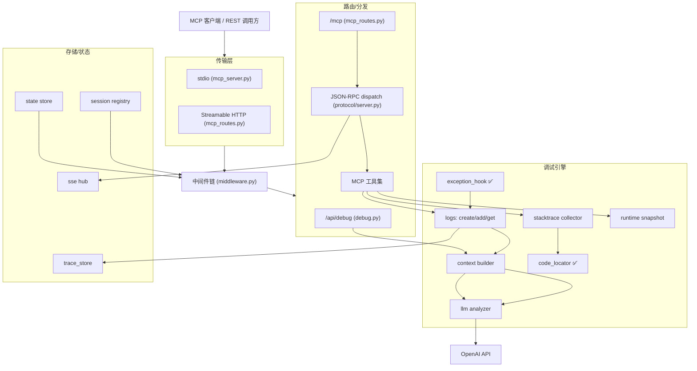

---

## 3. 模块设计

### 3.1 传输层

#### 3.1.1 Streamable HTTP（`app/api/mcp_routes.py`）✅

实现 MCP Streamable HTTP 规范，单路由 `/mcp` 支持三种方法：

| 方法 | 行为 | 关键逻辑 |
| --- | --- | --- |
| `POST /mcp` | 收 JSON-RPC（initialize/tools/list/tools/call/通知） | 预解析 JSON 取 `method`/`id`/`Mcp-Session-Id`；`initialize` 时 `registry.create()` 下发 `Mcp-Session-Id`；非 initialize 无有效会话 → 400；分发 `dispatch_raw(raw)`；按 `Accept` 决定返回 JSON 或 SSE |
| `GET /mcp` | SSE 推送通道 / 健康检查 | `Accept: text/event-stream` 且会话有效 → 订阅 `hub.subscribe(session_id)` 长连推送；否则返回 `_health_payload()` |
| `DELETE /mcp` | 终止会话 | `registry.delete(session_id)` → 204 |

**会话模型**：`Mcp-Session-Id` 头贯穿；`registry.mark_initialized()` 标记初始化完成；未初始化访问 `tools/*` 被拒（400）。定时清理 TTL=1800s（`main.py` lifespan）。

**SSE 广播**：`app/mcp/transports/sse.py` 的 `hub` 提供 `subscribe/format_event/unsubscribe`，用于服务端→客户端主动推送。

#### 3.1.2 stdio（`app/mcp_server.py` + `app/mcp/transports/stdio.py`）✅

- `mcp_server.py`：标准 MCP Server，用 `mcp` SDK 的 `stdio_server` 通信，工具清单从统一 `_tool_registry` 动态导出，避免漏注册和工具面漂移。
- 注册方式：客户端配置 `{"command":"python","args":["-m","app.mcp_server"],"cwd":"<abs>"}`。
- stdio 唯一启动命令：`python -m app.mcp_server`。

**MCP 工具总览（HTTP 17 个 / stdio 17 个，业务实现共用）**：

| 工具（短名） | 说明 | 实现 |
| --- | --- | --- |
| `debug` | 调试入口（含 context 组装） | `debug_api.py` |
| `context` | trace+runtime+源码片段 | `context_api.py` |
| `trace` | 按关键字+时间窗搜历史 trace / 最近错误摘要 | `trace_api.py` |
| `stacktrace` | 最近/指定异常堆栈（文件/行/函数） | `stacktrace_api.py` |
| `ingest_network` / `get_network_trace` | 网络请求采集 | `network_api.py` |
| `get_blame_for_frame` / `get_recent_diff` | Git 代码追溯 | `git_api.py` |
| `ingest_silent_failure` | 静默失败检测 | `silent_failure_api.py` |
| `ingest_error` | 错误上报 | `ingest_api.py` |
| `ingest_console` | 控制台日志采集 | `ingest_api.py` |
| `get_related_specs` | 相关规范查询 | `spec_api.py` |
| `verify` | 规范断言验证 | `verify_api.py` |
| `verify_ui` | 前端 UI 验证 | `verify_ui_api.py` |
| `auto_test` | 页面自动遍历 | `auto_test_api.py` |
| `repair_async` | AI Debug Agent 修复入队 | `repair_api.py`（FR19） |
| `repair_result` | AI Debug Agent 修复结果轮询 | `repair_api.py`（FR19） |

#### 3.1.3 双传输一致性

HTTP 传输经 `register_all_tools()`（`app/mcp/tools/__init__.py`）注册 **17 个工具**；stdio 传输（`mcp_server.py`）共用同一注册表，**实际各 17 个**，工具名为短名：`debug, context, trace, stacktrace, ingest_network, get_network_trace, get_blame_for_frame, get_recent_diff, ingest_silent_failure, ingest_error, ingest_console, get_related_specs, verify, verify_ui, auto_test, repair_async, repair_result`。

### 3.2 中间件层（`app/middleware.py`）✅

注册顺序（内→外，LIFO 栈）：`NetworkCapture → Auth → MaxBodySize → RateLimit → SecurityHeaders → Trace → CORS`。

> ✅ **真实执行顺序（外→内）**：
> `CORS → Trace → SecurityHeaders → RateLimit → MaxBodySize → Auth → NetworkCapture → 路由`。
> 注：`NetworkCaptureMiddleware` 在 `main.py` 中于 `setup_middleware` 之前注册，因此位于最内层，仅记录已通过鉴权/限流/体积限制的请求。`CORS` 必须最后 `add_middleware`（最外层），`OPTIONS` 预检请求先于 `Auth` 处理，不再被 401 拦截。

| 中间件 | 机制 | 设计要点 |
| --- | --- | --- |
| `CORSMiddleware`（最外层） | 按 `cors_origins` 配置；`*` 时 `allow_credentials=False` | OPTIONS 预检先于 Auth 处理，不再被 401 拦截 |
| `TraceMiddleware` | 注入 `trace_id` → `X-Trace-Id`/`X-Response-Time`；异常记录 `trace_id` | 请求级可观测 |
| `SecurityHeadersMiddleware` | 补 `X-Content-Type-Options`/`X-Frame-Options`/`Referrer-Policy`/`X-XSS-Protection` | — |
| `RateLimitMiddleware` | `state_store.allow("ratelimit:{ip}", per_minute, 60)`；**异常降级返回 429（fail-closed）** | 按客户端 IP；**Redis ZSET 滑动窗口**（替代固定窗口，消除临界点突发）；端点级限流（`/ingest/*` 120/min，`/analyze` 10/min） |
| `MaxBodySizeMiddleware` | 先查 `Content-Length` 硬拒；POST/PUT/PATCH **流式分块读取**，超 `max_body_size` 立即 413，避免整 body 进内存 | 防 DoS/OOM |
| `AuthMiddleware` | Bearer / X-API-Key；`hmac.compare_digest` 恒定时间比较；`PUBLIC_PATHS=("/", "/health", "/demo", "/demo/silent-failure", "/ai-debug.js")`（`/metrics` 不在内，需鉴权 — SEC-08） | **fail-closed**：无 Key 且 `api_key` 已设 → 401；未设 `api_key` 则整体禁用（启动告警） |
| `NetworkCaptureMiddleware`（最内层） | 记录已通过鉴权/限流/体积限制的请求到网络捕获存储 | 仅记录合法请求，避免泄漏攻击流量 |

### 3.3 路由/分发层

#### 3.3.1 REST 调试 API（`app/api/debug.py`）✅

| 端点 | 逻辑 |
| --- | --- |
| `POST /api/debug/run` | `create_request_id` → `add_log(request_start/processing/response_ready)` → `build_context` → 出错则 `capture_exception` 挂 `context["exception"]` → `DebugResponse` |
| `POST /api/debug/analyze` | `get_logs`→404 校验→`build_context`→`collect_runtime_snapshot`(失败降级)→`analyze()`；LLM 失败 502 |
| `POST /api/debug/analyze/stream` | 同上，SSE `data:{chunk}` / `[DONE]` |
| `GET /api/debug/runtime` | `collect_runtime_snapshot()` |
| `GET /api/debug/session` | `session_manager.list_active()` 含 idle 时长 |

#### 3.3.2 JSON-RPC 分发（`app/mcp/protocol/server.py` + `jsonrpc.py`）✅

`dispatch_raw(raw)` 解析 JSON-RPC 2.0，按 `method` 路由到工具 `handler`；`make_error(id, code, msg)` 统一错误；`PROTOCOL_VERSION`/`CAPABILITIES` 声明能力。错误不回显内部堆栈（仅"见服务端日志"）。

### 3.4 调试引擎

#### 3.4.1 Trace Log 管理（`app/runtime/core/logs.py`）✅

- `create_request_id()` → 唯一 ID。
- `add_log(request_id, step, data)` → 时序追加，步骤含 `request_start`/`processing`/`response_ready`/`error` 及 MCP 专用 `mcp_*`。
- `get_logs(request_id)` → 按序取回。
- 持久化由 `trace_store` 后端（`memory`/`postgresql`）承担；TTL 清理（`main.py` `periodic_cleanup`，300s 周期）。

#### 3.4.2 Context Builder（`app/runtime/context/builder.py`）✅

`build_context(request_id, logs)` → `{request_id, flow, input, output, errors}`。单条格式异常 `try/except` 标记为 `<malformed>` 并跳过，**不阻断整体**。

> ⚠️ 注意：此构建器现已含 `code_snippets`（FR11 已接线）。详见 §6。

#### 3.4.3 Stacktrace Collector（`app/runtime/collectors/stacktrace.py`）✅

`capture_exception(exc)` → `{type, message, traceback, frames[], frame_count}`；每帧 `{file, line, function, code, locals}`。`format_trace_for_ai()` 生成精简文本（含局部变量前 N 个）。

#### 3.4.4 Code Locator（`app/runtime/collectors/code_locator.py`）✅ 已接线

- `get_code_snippet(file, line, context_lines)`：用 `linecache` 读取 `line±context_lines` 行，报错行以 `>>> N: ` 标注；文件读不到返回 `found=False`。
- `get_snippets_for_frames(frames)`：批量处理堆栈帧。
- **已修复**：`config.py` 已增加 `code_context_lines`、`source_path_map`、`ide_scheme`、`whitelist_path_prefix`。

#### 3.4.5 Runtime Snapshot（`app/runtime/collectors/runtime.py`）✅

`collect_runtime_snapshot()`（psutil）→ `RuntimeSnapshot{pid, cpu_percent, memory_mb, thread_count, open_files, python_version, env_hint}`。失败降级（不抛未捕获异常）。

#### 3.4.6 LLM Analyzer（`app/llm/analyzer.py`）✅

- `SYSTEM_PROMPT`：要求模型输出 JSON `{root_cause, impact, fix, confidence}`。
- `build_analysis_prompt(context)`：把 context 拼为文本（调试/展示用）。
- `truncate_context(context, max_tokens)`：运行时快照/异常帧/整体按字符数（`max_tokens*3`）截断，超长标记 `_truncated`。
- `_retry_call(...)`：重试（`llm_max_retries`）+ 指数退避 + 限流/超时处理；耗尽切换到 `llm_fallback_model`（缩短 prompt 重试 1 次）；仍失败抛 `RuntimeError`。
- `analyze(context)` / `analyze_stream(context)`：非流式/流式；流式用 SSE 逐块 yield。
- **✅ 新增 AsyncOpenAI**：`analyze_async` / `analyze_stream_async` 全链路 async/await，不再阻塞事件循环。
- **✅ 多级缓存**：L1（OrderedDict LRU 进程级，100 条）+ L2（Redis 分布式，TTL 1h）+ L3 缓存预热（`app/llm/cache_prewarm.py`，从 L2 扫描热门 fingerprint 回填 L1，只写 L1 不刷新 L2 TTL，2026-07-26 落地），按 `fingerprint` 缓存 LLM 分析结果，同类错误不再重复调用。Dashboard 缓存加 Redis L2 + `invalidate_cache`。

#### 3.4.7 全局异常钩子（`app/runtime/hooks/exception_hook.py`）✅

`install_global_hook()`（幂等）：
- 覆盖 `sys.excepthook` → 未捕获同步异常自动 `capture_exception(exc, source="global_hook")`。
- 覆盖 asyncio loop `set_exception_handler` → 未 await 的协程异常同样捕获。
- FastAPI 请求内异常由 `middleware`/路由层单独捕获（Starlette 会吞部分异常）。
- 捕获逻辑自身 `try/except` 包裹，绝不掩盖原始报错。

> 价值：直接消解用户"手动查日志"负担——任何未处理异常自动入库，宿主 AI 用 `list_recent_traces` 即可见。

### 3.5 存储/状态层

| 组件 | 职责 | 实现 |
| --- | --- | --- |
| `trace_store` | trace/session 持久化 | `memory` / `postgresql` / `async_pg`（工厂 `storage/factory.py`） |
| `async_pg_store` ✅ | asyncpg 异步存储（feature flag `pg_async_enabled=False` 默认关闭） | `app/runtime/core/storage/async_pg_store.py`，灰度切换可回退 |
| `session registry` | MCP `Mcp-Session-Id` 会话生命周期 | `transports/session.py`，TTL 1800s |
| `state store` | 限流/计数 | `memory` / `redis`（Redis ZSET 滑动窗口限流） |
| `sse hub` | 服务端→客户端广播 | `transports/sse.py` |
| `dashboard event bus` ✅ | Dashboard 实时 SSE 广播（FR20，无 session 门槛） | `app/api/dashboard_events.py`（`DashboardEventBus`，跨线程 `call_soon_threadsafe`，队列满丢旧保最新） |
| `specs` ✅ | 规范存储（FR15） | `app/runtime/verifier/spec_store.py`，**独立 specs 表**（消除 N+1 查询，不再从 traces 扫描恢复） |
| `errors` ✅ | 异常持久化聚合 | `app/runtime/core/errors.py`，**独立 errors 表**（fingerprint + occurrence_count 落 PG，重启不丢失） |
| `MemoryTraceStore` | 内存存储 | **OrderedDict + max_entries 容量上限**（防 OOM） |

#### 3.5.1 PostgreSQL 存储实现（`app/runtime/core/storage/pg_store.py`）✅

**连接池**：`psycopg2.pool.ThreadedConnectionPool`（minconn=2, maxconn=10），线程安全，全局单例。

**自动建表**：`_ensure_init()` 启动时执行 `CREATE TABLE IF NOT EXISTS`：
- `traces`（id BIGSERIAL, request_id TEXT, timestamp DOUBLE PRECISION, step TEXT, data JSONB）
- `sessions`（session_id TEXT PRIMARY KEY, created_at DOUBLE PRECISION, last_active DOUBLE PRECISION, metadata JSONB）

**数据序列化**：`save_entry` 统一用 `json.dumps(data, ensure_ascii=False, default=str)` 序列化，支持 dict/list/str/int/float/bool/None；`get_entries` 用 `_parse_data` 安全反序列化（JSON 字符串→对象，非 JSON 字符串→原样返回）。

**重试机制**：`_execute_with_retry` 包装 SQL 执行，捕获 `OperationalError` 自动重连重试。

**查询接口**：`list_request_ids(limit)` 返回最近写入的 request_id 列表（按 timestamp 倒序），供 Dashboard 和 MCP Tools 使用。

#### 3.5.2 Dashboard API（`app/api/dashboard.py`）✅

| 端点 | 功能 | 数据源 |
| --- | --- | --- |
| `GET /api/dashboard/stats` | 概览统计（total/silent/exceptions/spec_count） | errors 缓冲 + PG traces |
| `GET /api/dashboard/traces?limit=N` | 列出最近 traces 摘要 | errors 缓冲 + PG traces |
| `GET /api/dashboard/trace/{trace_id}` | trace 详情（含 spec_diffs） | PG traces + errors 缓冲 |
| `GET /api/dashboard/specs` | 列出已存规范 | spec_store |

`_collect_all_traces` 合并两个数据源：
1. `errors.list_recent()` — 内存异常缓冲（save_trace 默认存这里）
2. `logs.list_request_ids()` — PostgreSQL 持久化数据

`_extract_trace_summary` 安全处理 data 字段（支持 str/dict/None），`_safe_int` 处理 status 类型转换。

### 3.6 可观测性（`app/observability.py`）✅

`/metrics`（Prometheus 文本）、`/health`（校验 LLM 配置 + 存储层连通性，状态 `ok/degraded/unhealthy`）、启动日志打印关键配置。

### 3.7 配置（`app/config.py`，pydantic-settings）✅

单例 `settings`，读项目根 `.env`（基于 `__file__` 锚定绝对路径，任意 CWD 启动行为一致；修复 ENV-001）。`code_context_lines` 等 FR11 配置键已补全。

---

## 4. 关键流程时序

### 4.1 全局异常自动捕获（✅ 已落地）

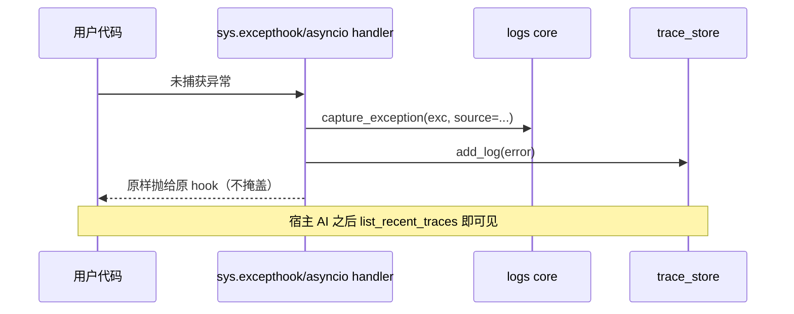

### 4.2 调试流程 + LLM 分析（✅）

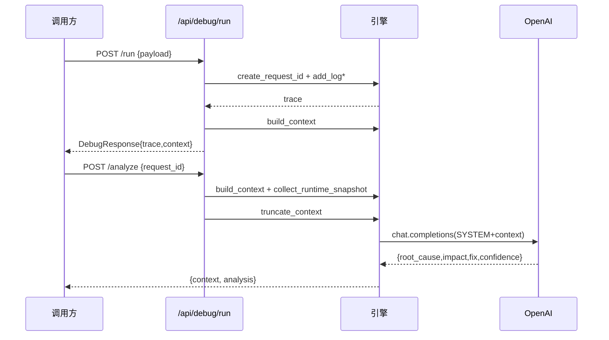

### 4.3 MCP Streamable HTTP 握手（✅）

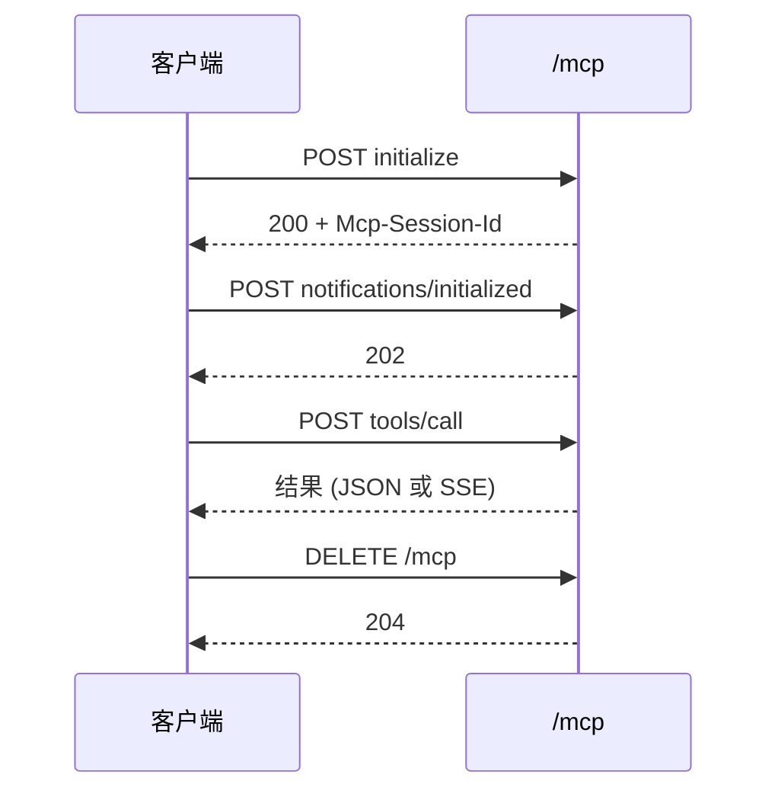

---

## 5. 数据模型（`app/schemas`）

```python
# TraceEntry: {step, data, ts}
# DebugContext: {trace, runtime?, code_snippets:[CodeSnippet], note}
# CodeSnippet: {file, error_line, snippet, found}
# RuntimeSnapshot: {pid, cpu_percent, memory_mb, thread_count, open_files, python_version, env_hint}
# Session: {session_id, created_at, last_active, metadata}
```

LLM 输出契约：`{root_cause:str, impact:str, fix:str, confidence:"high|medium|low"}`。

---

## 6. 已实现的关键能力

> 以下能力已按本架构实现并通过测试，详细实现细节参见各模块源码。

| 能力 | 组件 | 说明 |
| --- | --- | --- |
| 脱敏 | [app/runtime/core/redaction.py](../../app/runtime/core/redaction.py) | 存储边界统一脱敏，默认开启；**复合键名子串匹配 + 白名单** |
| 统一存取 | [app/runtime/core/trace_repo.py](../../app/runtime/core/trace_repo.py) | 在 TraceStorage + errors 之上实现 save_trace/get_trace/save_network_record/save_ui_event |
| 网络采集 | `app/runtime/collectors/network.py` + `tools/network_api.py` | 解析/截断 + ingest_network/get_network_trace |
| UI 采集 | `app/runtime/collectors/ui_event.py` | 解析/截断 |
| Git 归因 | [app/runtime/core/git.py](../../app/runtime/core/git.py) + `tools/git_api.py` | blame/diff，带超时+路径白名单 |
| 静默失败 | `app/mcp/tools/silent_failure_api.py` + [api/ingest.py](../../app/api/ingest.py) | 编排 ui/network + trace_kind |
| 跨语言上报 | `app/mcp/tools/ingest_api.py` + `api/ingest.py` | ingest_error |
| inbound 采集 | [app/middleware_network.py](../../app/middleware_network.py) | 独立中间件，默认关闭，安全栈内层 |
| 完整上下文 | [app/runtime/context/builder.py](../../app/runtime/context/builder.py)::build_debug_context | 注入 code/git/network/ui/runtime/related_specs |
| 规范驱动采集 | `app/runtime/collectors/spec.py` + `tools/spec_api.py` | 扫描/标签匹配/缓存/脱敏 + get_related_specs |
| 指纹去重聚合 | [app/runtime/core/errors.py](../../app/runtime/core/errors.py) | compute_fingerprint + occurrence_count，避免重复刷屏 |
| 双传输注册 | [app/mcp/tools/__init__.py](../../app/mcp/tools/__init__.py) + [app/mcp_server.py](../../app/mcp_server.py) | HTTP / stdio 均为 17 个，统一注册表动态导出；**M5 版本协商（SUPPORTED_PROTOCOL_VERSIONS）** |
| 代码定位 | [app/runtime/collectors/code_locator.py](../../app/runtime/collectors/code_locator.py) | 源码片段 + vscode:// 链接，路径白名单防穿越 |
| 静默失败检测 | [app/runtime/verifier/assert_engine.py](../../app/runtime/verifier/assert_engine.py) | assert_behavior 纯函数，<1ms 判定 |
| 前端自动化 | `app/verifier/ui_runner.py` + `tools/auto_test_api.py` | Playwright headless 遍历，可选依赖 |
| 规范驱动闭环 | [app/runtime/verifier/spec_store.py](../../app/runtime/verifier/spec_store.py) | spec CRUD + verify 工具 + spec_diffs 注入 |

---

## 7. 关键设计决策（ADR 摘要）

| 决策 | 选择 | 理由 |
| --- | --- | --- |
| 宿主 AI 推理 vs 内置分析 | **默认宿主 AI 推理**，`analyze_with_llm` 仅可选 | 避免重复推理与花费；服务专注"采集+结构化" |
| 协议 | MCP（JSON-RPC 2.0）+ Streamable HTTP/stdio | 标准、被主流客户端原生支持 |
| 上下文截断 | 字符估算（`max_tokens*3`）+ 帧/局部变量上限 | 控成本与延迟，防超长 |
| 安全默认 | fail-closed + 恒定时间比较 | 防未授权与时序攻击 |
| 降级 | 快照/LLM 失败不阻断主流程 | 提高可用性 |
| 存储 | 工厂模式 memory/pg/async_pg + 状态 memory/redis | 本地轻量 / 生产持久 / asyncpg 灰度切换 |

---

## 8. 部署与配置

- 启动：HTTP 使用 `python -m app.main`；stdio 使用 `python -m app.mcp_server`。
- 依赖：`requirements.txt`（fastapi、uvicorn、openai、psutil、psycopg2、asyncpg、redis、mcp、pydantic-settings）。
- 关键配置：见 `PRD.md` §11.3；**务必生产设 `API_KEY` 与 `CORS_ORIGINS`**；`code_context_lines` 待补（§6）。
- 容器化：`Dockerfile` + `docker-compose.yaml` 已提供。

---

## 9. 安全设计

- 传输：HTTPS 由前置代理提供；**CORS 默认收紧为空串**（不下发头），`*` 时强制 `allow_credentials=False`（SEC-12 已修复顺序）。
- 鉴权：API Key，fail-closed，恒定时间比较，公钥路径免鉴权。**限流 fail-closed**：初始化失败返回 429（SEC-07）。
- 防 DoS：流式请求体限制（内存恒定 ≤ `max_body_size`）、**chunked body 字节流检查**（流式累计超限 413，M8）、按 IP 限流（Redis ZSET 滑动窗口）。
- 信息脱敏：内部异常/DB 错误不回显；`/health` 仅状态不泄露细节。**复合键名脱敏**：子串匹配 + 白名单（`db_password`/`user_token` 被脱敏，`password_hash`/`public_key` 受保护）。
- SSE 安全：`session_id` 绑定校验（SEC-04）。
- `/metrics`：独立鉴权 toggle（SEC-08）。
- 密钥：`.env` 不入库，提供 `.env.example` + `.gitignore`。
- 路径安全：`file://`/`vscode://` 仅限 `WHITELIST_PATH_PREFIX`，白名单为空时默认收敛 CWD，防目录穿越。
- RBAC 角色分级：三级 `admin > developer > viewer`；`require_role(*roles)` FastAPI 依赖工厂已挂载**全部 33 条 REST 路由**（`debug.py` 14 + `ingest.py` 7 + `dashboard.py` 7 + `spec.py` 5）及 MCP `tools/call` 分发；未命中映射默认 viewer（fail-closed）。

### 9.1 RBAC 权限矩阵 ✅

**覆盖范围**：以下矩阵覆盖全部已挂载 `require_role` 的 33 条 REST 路由 + 17 个 MCP 工具。

**REST API（`debug.py` 14 条路由，全部挂载 `require_role`）**：

| 端点 | admin | developer | viewer | 实现 |
| --- | --- | --- | --- | --- |
| `POST /api/debug/run` | ✅ | ✅ | ❌ | `require_role("admin","developer")` |
| `POST /api/debug/analyze` | ✅ | ✅ | ❌ | `require_role("admin","developer")` |
| `POST /api/debug/analyze/stream` | ✅ | ✅ | ❌ | `require_role("admin","developer")` |
| `POST /api/debug/analyze/async` | ✅ | ✅ | ❌ | `require_role("admin","developer")` |
| `GET /api/debug/analyze/result/{job_id}` | ✅ | ✅ | ✅ | `require_role("admin","developer","viewer")` |
| `POST /api/debug/repair/async` | ✅ | ✅ | ❌ | `require_role("admin","developer")` |
| `GET /api/debug/repair/result/{job_id}` | ✅ | ✅ | ✅ | `require_role("admin","developer","viewer")` |
| `GET /api/debug/runtime` | ✅ | ✅ | ✅ | `require_role("admin","developer","viewer")` |
| `GET /api/debug/session` | ✅ | ✅ | ✅ | `require_role("admin","developer","viewer")` |
| `POST /api/debug/verify` | ✅ | ✅ | ❌ | `require_role("admin","developer")` |
| `POST /api/debug/verify/ui` | ✅ | ✅ | ❌ | `require_role("admin","developer")` |
| `GET /api/debug/health` | ✅ | ✅ | ✅ | `require_role("admin","developer","viewer")` |
| `POST /api/debug/echo`（诊断，默认关闭） | ✅ | ❌ | ❌ | `require_role("admin")` |
| `GET /api/debug/token`（诊断，默认关闭） | ✅ | ❌ | ❌ | `require_role("admin")` |

**`ingest.py`（7 条路由，全部挂载 `require_role`）**：

| 端点 | admin | developer | viewer | 实现 |
| --- | --- | --- | --- | --- |
| `POST /ingest/network` | ✅ | ✅ | ❌ | `require_role("admin","developer")` |
| `GET /ingest/network/{trace_id}` | ✅ | ✅ | ✅ | `require_role("admin","developer","viewer")` |
| `POST /ingest/silent-failure` | ✅ | ✅ | ❌ | `require_role("admin","developer")` |
| `POST /ingest/error` | ✅ | ✅ | ❌ | `require_role("admin","developer")` |
| `POST /ingest/console` | ✅ | ✅ | ❌ | `require_role("admin","developer")` |
| `POST /ingest/ui-event` | ✅ | ✅ | ❌ | `require_role("admin","developer")` |
| `POST /ingest/batch` | ✅ | ✅ | ❌ | `require_role("admin","developer")` |

**`dashboard.py`（7 条路由，全部挂载 `require_role`）**：

| 端点 | admin | developer | viewer | 实现 |
| --- | --- | --- | --- | --- |
| `GET /api/dashboard/stats` | ✅ | ✅ | ✅ | `require_role("admin","developer","viewer")` |
| `GET /api/dashboard/traces` | ✅ | ✅ | ✅ | `require_role("admin","developer","viewer")` |
| `GET /api/dashboard/trace/{trace_id}` | ✅ | ✅ | ✅ | `require_role("admin","developer","viewer")` |
| `GET /api/dashboard/specs` | ✅ | ✅ | ✅ | `require_role("admin","developer","viewer")` |
| `GET /api/dashboard/errors/aggregated` | ✅ | ✅ | ✅ | `require_role("admin","developer","viewer")` |
| `GET /api/dashboard/errors/ranked` | ✅ | ✅ | ✅ | `require_role("admin","developer","viewer")` |
| `GET /api/dashboard/errors/history` | ✅ | ✅ | ✅ | `require_role("admin","developer","viewer")` |

**`spec.py`（5 条路由，全部挂载 `require_role`）**：

| 端点 | admin | developer | viewer | 实现 |
| --- | --- | --- | --- | --- |
| `POST /api/spec` | ✅ | ✅ | ❌ | `require_role("admin","developer")` |
| `GET /api/spec` | ✅ | ✅ | ✅ | `require_role("admin","developer","viewer")` |
| `GET /api/spec/{spec_id}` | ✅ | ✅ | ✅ | `require_role("admin","developer","viewer")` |
| `PATCH /api/spec/{spec_id}` | ✅ | ✅ | ❌ | `require_role("admin","developer")` |
| `DELETE /api/spec/{spec_id}` | ✅ | ✅ | ❌ | `require_role("admin","developer")` |

**MCP 工具（17 个，`TOOL_ROLE_REQUIREMENTS` 字典门控）**：

| 工具 | admin | developer | viewer | required_roles |
| --- | --- | --- | --- | --- |
| `debug` | ✅ | ✅ | ❌ | `("admin","developer")` |
| `ingest_network` | ✅ | ✅ | ❌ | `("admin","developer")` |
| `ingest_silent_failure` | ✅ | ✅ | ❌ | `("admin","developer")` |
| `ingest_error` | ✅ | ✅ | ❌ | `("admin","developer")` |
| `ingest_console` | ✅ | ✅ | ❌ | `("admin","developer")` |
| `verify` | ✅ | ✅ | ❌ | `("admin","developer")` |
| `verify_ui` | ✅ | ✅ | ❌ | `("admin","developer")` |
| `auto_test` | ✅ | ✅ | ❌ | `("admin","developer")` |
| `repair_async` | ✅ | ✅ | ❌ | `("admin","developer")`；`agent_enabled=False` 时返回 501 |
| `context` | ✅ | ✅ | ✅ | `("admin","developer","viewer")` |
| `trace` | ✅ | ✅ | ✅ | `("admin","developer","viewer")` |
| `stacktrace` | ✅ | ✅ | ✅ | `("admin","developer","viewer")` |
| `get_network_trace` | ✅ | ✅ | ✅ | `("admin","developer","viewer")` |
| `get_blame_for_frame` | ✅ | ✅ | ✅ | `("admin","developer","viewer")` |
| `get_recent_diff` | ✅ | ✅ | ✅ | `("admin","developer","viewer")` |
| `get_related_specs` | ✅ | ✅ | ✅ | `("admin","developer","viewer")` |
| `repair_result` | ✅ | ✅ | ✅ | `("admin","developer","viewer")` |
| `analyze_with_llm`（未注册为工具） | — | — | — | 内部函数，通过 `debug` 工具间接调用 |

---

## 10. 风险与开放问题

| 项 | 说明 | 处置 |
| --- | --- | --- |
| ~~代码定位未接线~~ | ~~`get_debug_context` 不含片段~~ | §6 ✅ 已修复 |
| ~~静默失败/前端自动化~~ | ~~FR13/FR14/FR15 待建~~ | ✅ 已实现 |
| 厂商锁定 | 仅 OpenAI | 多 LLM provider 已支持（openai/zhipu/custom）|
| memory 后端 | 重启即丢 | 生产用 postgresql 或 async_pg |
| ~~PGStore API 误用~~ | ~~`conn.execute()` 不存在~~ | ✅ 已改用 `cur = conn.cursor(); cur.execute()` |
| ~~data 字段非 dict 时崩溃~~ | ~~`json.loads` 失败 / `.get()` 报错~~ | ✅ `_parse_data` 安全解析 + 类型检查 |
| SSE 长连接测试 | TestClient 中会阻塞 | 标记 `@pytest.mark.skip`，需手动验证 |

---

## 11. 测试策略

### 11.1 测试分层

| 层级 | 目录 | 用例数 | 说明 |
| --- | --- | --- | --- |
| 单元测试 | `tests/unit/` | 310+ | redaction、fingerprint、storage、dashboard、verify_api、async_pg 等 |
| 脱敏集成测试 | `tests/integration/test_redaction_integration.py` | 18 | 端到端脱敏链路验证 |
| AsyncPGStore 测试 | `tests/integration/test_pg_integration.py` | 12 | PGStore 连接、Dashboard 读取、MCP Tools 读取、LLM 分析 |
| **合计** | — | **340 passed / 6 skipped / 0 failed** | 起始基线 248/6/1，新增 92 个测试，消除全部失败 |

### 11.2 测试执行

```bash
# 全部测试（需要 PostgreSQL 运行中）
python -m pytest tests/ --tb=short -q

# 仅单元测试（不依赖 PostgreSQL）
python -m pytest tests/unit/ --tb=short -q

# 仅 PG 集成测试
python -m pytest tests/integration/test_pg_integration.py --tb=short -q

# 按 marker 运行
python -m pytest -m "not integration and not pg and not slow" --tb=short -q
```

> **pytest markers**：`integration` / `llm` / `pg` / `slow`，`pytest.ini` 已注册。

### 11.3 PG 集成测试覆盖

- **PGStoreConnection**：连接池、表自动创建、save/get 往返、字符串 data 存储、list_request_ids、_parse_data 辅助函数
- **DashboardIntegration**：stats 结构、traces 列表从 PG 读取、trace 详情从 PG 读取
- **MCPToolIntegration**：list_recent_traces 包含 PG 数据、search_logs 搜索 PG 数据、get_logs 返回 PG 数据
- **LLMIntegration**：analyze_with_llm 端到端（LLM 未配置时自动跳过）

---

## 12. 项目架构图（Mermaid）

### 12.1 系统架构总览

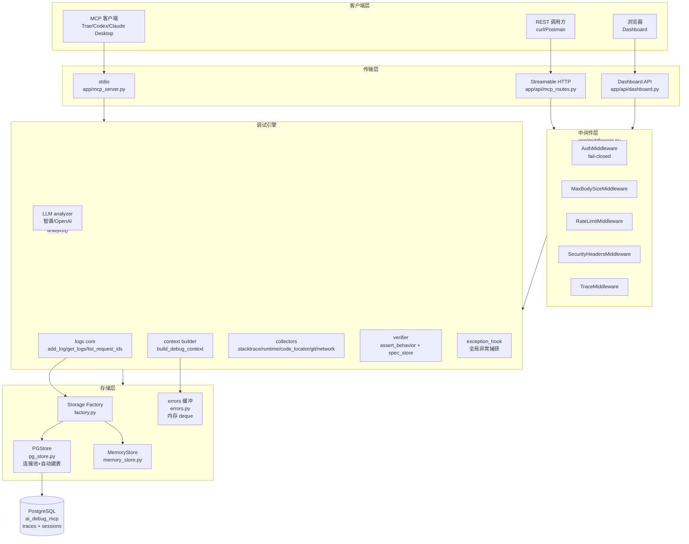

### 12.2 数据流（POST /debug 端到端）

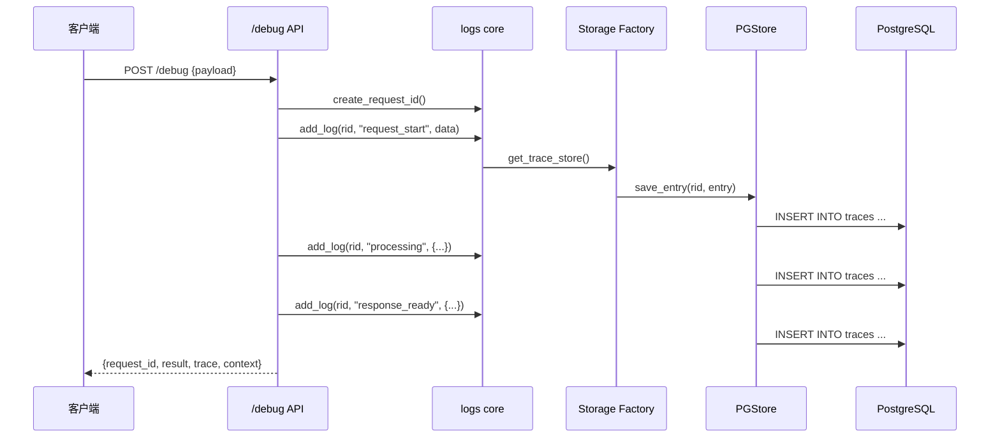

### 12.3 Dashboard 读取流程

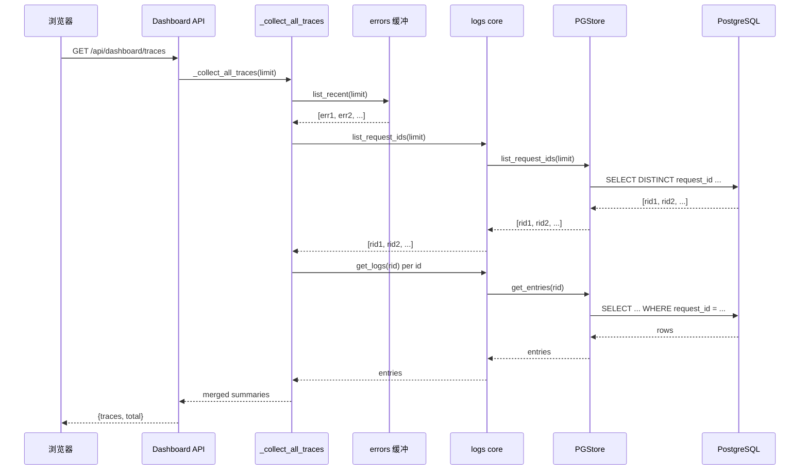

---

## 附录：模块 ↔ 文件 速查

| 模块 | 文件 |
| --- | --- |
| 入口/生命周期 | `app/main.py` |
| 中间件 | `app/middleware.py` |
| REST 调试 | `app/api/debug.py` |
| HTTP MCP | `app/api/mcp_routes.py` |
| stdio MCP | `app/mcp_server.py` |
| JSON-RPC | `app/mcp/protocol/{server,jsonrpc}.py` |
| Trace | `app/runtime/core/logs.py` |
| Context | `app/runtime/context/builder.py` |
| Stacktrace | `app/runtime/collectors/stacktrace.py` |
| Code Locator | `app/runtime/collectors/code_locator.py` ✅ |
| Runtime | `app/runtime/collectors/runtime.py` |
| LLM | `app/llm/analyzer.py` |
| 异常钩子 | `app/runtime/hooks/exception_hook.py` ✅ |
| 存储 | `app/runtime/core/storage/*` |
| 会话/SSE | `app/mcp/transports/{session,sse}.py` |
| 可观测 | `app/observability.py` |
| 配置 | `app/config.py` |

---

## 13. 数据流通与执行流程复核（2026-07-22 静态取证）

> 本节为「数据从入口到出口」的端到端复核，与 §2/§4 的设计图互为印证；所有结论附 `文件:行`。
> 配套安全结论见内部安全审查文档的「SEC-01~15」补充章。
> ✅ 其中 **P0 四项（LFI/SSRF/默认鉴权/工具超时）已于 2026-07-22 修复**，详见内部审计报告；下文描述的是修复前的原始数据流与风险面。

### 13.1 两条入口（Ingress）

| 入口 | 起点 | 鉴权 | 说明 |
| --- | --- | --- | --- |
| **HTTP** | `app/main.py:98` FastAPI app | 依 `AuthMiddleware`（默认关闭，见 SEC-03） | 中间件真实顺序：`Trace→SecurityHeaders→RateLimit→MaxBodySize→Auth→CORS→NetworkCapture→路由`（订正见 §3.2） |
| **stdio** | `app/mcp_server.py:172`（`python -m app.mcp_server`） | **无中间件、无鉴权** | 依赖“本地子进程 + 进程隔离”；每个 MCP 客户端各自拉起独立进程 |

### 13.2 核心数据流路径（节点级 I/O）

| 流程 | 入口 | 传递链（文件:行） | 存储落点 | 出口 |
| --- | --- | --- | --- | --- |
| **F1 MCP 工具调用** | `POST /mcp` `mcp_routes.py:37` | 预解析 JSON→会话校验 `:54-77`→`dispatch_raw` `server.py:158`→`_handle_tools_call` `server.py:75`→17 工具 handler | 依工具而定 | JSON / SSE `:94-103` |
| **F2 错误上报** | `POST /ingest/error` `ingest.py:66` | `tool_ingest_error`→`_parse_frames`（仅 `int(line)`，**不校验 file 路径**）→`save_trace` `trace_repo.py:76`→`redact`+`errors.record`(全局 deque)+`add_log` | `errors._recent`(内存) + `trace_store` | `{error_id}` |
| **F3 完整上下文构建** | 工具 `context` / `GET /api/dashboard/trace/{id}` `dashboard.py:176` | `build_debug_context` `context.py:44`→`get_trace`→**`code_locator` 读文件** `:110`→`git blame/diff` `:119,125`→network/ui/spec/runtime | 只读 | dict（含 `code_snippets`） |
| **F4 LLM 分析** | `POST /api/debug/analyze` `debug.py:77` | `get_logs`→`build_context`→`collect_runtime_snapshot`→`analyze` `analyzer.py:342`→`_prepare_context_for_llm`(截断+**递归脱敏** `:107-110`) | 只读 | `{context, analysis}` |
| **F5 全局异常自动捕获** | `sys.excepthook`/asyncio handler `exception_hook.py:36,45` | `capture_exception` `stacktrace.py:22`→`errors.record`（**message/traceback 未脱敏**，见 SEC-06） | `errors._recent` | 供 `stacktrace`/`trace` 工具检索 |

### 13.3 存储模型（关键架构事实）

- `trace_store`（默认 `memory`，可选 `postgresql`，工厂 `storage/factory.py:31`）以 `request_id`/`error_id` 为 key，条目 `{timestamp, step, data}`（`logs.py:13`）。
- ⚠️ **所有数据类型（异常/network/ui_event/console/trace_data/meta/link）都写进同一张 `traces` 表**，用 `step` 字段区分（`trace_repo.py:44-49`）。独立表现状：`errors`/`specs` 由 `pg_store.py` DDL 常量建表并有完整 CRUD（`upsert_error`/`save_spec`/`get_spec`/`list_specs_pg`/`delete_spec`，活跃使用）；`network_records`/`ui_events` 原"已建 SQL 但代码从未使用"，M11 已删除其迁移文件（`migrations/20260712_*`），数据仍经 traces 表 step 字段存储。
- `errors._recent`：进程级全局 `deque(maxlen=200)`（`errors.py:21`），按 `compute_fingerprint`（`:29`）去重聚合。
- `session registry`（`transports/session.py`）仅管理 MCP 会话生命周期，**不承载业务数据、不做数据隔离**。

### 13.4 数据出口（Egress）

只有三个出口：① 返回调用方（工具结果/REST/SSE）；② **外部 LLM**（仅 `/analyze`、`analyze_with_llm` 触发，发送前经 `_prepare_context_for_llm` 截断+递归脱敏 `analyzer.py:107`）；③ 浏览器 SSE。无遥测、无云存储——「数据本地驻留」成立。

### 13.5 工具注册与执行流程（订正工具清单）

`register_all_tools()`（`tools/__init__.py`）**实际注册 17 个工具**，工具名为短名：
`debug, context, trace, stacktrace, ingest_network, get_network_trace, get_blame_for_frame, get_recent_diff, ingest_silent_failure, ingest_error, ingest_console, get_related_specs, verify, verify_ui, auto_test, repair_async, repair_result`。

> 说明：`get_debug_context / list_recent_traces / search_logs / get_runtime_snapshot / analyze_with_llm` **不是注册的工具名**——它们是内部处理函数，对外以 `context / trace / stacktrace` 短名暴露；`get_runtime_snapshot`、`analyze_with_llm` 当前**未作为独立 MCP 工具注册**。HTTP 与 stdio 共用同一注册表（`mcp_server.py:45`），因此实际是「HTTP 17 / stdio 17」，不存在数量差异。

### 13.6 执行流程要点

- **异常处理**：路由层（`ingest.py`/`debug.py`/`main.py`）全 `try/except`，对外统一 `"Internal server error"`；全局兜底 `error_handlers.py:15`；工具异常 `server.py:100` 返回 `isError:True`（但**无机器可读 error_code**，见 SEC-11）。
- **降级**：`build_debug_context` 六个子采集器各自 `try/except`（`context.py:109,122,132,142,152`），任一失败不阻断整体——设计亮点，但也把攻击者可控的 frame 路径放大为文件读取/ git 命令（见 SEC-01）。
- **并发**：`MemoryTraceStore`/`errors`/`spec_store`/`session registry` 均 `Lock` 保护；PG 连接池双重检查锁正确。⚠️ 但 `analyzer._get_client` 用模块级 bool 冒充自旋锁（`analyzer.py:18,47-55`），非真正线程安全；**全链路无单次工具调用超时**（`server.py:87`/`mcp_server.py:125`，见 SEC-05）。

---

## 14. 高并发设计评审（2026-07-22 高级架构师审查）

> 本节为高级架构师逐行代码审查后的高并发专项评估，聚焦异步处理、缓存机制、限流策略和数据预防。
> 完整评分与优化路线图见内部代码审查文档 §企业级架构综合评审。
> 参考架构映射见 §14.6（无人机巡检平台思路 → Lujo-MCP 落地）。

### 14.1 异步处理现状

**已实现的异步模式：**

| 异步点 | 位置 | 实现方式 |
|--------|------|----------|
| 应用生命周期 | `main.py:44-100` | `@asynccontextmanager` + `asyncio.create_task` 定时清理 |
| 中间件链 | `middleware.py` | `BaseHTTPMiddleware.dispatch` async |
| MCP 工具分发 | `protocol/server.py:75-123` | `asyncio.iscoroutinefunction` 检测 + `asyncio.to_thread` 包装同步工具 |
| SSE 流式响应 | `mcp_routes.py:95-99` | `StreamingResponse` + async generator |
| LLM 流式分析 | `api/debug.py:122-150` | `StreamingResponse` + `text/event-stream` |
| stdio 传输 | `transports/stdio.py:48-99` | `asyncio` + `loop.run_in_executor` |

**关键异步缺陷：**

1. **🔴 PostgreSQL 操作完全同步**（`pg_store.py:40-60`）：`ThreadedConnectionPool(min=2, max=10)` 是同步连接池。在 FastAPI async handler 中调用同步 PG 操作会阻塞事件循环。`maxconn=10` 硬编码不可配置，超过 10 个并发写入请求排队等待。
2. **🔴 LLM 调用同步阻塞**（`analyzer.py:276-339`）：`_retry_call` 同步 HTTP 调用 2-10 秒。`/api/debug/analyze` 定义为 `def`（非 `async def`），FastAPI 将其放入线程池执行（默认 40 线程），高并发时线程池耗尽。
3. **🟡 Redis 操作同步**（`state/store.py:80-114`）：`redis.Redis` 同步客户端，限流中间件每个请求增加 1-2ms 延迟。

**改进方向：**
- P0：PG 切换到 `asyncpg` + `asyncio`，所有 PG 操作改为 `async/await`
- P1：LLM 调用改为 `async def` + `httpx.AsyncClient`
- P2：Redis 切换到 `aioredis`

### 14.2 缓存机制现状

**已实现的缓存：**

| 缓存层 | 位置 | 策略 | 失效机制 |
|--------|------|------|----------|
| 规范文件扫描 | `collectors/spec.py:59,185-209` | 进程级 `_spec_cache` dict，按 `mtime` 检查 | 文件修改时刷新 |
| 脱敏正则编译 | `core/redaction.py:56-87` | `_extra_cache` + 配置签名比对 | 配置变化时重建 |
| 源码行读取 | `collectors/code_locator.py` | 依赖 Python 内置 `linecache` | linecache 自带 |
| 异常指纹去重 | `core/errors.py:37-75` | `deque(maxlen=200)` + fingerprint 聚合 | 容量淘汰 |

**缺失的关键缓存**（2026-07-22 评审时状态，以下均已在后续阶段落地）：

1. **🔴 无 LLM 分析结果缓存** → ✅ **已落地（Phase 3）**：L1 OrderedDict LRU（100 条）+ L2 Redis（TTL 1h），按 `fingerprint` 缓存；L3 预热已落地（`app/llm/cache_prewarm.py`，2026-07-26，只写 L1 不刷新 L2 TTL）
2. **🔴 Dashboard API 无查询缓存** → ✅ **已落地（任务 D）**：Dashboard 查询缓存 TTL 30s + Redis L2 + `invalidate_cache`
3. **🟡 无 HTTP 响应缓存头**：幂等 GET 请求无 `ETag`/`Cache-Control`。（仍未落地，优先级低）

**改进方向：**
- P0：LLM 结果按 `fingerprint` 缓存，TTL 1h，LRU 100 条
- P1：Dashboard 查询缓存 TTL 30s
- P2：HTTP `Cache-Control: max-age=30` + `ETag`

### 14.3 请求分流策略

**已实现的分流：**

| 分流维度 | 位置 | 策略 |
|----------|------|------|
| 路径白名单 | `middleware.py:20` | `PUBLIC_PATHS` 免鉴权（5 项：`/`、`/health`、`/demo`、`/demo/silent-failure`、`/ai-debug.js`） |
| MCP 方法路由 | `protocol/server.py:132-137` | `_METHOD_MAP` 分发 |
| 存储后端 | `core/storage/factory.py:31-42` | 环境变量选择 memory/postgresql |
| 状态后端 | `state/store.py:121-131` | 环境变量选择 memory/redis |
| LLM Provider | `analyzer.py:31-35` | 选择 openai/zhipu/custom |
| 规范类型 | `verifier/assert_engine.py:29-38` | `spec.kind` 分发 api/ui/rule |

**缺失的分流：**

1. **🟡 无请求优先级队列**：健康检查、数据写入、Dashboard 查询共享同一限流配额。
2. **🟡 无限流分级**：所有 IP 共享 `rate_limit_per_minute=60`，无按端点/按用户分级。
3. **🟡 无请求体分流**：大请求（>1MB）直接拒绝，无异步队列分流。

**改进方向：**
- P1：端点级限流（`/ingest/*` 和 `/api/debug/analyze` 不同阈值）
- P2：请求优先级（健康检查 > 写入 > 查询）

### 14.4 高并发数据预防

**已实现的防护措施：**

| 防护层 | 位置 | 机制 |
|--------|------|------|
| 请求体限制 | `middleware.py:56-78` | `max_body_size=1MB` 硬截断 |
| 速率限制 | `middleware.py:95-108` | 固定窗口 60req/min/IP |
| PG 连接池 | `pg_store.py:40-60` | `ThreadedConnectionPool(min=2, max=10)` |
| 连接重试 | `pg_store.py:122-148` | `_execute_with_retry(max_retries=2)` |
| 定时清理 | `main.py:77-86` | 每 300s 清理过期 trace/session |
| 异常缓冲上限 | `core/errors.py:21` | `deque(maxlen=200)` |
| 安全启动校验 | `main.py:33-41` | 拒绝 `0.0.0.0` + 空 API_KEY |
| 启动期工厂校验 | `main.py:74-75` | fail-fast 校验 `STORAGE_BACKEND` |

**关键高并发风险：**

1. **🔴 PG 连接池瓶颈**（`maxconn=10` 硬编码）：100 并发写入 → 10 连接全占 → 90 请求阻塞 → 最坏等待 200ms+
2. **🔴 内存存储多 worker 数据不一致**：`gunicorn` 多 worker 下每个 worker 独立内存，数据完全隔离
3. **🔴 定时清理无分布式锁**：多 worker 各自执行清理，重复操作
4. **🟡 异常指纹缓冲无持久化**：`occurrence_count`/`fingerprint` 仅内存，重启丢失
5. **🟡 spec_store 恢复性能**：扫描 500 个 request_id = 500 次 PG 查询

**并发安全矩阵：**

| 组件 | 线程安全 | 进程安全 | 分布式安全 |
|------|----------|----------|------------|
| MemoryTraceStore | ✅ Lock | ❌ 进程隔离 | ❌ |
| PGTraceStore | ✅ 连接池 | ✅ 共享 DB | ✅ |
| MemoryStateStore | ✅ Lock | ❌ 进程隔离 | ❌ |
| RedisStateStore | ✅ | ✅ | ✅ |
| errors deque | ✅ Lock | ❌ 进程隔离 | ❌ |
| spec_store | ✅ Lock | ✅ PG 持久化 | ✅ |
| SSEHub | ✅ asyncio.Queue | ❌ | ❌ |
| SessionRegistry | ✅ Lock | ❌ | ❌ |

**改进方向：**
- P0：PG 连接池可配置化（`PG_MAX_CONNECTIONS` 环境变量，默认 20）
- P0：生产环境强制 `STORAGE_BACKEND=postgresql` + `STATE_BACKEND=redis`
- P1：分布式清理锁（Redis `SET NX`）
- P1：异常聚合持久化（新增 `error_stats` 表）
- P2：spec_store 独立表（替代从 traces 扫描恢复）

### 14.5 数据写入/读取路径分析

**写入路径瓶颈：**
```
浏览器 SDK → /ingest/* (HTTP) → tool handler → trace_repo → add_log → TraceStorage
                                                                              ↓
                                                              Memory: defaultdict + Lock
                                                              PG: ThreadedConnectionPool(10)
```
- 同步 PG 操作阻塞事件循环
- 连接池 maxconn=10 限制并发
- 每条 trace 多次 `add_log` 调用（trace_data + trace_meta + trace_link = 3 次 INSERT）

**读取路径瓶颈：**
```
Dashboard → /api/dashboard/traces → _collect_all_traces → errors.list_recent + logs.list_request_ids
```
- 每次请求全量扫描 + 排序
- 无查询缓存
- `_extract_trace_summary` 对每个 request_id 调用 `get_logs`（N+1 查询）

### 14.6 参考架构映射：无人机巡检平台思路 → Lujo-MCP 落地

> 本节参考《无人机巡检平台高并发与架构优化技术术语手册》的核心架构思想，映射到 Lujo-MCP 的优化场景。

#### 14.6.1 高并发限流算法升级

**巡检平台思路：**
- **令牌桶**：允许突发流量，适合"平时平稳、突发集中"场景
- **漏桶**：强制平滑速率，保护下游 DB
- **滑动窗口**：避免固定窗口临界点流量翻倍

**Lujo-MCP 映射：**
- 当前实现：`state/store.py:50-58` 使用**固定窗口**（60s 窗口，60 次请求）
- 问题：窗口临界点（59s 和 61s 各 60 次 = 2s 内 120 次）
- **落地建议**：
  ```python
  # 滑动窗口实现（参考巡检平台思路）
  class SlidingWindowRateLimiter:
      def allow(self, key: str, limit: int, window: int) -> bool:
          now = time.time()
          # 查询过去 window 秒内的请求数
          count = redis.zcount(key, now - window, now)
          if count < limit:
              redis.zadd(key, {str(now): now})
              redis.expire(key, window)
              return True
          return False
  ```

#### 14.6.2 异步化消息队列引入

**巡检平台思路：**
- **消息队列削峰填谷**：生产者发送后立即返回，消费者异步处理
- **线程池隔离**：非核心链路独立线程池，防止拖垮主业务

**Lujo-MCP 映射：**
- 当前问题：`/api/debug/analyze` 同步调用 LLM（2-10s），阻塞 FastAPI 线程池
- **落地建议**：
  ```python
  # 方案 A：Celery + Redis 消息队列
  from celery import Celery
  app = Celery('tasks', broker='redis://localhost:6379/0')
  
  @app.task
  def analyze_async(trace_id: str):
      context = build_debug_context(trace_id)
      result = analyze(context)
      # 结果写入 Redis，前端轮询获取
      redis.set(f"analysis:{trace_id}", json.dumps(result), ex=3600)
      return result
  
  # API 改为异步提交
  @router.post("/analyze/async")
  async def debug_analyze_async(req: AnalyzeRequest):
      task = analyze_async.delay(req.request_id)
      return {"task_id": task.id, "status": "queued"}
  
  # 前端轮询结果
  @router.get("/analyze/result/{task_id}")
  async def get_analyze_result(task_id: str):
      result = AsyncResult(task_id)
      if result.ready():
          return {"status": "completed", "result": result.get()}
      return {"status": "pending"}
  ```

  ```python
  # 方案 B：FastAPI BackgroundTasks（轻量级）
  from fastapi import BackgroundTasks
  
  @router.post("/analyze/background")
  async def debug_analyze_background(
      req: AnalyzeRequest,
      background_tasks: BackgroundTasks
  ):
      background_tasks.add_task(analyze_and_store, req.request_id)
      return {"status": "processing", "message": "Analysis started in background"}
  ```

#### 14.6.3 多级缓存架构

**巡检平台思路：**
- **L1 本地缓存**：Caffeine/Guava，纳秒级读取，无网络开销
- **L2 分布式缓存**：Redis Cluster，高频读写热点数据
- **旁路缓存模式**：先更新 DB，再删缓存，MQ 补偿一致性
- **三防机制**：防穿透（布隆过滤器）、防雪崩（随机 TTL）、防击穿（互斥锁）

**Lujo-MCP 映射：**
- ✅ **当前实现（2026-07-26 更新）**：L1 OrderedDict LRU（100 条，进程级）+ L2 Redis（TTL 1h，分布式）+ L3 缓存预热（`app/llm/cache_prewarm.py`，从 L2 扫描热门 fingerprint 回填 L1，只写 L1 不刷新 L2 TTL）；Dashboard 查询缓存 L1+L2；规范/脱敏进程级缓存保留
- **历史状态（2026-07-22 评审时）**：仅有进程级 dict 缓存（spec/redaction），无 L2 Redis 缓存
- **落地建议**（历史保留，大部分已实现）：
  ```python
  # L1 + L2 多级缓存（参考巡检平台架构）
  class MultiLevelCache:
      def __init__(self):
          self.l1 = {}  # 进程级 LRU
          self.l2 = redis.Redis()
      
      def get(self, key: str) -> Optional[Any]:
          # L1 命中
          if key in self.l1:
              return self.l1[key]
          # L2 命中
          value = self.l2.get(key)
          if value:
              self.l1[key] = json.loads(value)
              return self.l1[key]
          # 回源查询
          return None
      
      def set(self, key: str, value: Any, ttl: int = 3600):
          # 先写 L2，再写 L1
          self.l2.setex(key, ttl, json.dumps(value))
          self.l1[key] = value
  
  # LLM 分析结果缓存
  llm_cache = MultiLevelCache()
  
  def analyze_cached(fingerprint: str, context: dict) -> dict:
      cache_key = f"llm:{fingerprint}"
      cached = llm_cache.get(cache_key)
      if cached:
          return cached
      result = analyze(context)
      llm_cache.set(cache_key, result, ttl=3600)  # 防雪崩：随机 TTL
      return result
  ```

#### 14.6.4 线上故障排查方法论

**巡检平台思路：**
- **应急止损优先**：降级、熔断、限流、回滚
- **链路追踪**：SkyWalking/Prometheus，分布式 Trace ID
- **资源诊断**：CPU/内存/GC/线程池

**Lujo-MCP 映射：**
- 已实现：`observability.py` Prometheus 指标、`trace_id` 贯穿请求
- **落地建议**：
  ```python
  # 熔断器模式（参考巡检平台熔断思路）
  from pybreaker import CircuitBreaker
  
  llm_breaker = CircuitBreaker(
      fail_max=5,      # 5 次失败后熔断
      reset_timeout=60  # 60s 后尝试恢复
  )
  
  @llm_breaker
  def analyze_with_breaker(context: dict) -> dict:
      return analyze(context)
  
  # 降级策略
  def analyze_with_fallback(context: dict) -> dict:
      try:
          return analyze_with_breaker(context)
      except CircuitBreakerError:
          # 熔断时返回缓存结果或简化分析
          cached = llm_cache.get(f"llm:{context.get('fingerprint')}")
          if cached:
              return cached
          return {"analysis": "LLM service unavailable", "fallback": True}
  ```

#### 14.6.5 关键映射总结

| 巡检平台概念 | Lujo-MCP 对应场景 | 落地优先级 |
|--------------|----------------------|------------|
| 令牌桶限流 | 替换固定窗口限流，防临界点突发 | P1 |
| 消息队列削峰 | LLM 分析异步化，Celery/BackgroundTasks | P0 |
| L1/L2 多级缓存 | LLM 结果 + Dashboard 查询缓存 | P0 |
| 防穿透/雪崩/击穿 | 缓存空值 + 随机 TTL + 互斥锁 | P1 |
| 熔断器 | LLM 调用熔断 + 降级缓存 | P1 |
| 链路追踪 | 已有 trace_id，补充 PG/LLM 耗时指标 | P2 |

> 参考来源：《无人机巡检平台高并发与架构优化技术术语手册》（用户提供）
> 映射日期：2026-07-22

---

## 15. 数据层长期优化设计（Phase 5，2026-07-24）

> 本章记录 Phase 5 数据层长期优化的设计决策，包括 P3-1 表分区和 P3-2 归档策略。
> 实现位置：`app/runtime/core/storage/pg_store.py`（同步）、`app/runtime/core/storage/async_pg_store.py`（异步）、`app/config.py`

### 15.1 设计背景与目标

**问题**：traces 表随时间增长，单表数据量过大导致：
1. 查询性能下降（Dashboard 扫描全表）
2. 索引膨胀，写入变慢
3. 过期数据清理慢（DELETE 全表扫描）
4. 历史数据无法低成本保留

**目标**：
- **P3-1 分区**：traces 表按月 RANGE 分区，冷热数据分离，查询仅扫描相关分区
- **P3-2 归档**：超过 N 天的数据自动归档到 traces_archive 表，主表保持轻量
- **向后兼容**：所有功能默认关闭，现有用户零感知
- **双实现一致**：同步（pg_store）和异步（async_pg_store）两套实现行为一致

### 15.2 P3-1：表分区设计

#### 15.2.1 分区方案选择

| 方案 | 优点 | 缺点 | 选择 |
|------|------|------|------|
| pg_partman 扩展 | 自动化程度高，支持自动扩分区 | 需要安装扩展，Docker 镜像需额外配置 | ❌ |
| PostgreSQL 声明式分区（原生） | 零依赖，内置支持，稳定可靠 | 需手动管理分区创建 | ✅ |
| 应用层分表（多表名） | 灵活可控 | 业务代码侵入大，查询复杂 | ❌ |

**决策**：使用 PostgreSQL 原生声明式 RANGE 分区，应用层管理分区创建。

#### 15.2.2 分区键选择

- **分区键**：`timestamp`（DOUBLE PRECISION，unix 时间戳秒）
- **分区类型**：RANGE 分区
- **分区粒度**：按月（每月一个分区）
- **主键**：`(id, timestamp)` — 分区表主键必须包含分区键

**为什么选 timestamp 而不是 request_id？**
- 查询模式：Dashboard 按时间范围查询（最近 N 条），时间分区可裁剪
- 数据生命周期：过期清理按时间维度，分区可直接 DROP（比 DELETE 快 100x）
- 写入分布：时间序列数据天然按时间递增，写入集中在最新分区

#### 15.2.3 分区命名与范围

- 命名格式：`traces_YYYY_MM`（如 `traces_2024_07`）
- 范围计算：每月 1 日 00:00:00 UTC 到下月 1 日 00:00:00 UTC
- 区间类型：`[start, end)`（左闭右开，PostgreSQL RANGE 分区标准）

#### 15.2.4 自动分区管理

**预创建策略**：
- 启动时检查并创建当月及未来 N 个月分区（默认 N=2）
- 运行时惰性检查：每 1000 次写入检查一次，确保新分区存在
- 配置项：`pg_partition_precreate_months`（默认 2）

**为什么是惰性检查而不是定时任务？**
- 避免引入后台线程/定时器，保持存储层简单
- 每月只需创建一次，1000 次写入的检查成本可忽略
- 与现有 periodic_cleanup 解耦，减少复杂度

#### 15.2.5 初始化流程

```
_ensure_init()
  ├─ pg_partition_enabled = False → 普通 CREATE TABLE（向后兼容）
  └─ pg_partition_enabled = True
      ├─ 检查 traces 表是否存在
      │   └─ 不存在 → 创建分区主表（PARTITION BY RANGE）
      ├─ 创建索引（全局索引，自动继承到所有分区）
      └─ _ensure_partitions() → 创建当月及未来 N 个月分区
```

**注意**：仅全新安装支持分区模式。如果 traces 表已存在（普通表），不会自动转换为分区表——历史数据迁移需手动操作（超出本次范围）。

### 15.3 P3-2：归档策略设计

#### 15.3.1 归档表结构

```sql
CREATE TABLE traces_archive (
    id          BIGINT,           -- 与主表相同，不使用 BIGSERIAL（归档数据已有 id）
    request_id  TEXT NOT NULL,
    timestamp   DOUBLE PRECISION NOT NULL,
    step        TEXT NOT NULL,
    data        JSONB,
    archived_at TIMESTAMP DEFAULT CURRENT_TIMESTAMP  -- 归档时间戳
);
```

- 结构与主表基本一致，新增 `archived_at` 字段记录归档时间
- 有独立的索引（`idx_traces_archive_rid`、`idx_traces_archive_ts`）
- 不建分区（归档数据查询少，全表扫描可接受）

#### 15.3.2 归档触发时机

**触发点**：`cleanup_expired(ttl_seconds)` 方法开头

```
cleanup_expired(ttl_seconds)
  ├─ pg_archive_enabled = True
  │   ├─ _archive_old_traces(days=pg_archive_days)
  │   │   ├─ 成功 → commit
  │   │   └─ 失败 → rollback + log warning（不影响后续删除）
  │   └─ 继续执行正常的 DELETE 清理
  └─ pg_archive_enabled = False → 直接 DELETE（原行为）
```

**为什么在 cleanup_expired 里而不是单独的定时任务？**
- 复用现有的 periodic_cleanup 调度（每 300s 一次）
- 归档与清理是同一生命周期的两个阶段，逻辑上应在一起
- 失败不影响主流程（try/except 包裹）

#### 15.3.3 归档算法

**模式一：移动模式**（`pg_archive_delete_after=True`，默认）

```sql
WITH moved AS (
    DELETE FROM traces WHERE timestamp < $1
    RETURNING id, request_id, timestamp, step, data
)
INSERT INTO traces_archive (id, request_id, timestamp, step, data)
SELECT id, request_id, timestamp, step, data FROM moved
```

- 使用 CTE `DELETE ... RETURNING` 原子操作
- 一次扫描同时完成删除和归档，效率最高
- 数据一致性：要么全部成功，要么全部回滚

**模式二：复制模式**（`pg_archive_delete_after=False`，用于验证）

```sql
INSERT INTO traces_archive (id, request_id, timestamp, step, data)
SELECT id, request_id, timestamp, step, data FROM traces
WHERE timestamp < $1 AND id NOT IN (SELECT id FROM traces_archive)
```

- 仅复制不删除，用于验证归档正确性
- `id NOT IN` 防止重复归档（幂等）

### 15.4 配置项设计

| 配置项 | 类型 | 默认值 | 说明 |
|--------|------|--------|------|
| `pg_partition_enabled` | bool | False | 是否启用 traces 表按月分区 |
| `pg_partition_precreate_months` | int | 2 | 自动预创建未来 N 个月的分区 |
| `pg_archive_enabled` | bool | False | 是否启用自动归档 |
| `pg_archive_days` | int | 30 | 归档阈值天数（超过该天数的数据归档） |
| `pg_archive_delete_after` | bool | True | 归档后是否从主表删除（False=仅复制） |

**设计原则**：
- 全部默认关闭，零风险向后兼容
- 命名统一前缀 `pg_`，与其他 PG 配置项一致
- 布尔开关 + 参数微调，灵活控制

### 15.5 测试策略

**纯函数测试**（无需 DB，6 用例）：
- `_month_partition_name` 格式正确性
- `_month_range_epoch` 范围计算（1 月、12 月跨年、上界排他）
- sync 与 async 实现一致性

**Mock 集成测试**（fake conn，5 用例）：
- 启用归档时 cleanup_expired 调用归档 SQL
- 关闭归档时不调用归档 SQL
- 启用分区时 save_entry 惰性检查分区
- 关闭分区时不检查分区
- 惰性检查频率（每 1000 次一次）

**真实 PG 集成测试**（需 PG，手动运行）：
- 分区表创建与写入
- 跨月数据路由到正确分区
- 归档数据正确性
- cleanup_expired 端到端验证

### 15.6 限制与未来扩展

**当前限制**：
1. 仅支持全新安装的分区模式，不支持普通表→分区表的在线迁移
2. 不支持自动 DROP 旧分区（需手动 DROP 或后续开发）
3. 归档表不分区，查询归档数据可能较慢
4. 分区键使用 timestamp（double），非 date/timestamptz——与现有 schema 一致

**未来可扩展**：
- 在线迁移工具（普通表 → 分区表，使用 pg_repack 或触发器双写）
- 自动 DROP 超过保留期的分区（配置 `pg_partition_retention_months`）
- 归档表也按月分区（进一步提升归档查询性能）
- 支持 LIST/HASH 分区（按 request_id 哈希分散写入）

---

## 16. 三轨并行开发：削峰队列 / 向量检索 / RBAC（2026-07-25）

> 本章记录本轮三轨并行开发（Track A/B/C）的架构设计、成交条件与合并纪律。三条轨道在同一代码基上并行推进，依赖"文件物理隔离 + 共享点集中提交"避免互踩。
> 三轨所落地的能力均默认关闭（feature flag），向后兼容，不破坏现有签名。
> 关键代码入口：
> - Track A：[analysis_queue.py](../../app/llm/analysis_queue.py)、[debug.py](../../app/api/debug.py)、[main.py](../../app/main.py)
> - Track B：[vector_store.py](../../app/rag/vector_store.py)、[analyzer.py](../../app/llm/analyzer.py)
> - Track C：[key_rotation.py](../../app/auth/key_rotation.py)、[rbac.py](../../app/auth/rbac.py)、[middleware.py](../../app/middleware.py)

### 16.1 三轨并行合并纪律

| 纪律 | 具体落点 |
| --- | --- |
| **analyzer.py 区域不互踩** | Track A 改 LLM 调用区（实际零侵入 analyzer，仅在外层包队列）、Track B 改知识库挂钩区（仅 KB hook 区域）、Track C 完全不碰 analyzer |
| **文件物理隔离** | A 在 `app/llm/analysis_queue.py`、B 在 `app/rag/vector_store.py`、C 在 `app/auth/` |
| **共享改动点集中提交** | 仅 [config.py](../../app/config.py) 与 [main.py](../../app/main.py) 的 lifespan 钩子是共享改动点，本轮集中提交避免冲突 |
| **零签名变更** | Track C 的 `AuthMiddleware` 公共签名未变（仅 `__init__`/`dispatch` 体内调 key_rotation/rbac），`setup_middleware(app)` 签名未变，[ingest.py](../../app/api/ingest.py) 完全无鉴权改动 |
| **默认关闭、向后兼容** | 三轨所有新能力均通过 feature flag 控制，默认关闭；`api_keys` 逗号分隔优先，空时回退单 `api_key`；`rbac_enabled=False` 时全 admin |

### 16.2 Track A — P3-6 异步分析队列（消息队列削峰）

#### 16.2.1 削峰语义成交条件

> **关键设计判断**：裸 `BackgroundTasks` **无削峰**——它只是把任务挪到后台，并未限制并发上限。
> 真正的削峰必须同时满足：
> 1. **有界队列**：`asyncio.Queue(maxsize=N)`，N=峰容量，满则背压（不能无限堆积）
> 2. **并发上限对齐外部配额**：`asyncio.Semaphore(K)`，K 对齐 LLM RPM/TPM，防止打爆上游
> 3. **常驻消费协程**：K 个 worker 协程常驻，从队列取任务执行

三要素缺一不可：仅有界队列无并发上限 → 上游被打爆；仅并发上限无有界队列 → 内存被堆积任务撑爆；无常驻消费协程 → 任务无人执行。

#### 16.2.2 数据流

```
POST /analyze/async (debug.py)
   │
   ▼
enqueue(context, model)  ──→ asyncio.Queue(maxsize=100)  [满则抛 QueueFullError → 429]
                                  │
                                  ▼
                  K=4 常驻 worker 协程（main.py lifespan 启动）
                                  │
                                  ▼
                  asyncio.Semaphore(K)  [对齐 LLM RPM/TPM]
                                  │
                                  ▼
                  analyze_async(...)（延迟导入，零侵入 analyzer.py）
                                  │
                                  ▼
                          写 job 状态（drain 时统计）
```

时序图：

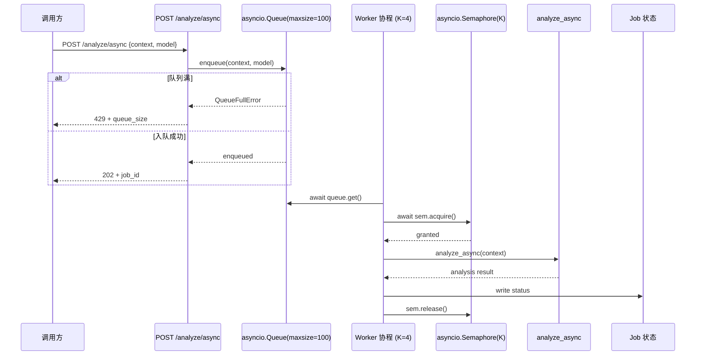

#### 16.2.3 关键设计要点

| 维度 | 设计 |
| --- | --- |
| **背压** | 队列满抛 `QueueFullError`，端点返回 `429 + queue_size`（暴露当前队列深度，调用方可据此退避） |
| **优雅停机** | `drain(timeout)`：取消 worker → `queue.join(timeout)` 等排空 → 统计 `{drained, unfinished}`，未完成任务在停机时可见 |
| **隔离性** | 消费协程**延迟导入** `analyze_async`，对 analyzer.py 零侵入；analyzer 仍可被同步 `/analyze` 端点直接调用 |
| **生命周期** | 在 [main.py](../../app/main.py) 的 `lifespan` 中启动 K 个 worker，停机时调用 `drain(timeout)` |
| **配置开关** | `llm_async_analysis_enabled=False` 默认关闭，启用时才挂载 `/analyze/async` 路由并启动 worker |

#### 16.2.4 配置项

| 配置项 | 类型 | 默认值 | 说明 |
| --- | --- | --- | --- |
| `llm_async_analysis_enabled` | bool | False | 是否启用异步分析队列 |
| `llm_queue_maxsize` | int | 100 | 队列容量上限（满则 429 背压） |
| `llm_queue_workers` | int | 4 | 常驻消费协程数 K（对齐 LLM RPM/TPM） |
| `llm_queue_drain_timeout` | int | 30 | 优雅停机排空超时（秒） |

#### 16.2.5 设计权衡

- **为何不用 Celery？** Celery 需引入 broker（Redis/RabbitMQ）和 worker 进程，部署复杂度上升；而 LLM 分析是 CPU/IO 混合型短任务（2-10s），进程内 `asyncio.Queue` + `Semaphore` 已能覆盖单实例削峰需求，零外部依赖。
- **为何不用裸 `BackgroundTasks`？** 见 §16.2.1——无削峰语义，无法限制并发，会打爆 LLM 上游配额。
- **队列容量 100 的依据**：单实例内存可承受 ~100 条上下文（每条平均 10KB），且 4 worker × 10s/任务 = 40 req/min，与典型 LLM RPM 配额对齐。
- **`Semaphore(K)` 与 worker 数相同**：因 worker 本身即并发上限，`Semaphore` 在此用于显式声明并发约束，并为未来"多 worker 抢同一信号量"的扩展（如多队列共享 LLM 配额）预留扩展点。

### 16.3 Track B — 向量检索 RAG（Phase 7）

#### 16.3.1 可插拔边界成交条件

> **关键设计判断**：抽象必须落在**检索语义**，禁止后端实现细节 leak。
> - ✅ 抽象接口：`add(docs) / search(query, top_k) -> [(doc, score)]`
> - ❌ 禁止 leak：Qdrant 的 `collection`/`point`/`vector_id` 等后端专属概念不得出现在 `VectorStore` ABC 中

这样未来切换到 Qdrant/Weaviate/Chroma 任意后端，调用方代码零改动。

#### 16.3.2 类层次

```
VectorStore (ABC)                       ← 抽象基类，定义 add/search 语义
    ├── InProcessVectorStore            ← Jaccard 相似度，零依赖，默认实现
    ├── NullVectorStore                 ← no-op，禁用时返回空结果
    └── QdrantVectorStore               ← OpenAI/智谱 Embeddings 语义召回；uuid5 幂等 upsert；静默降级
```

类图：

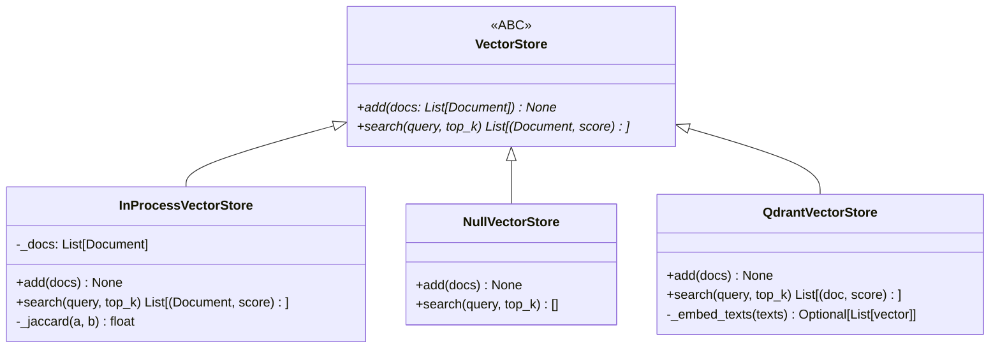

#### 16.3.3 工厂 + 注册表

| 机制 | 实现 |
| --- | --- |
| **单例工厂** | `get_vector_store()` 返回全局单例，**双重检查锁**保证线程安全 |
| **注册表插槽** | `register_vector_backend(name, cls)` 允许第三方注册新后端 |
| **内置注册** | `_REGISTRY = {"in_process": InProcessVectorStore}` |
| **未知后端** | `backend` 不在注册表 → 显式 `raise`（fail-closed，禁止静默回退） |
| **Qdrant 后端** | 已实现（`QdrantVectorStore`）：OpenAI/智谱 Embeddings 语义召回 + `uuid5(fingerprint)` 幂等 upsert + Qdrant 原生 `score_threshold` 过滤；不可用时静默降级（add=no-op / search=空），绝不穿透 LLM 主链路 |

#### 16.3.4 集成位置

在 [analyzer.py](../../app/llm/analyzer.py) 中：

```
analyze(context)
   │
   ├─ 精确指纹 hit（L1/L2 缓存命中） → 直接返回缓存结果
   │
   └─ 精确指纹 miss
        │
        ├─ vector_store_enabled=False → 跳过向量召回
        │
        └─ vector_store_enabled=True
             │
             ├─ vector_store.search(context.fingerprint, top_k=3)
             │     ↓ score >= 0.3
             ├─ 命中相似历史上下文 → 注入到 LLM prompt 作为 KB 参考
             └─ 返回结果新增字段：
                  ├─ knowledge_base_hit: bool（是否命中向量召回）
                  └─ analysis_source: str（"cache" | "vector_kb" | "llm"）
```

#### 16.3.5 配置项

| 配置项 | 类型 | 默认值 | 说明 |
| --- | --- | --- | --- |
| `vector_store_enabled` | bool | False | 是否启用向量检索 RAG |
| `vector_store_backend` | str | "in_process" | 后端名称（注册表 key） |
| `vector_store_top_k` | int | 3 | 召回条数上限 |
| `vector_store_min_score` | float | 0.3 | 相似度下限（低于此分数丢弃） |

#### 16.3.6 设计权衡

- **为何用 Jaccard 而非余弦相似度？** InProcessVectorStore 定位为零依赖的默认实现，Jaccard 仅需集合运算，无需嵌入模型；上生产时切换到 Qdrant 等带向量的后端即可获得语义相似度。
- **为何 `min_score=0.3`？** Jaccard 在 token 集合较小时分布偏低，0.3 是经验阈值过滤明显无关项；切换到余弦相似度后端时该阈值需重新校准。
- **为何在精确指纹 miss 后才做向量召回？** 精确命中走缓存（O(1) L1/L2），miss 才进入向量召回（O(N) 扫描）——分级降级，最大化缓存命中率。
- **为何禁止静默回退？** 配置 `backend=qdrant` 但 Qdrant 运行时不可用时，静默回退到 `in_process` 会让用户误以为在用 Qdrant——这是"静默半死"反模式。当前实现采用"静默降级"：后端类型不变（仍是 `QdrantVectorStore`），但 `add` 变 no-op、`search` 返回空，绝不抛异常穿透 LLM 主链路，绝不偷偷换后端。

#### 16.3.7 RAG 数据流详解（2026-07-26 补充）

##### 原始数据来源

> **关键设计判断**：本项目的 RAG 不是传统"文档切片 RAG"，而是**"运行时分析结果 RAG"**。原始数据不是静态文件（Markdown/PDF），而是 LLM 实时分析产生的结构化 JSON。

**唯一写入源头**：`analyzer._persist_analysis_to_knowledge_base()`（[analyzer.py:610-645](../../app/llm/analyzer.py#L610-L645)）

```
用户 POST /api/debug/analyze
  → analyzer.analyze(context)
    → LLM 分析成功，获得 result["analysis"]
      → _persist_analysis_to_knowledge_base(fingerprint, result)
        ├─ upsert_knowledge_entry()  → 进程内 LRU 知识库（精确匹配用）
        └─ vector_store.add([...])  → 向量库（语义检索用）
             └─ doc = {fingerprint, analysis, fix_suggestion, source}
```

**写入数据结构**：

| 字段 | 类型 | 说明 |
|------|------|------|
| `fingerprint` | str | 错误指纹（`_get_error_fingerprint(context)` 生成），作为知识库 key 和 Qdrant point id |
| `analysis` | dict | LLM 分析结果：`{root_cause, impact, confidence, fix, ...}` |
| `fix_suggestion` | str | 修复建议（`analysis.get("fix", "")`） |
| `source` | str | 固定 `"llm"`，标记数据来源 |

**触发时机**：每次 LLM 分析成功后自动沉淀，无需手动导入或批处理任务。

##### 切片（Chunking）机制说明

> **本项目没有传统意义上的文档切片**。原因是数据形态不同。

**对比传统 RAG**：

| 维度 | 传统文档 RAG | 本项目 RAG |
|------|-------------|-----------|
| 原始数据 | 长文本文件（几百～几千 token） | 短 JSON dict（几十～几百 token） |
| 切片方式 | 按 token/段落/字符数切块（chunk_size=512, overlap=50） | **无需切片**——单条数据本身就是合理粒度 |
| 向量化单位 | 每个 chunk 独立 embedding | 整条 JSON 序列化后直接 embedding |

**实际的数据处理管线**（替代切片的轻量化方案）：

**Step 1 — 序列化**（所有后端共用）：
```python
# vector_store.py:36-38
def _serialize_doc(doc: dict) -> str:
    return json.dumps(doc, ensure_ascii=False, default=str)
```
把 dict → JSON 字符串，确保可序列化/可比较。

**Step 2 — Token 化**（仅 InProcessVectorStore 用）：
```python
# vector_store.py:29-33
def _tokenize(text: str) -> set[str]:
    _TOKEN_SPLIT = re.compile(r"[^0-9A-Za-z]+")
    return {tok for tok in _TOKEN_SPLIT.split(text.lower()) if tok}
```
按非字母数字切分为 token set，用于 Jaccard 相似度。**这不是切片，而是标准化数据粒度**——把 JSON 字符串转为 token 集合，便于集合运算。

**Step 3 — Embedding**（仅 QdrantVectorStore 用）：
```python
# qdrant_vector_store.py:180-217
def _embed_texts(texts: list[str]) -> Optional[list[list[float]]]:
    for i in range(0, len(texts), 2048):  # 2048 条/批，API 限制
        chunk = texts[i : i + 2048]
        response = client.embeddings.create(model=..., input=chunk)
```
这里的 `chunk` 是 **API 批量分片**（2048 条/批，受 OpenAI Embeddings API 单次输入上限限制），**不是数据切片**。每条 JSON 字符串整体做 embedding。

**给答辩的话术建议**：
> "我的 RAG 没有传统意义上的文档切片。因为我的原始数据是 LLM 实时分析产生的结构化 JSON（root_cause + fix_suggestion，通常几十到几百 token），不是长文本文件。每条数据本身就是合理的检索粒度，直接序列化后就可以做 embedding 或 token 化，不需要再切块。如果未来要接入静态文档知识库，我会在 `app/rag/` 下新增文档加载器和切片器模块，保持现有 VectorStore 接口不变。"

##### 三层 RAG 回退机制

```
analyze(context)
  │
  ├─ L1: get_knowledge_entry(fingerprint)
  │       精确指纹匹配 → 零延迟零成本 → 直接返回历史分析
  │
  ├─ L2: _try_vector_rag(context)  ← L1 miss 时
  │       query = json.dumps(context)
  │       → retrieve_similar(query)
  │         → vector_store.search(query, top_k)
  │            ├─ InProcess: token Jaccard 相似度
  │            └─ Qdrant: cosine 语义相似度
  │       → 命中 → 返回历史分析，标记 analysis_source="vector_rag"
  │
  └─ L3: LLM 新分析  ← L2 也 miss 时
          _retry_call() 调 LLM 做全新分析
          → 成功后自动回写 L1 + L2
```

| 层级 | 方法 | 成本 | 延迟 | 触发条件 |
|------|------|------|------|----------|
| **L1 精确命中** | `get_knowledge_entry()` | O(1) 哈希查找 | <1ms | 错误指纹完全匹配 |
| **L2 向量召回** | `retrieve_similar()` | O(N) 扫描 / 1 次 Embedding API | 10-500ms | L1 miss，精确指纹不存在 |
| **L3 LLM 新分析** | `_retry_call()` | 1-N 次 LLM API 调用 | 2-30s | L2 也 miss，全新错误 |

##### 双后端实现对比

| 维度 | InProcessVectorStore（默认） | QdrantVectorStore（生产） |
|------|---------------------------|--------------------------|
| **相似度算法** | Jaccard = \|交集\|/\|并集\| | Cosine 向量相似度 |
| **依赖** | 零外部依赖 | qdrant-client + OpenAI/智谱 Embeddings |
| **语义理解** | 无（纯 token 重叠） | 有（Embeddings 模型语义空间） |
| **数据存储** | 进程内 OrderedDict | Qdrant 向量数据库 |
| **持久化** | 进程级（重启丢失） | 服务级（重启保留） |
| **幂等写入** | 不适用 | uuid5(fingerprint) 确定性 id |
| **适用场景** | 开发/测试/离线 | 生产环境 |
| **切换方式** | `VECTOR_STORE_BACKEND=in_process` | `VECTOR_STORE_BACKEND=qdrant` |

##### 知识库 LRU 淘汰机制

`KnowledgeBaseStore` 用 `OrderedDict` 实现 LRU（[knowledge_base.py:42-114](../../app/rag/knowledge_base.py#L42-L114)）：

- 容量上限：100 条（`DEFAULT_MAX_ENTRIES = 100`）
- 每次 `get`/`upsert` 后 `move_to_end(fingerprint)` 标记为最近使用
- 超上限时 `popitem(last=False)` 淘汰最久未使用条目
- 线程安全：`threading.Lock` 保护所有读写

##### 全链路降级容错

| 故障场景 | 行为 | 代码位置 |
|----------|------|----------|
| `vector_store_enabled=False` | 返回 `NullVectorStore`，add=no-op，search=[] | [vector_store.py:157-158](../../app/rag/vector_store.py#L157-L158) |
| qdrant-client 未安装 | 静默降级为 no-op，warning 日志 | [qdrant_vector_store.py:70-76](../../app/rag/qdrant_vector_store.py#L70-L76) |
| Qdrant 连接失败 | `_qdrant_collection_ready=True` 后不再重试 | [qdrant_vector_store.py:126-134](../../app/rag/qdrant_vector_store.py#L126-L134) |
| Embedding API 失败 | `_embed_texts` 返回 None，add/search 均 no-op | [qdrant_vector_store.py:214-216](../../app/rag/qdrant_vector_store.py#L214-L216) |
| 向量召回异常 | `_try_vector_rag` catch → return None → 继续走 LLM | [analyzer.py:582-584](../../app/llm/analyzer.py#L582-L584) |

##### Agent 侧 RAG 消费

`RepairContextAssembler._safe_vector_recall()`（[context_assembler.py:71-86](../../app/agent/context_assembler.py#L71-L86)）独立调用 `retrieve_similar()`，将召回结果注入 `repair_context.vector_recall`，供 `RepairAgent` 生成修复方案时参考历史相似案例。这是 RAG 的第二个消费方（第一个是 `analyzer._get_knowledge_base_result()`）。

### 16.4 Track C — RBAC + API_KEY 轮换（AUDIT-2-13/14）

#### 16.4.1 零签名变更成交条件

> **关键设计判断**：RBAC 和 key 轮换必须**零侵入**鉴权公共接口。
> - `AuthMiddleware` 公共签名未变（仅 `__init__`/`dispatch` 体内调 key_rotation/rbac）
> - `setup_middleware(app)` 签名未变
> - [ingest.py](../../app/api/ingest.py) 完全无鉴权改动

这样所有现有路由、客户端 SDK、测试用例零改动即可继续工作。

#### 16.4.2 多 Key 轮换

| 维度 | 设计 |
| --- | --- |
| **配置格式** | `api_keys` 逗号分隔优先（如 `key1,key2,key3`），空时回退单 `api_key`（向后兼容） |
| **恒定时间比较** | `verify_api_key` 遍历所有 key **不短路** + `hmac.compare_digest`，防时序侧信道泄漏"命中第几个 key" |
| **轮换语义** | 新旧 key 可同时生效，老 key 在客户端切换完成后从 `api_keys` 移除即可——无需停机 |
| **fail-closed** | `api_keys` 配置但 `api_key` 未配置时，鉴权正常启用；两者皆未配置时整体禁用（启动告警） |

#### 16.4.3 角色分级（RBAC）

```
角色层级（高 → 低）：admin > developer > viewer

rbac_enabled=False  →  所有有效 key 默认 admin（向后兼容）
rbac_enabled=True   →  按 key→role 映射查表
                          ├─ 命中映射 → 返回对应 role
                          └─ 未命中映射 → 默认 viewer（fail-closed）
```

#### 16.4.4 FastAPI 依赖集成

```python
# 工厂模式：require_role(*allowed_roles) 返回 FastAPI 依赖
@router.post("/admin/operation",
             dependencies=[Depends(require_role("admin"))])
async def admin_operation(): ...

@router.post("/dev/debug",
             dependencies=[Depends(require_role("admin", "developer"))])
async def dev_debug(): ...
```

依赖读取 `request.state.role`（由 `AuthMiddleware.dispatch` 在验 key 后注入），无需重复验 key。

#### 16.4.5 中间件集成数据流

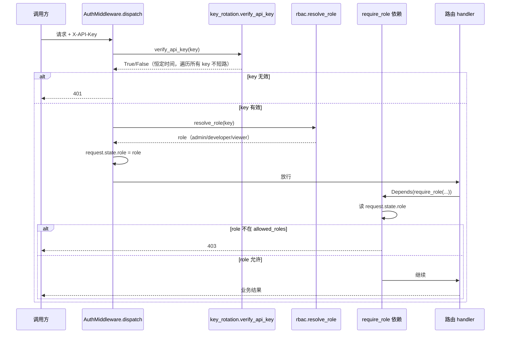

#### 16.4.6 配置项

| 配置项 | 类型 | 默认值 | 说明 |
| --- | --- | --- | --- |
| `api_keys` | str | "" | 逗号分隔的多 key 列表（优先于 `api_key`） |
| `api_key` | str | "" | 单 key（向后兼容，`api_keys` 为空时回退） |
| `rbac_enabled` | bool | False | 是否启用角色分级（关闭时全 admin） |
| `rbac_role_map` | dict | {} | key→role 映射（如 `{"admin_key": "admin", "dev_key": "developer"}`） |

#### 16.4.7 设计权衡

- **为何遍历所有 key 不短路？** 短路会在"命中第几个 key"上泄漏时序信息——攻击者据此可推断 key 数量和命中位置。恒定时间遍历 + `compare_digest` 是时序侧信道防御的标准做法。
- **为何 `rbac_enabled=False` 时全 admin？** 向后兼容——现有用户升级后行为不变，所有 key 仍可访问全部端点；显式开启 `rbac_enabled=True` 才进入分级模式。
- **为何未命中映射默认 viewer？** fail-closed 原则——配置了 RBAC 但忘记给某个 key 分配角色，应给最低权限而非最高，避免误授权。
- **为何用 FastAPI `Depends` 而非中间件层做角色检查？** 中间件层无法知道每个路由的角色要求；`Depends` 让路由声明式地表达"我需要什么角色"，职责清晰，且与 FastAPI 生态对齐。

### 16.5 三轨协同效应

三轨并非孤立功能，它们在 LLM 分析链路上形成协同：

```
Track C (RBAC)        Track A (削峰队列)         Track B (向量检索)
       │                     │                         │
       ▼                     ▼                         ▼
  鉴权 + 角色门控      /analyze/async 削峰        精确 miss 后向量召回
       │                     │                         │
       └─────────────────────┼─────────────────────────┘
                             ▼
                    LLM 分析链路（高可用 + 可控成本 + 知识增强）
```

- **Track C** 保证 `/analyze/async` 端点可被角色门控（如仅 `developer` 及以上可触发异步分析）
- **Track A** 在 LLM 上游削峰，防止突发请求打爆 RPM/TPM 配额
- **Track B** 在 LLM 调用前做向量召回，命中相似历史上下文时减少重复 LLM 调用（与 §3.4.6 的 L1/L2 缓存互补——L1/L2 走精确指纹，向量召回走语义相似）

### 16.6 测试与验证策略

| 轨道 | 测试要点 |
| --- | --- |
| Track A | 队列满时返回 429 + queue_size；K worker 并发上限对齐 Semaphore；`drain(timeout)` 统计 `{drained, unfinished}` 正确；feature flag 关闭时不挂载路由 |
| Track B | `InProcessVectorStore` Jaccard 相似度计算正确；`NullVectorStore` 返回空；`QdrantVectorStore` 降级矩阵（client/embedding/upsert/search 各失败点）；`knowledge_base_hit`/`analysis_source` 字段正确填充；`min_score` 过滤生效 |
| Track C | 多 key 恒定时间比较（无短路）；`api_keys` 空时回退 `api_key`；`rbac_enabled=False` 全 admin；未命中映射默认 viewer；`require_role` 工厂正确放行/拒绝 |

### 16.7 限制与未来扩展

**当前限制**：
1. Track A 的队列是进程内的，多 worker 实例间无共享队列（需 Redis Stream / Celery 才能跨实例削峰）
2. Track B 的 `InProcessVectorStore` 用 Jaccard，无语义相似度（已通过 `QdrantVectorStore` 提供语义召回后端，2026-07-26 落地）；Jaccard 后端保留作为零依赖默认实现
3. Track C 的 `rbac_role_map` 是静态配置，无运行时管理接口（增删 key 需改配置重启）

**未来扩展**：
- Track A：Redis Stream 作为分布式队列，跨实例共享配额
- Track B：~~实现 `QdrantVectorStore`，引入嵌入模型（如 `text-embedding-3-small`）做语义召回~~ ✅ 已完成（2026-07-26）；后续可扩展 Weaviate / Chroma 等其他向量后端（通过 `register_vector_backend` 注册表插槽）
- Track C：运行时 key 管理 API（CRUD key + role，写入 PG/Redis），无需重启

---

## 17. AI Debug Agent：自动修复 + 多 Agent 协同（Phase 1 + Phase 2 DAG）

> 本章记录 AI Debug Agent Phase 1（单 Agent `RepairAgent` + `BaseAgent` ABC 框架）与 Phase 2（多 Agent DAG：`GitAgent` + `TestAgent` + `SecurityAgent` 编排）的架构设计。
> Phase 2 于 2026-07-30 落地（`AGENT-002`）。
> 关键代码入口：[app/agent/](../../app/agent/)（11 文件）、[app/api/debug.py](../../app/api/debug.py)（2 REST 端点）、[app/mcp/tools/repair_api.py](../../app/mcp/tools/repair_api.py)（2 MCP 工具）。

### 17.1 设计目标与 Phase 1 定位

| 维度 | 设计 |
| --- | --- |
| **目标** | 在错误已捕获并完成根因分析后，自动产出可执行的修复计划（`RepairPlan`），把"分析 → 修复"链路从纯人工升级为 Agent 辅助 |
| **Phase 1 定位** | 单 Agent（`RepairAgent`）+ 多 Agent 协同框架（`BaseAgent` ABC 预留）。**不**在 Phase 1 实现 Git Agent / Test Agent / Security Agent |
| **Phase 2 待办** | ✅ 已完成（2026-07-30，`AGENT-002`）：在 `BaseAgent` ABC + `Coordinator` 框架上扩展多 Agent DAG（`GitAgent` + `TestAgent` + `SecurityAgent`）与并行编排 |
| **零侵入约束** | 默认 `agent_enabled=False`，路由不挂载，行为与旧版完全一致；启用后通过独立队列与 `Coordinator` 编排，不修改 `analyzer.py` 公共签名 |
| **向后兼容** | 9 个 `agent_*` 配置项全部默认关闭；`RepairAgent` 复用 `analyzer._get_async_client` 取 LLM 客户端，不重复造客户端管理逻辑 |

### 17.2 模块结构（`app/agent/`，11 文件）

```
app/agent/
├── __init__.py              ← 模块导出
├── base.py                  ← BaseAgent ABC + AgentContext/AgentResult/AgentTrace + AgentStatus
├── schemas.py               ← Pydantic 模型：RepairRequest/RepairPlan/RepairJob/Sources
├── context_assembler.py     ← RepairContextAssembler（并发聚合 analyze + retrieve_similar + get_recent_diff）
├── repair_agent.py          ← RepairAgent（复用 analyzer._get_async_client + 独立重试/fallback）
├── git_agent.py             ← GitAgent（Phase 2，git blame/diff 归因，不调 LLM）
├── test_agent.py            ← TestAgent（Phase 2，验证策略生成，依赖 repair_plan）
├── security_agent.py        ← SecurityAgent（Phase 2，修复方案安全审查，依赖 repair_plan）
├── dag.py                   ← 多 Agent DAG 拓扑定义（Phase 2）
├── repair_queue.py          ← RepairQueue + lifespan helper（结构对称 analysis_queue.py）
└── coordinator.py           ← Coordinator 编排器（Phase 1 单 Agent 串行 / Phase 2 多 Agent DAG）
```

#### 17.2.1 `BaseAgent` ABC（`base.py`）

| 抽象 | 职责 |
| --- | --- |
| `BaseAgent` ABC | 定义 `run(ctx: AgentContext) -> AgentResult` 抽象方法；子类只需实现业务逻辑，trace 收集、状态机、错误兜底由基类统一承担 |
| `AgentContext` | Agent 执行上下文（request_id / payload / assembled_context / trace 收集器） |
| `AgentResult` | Agent 执行结果（status / payload / error / trace） |
| `AgentTrace` | 执行轨迹（步骤名 / 耗时 / 输入摘要 / 输出摘要 / 降级标记），供 `Coordinator` 聚合后回传调用方 |
| `AgentStatus` | 枚举：`pending` / `running` / `succeeded` / `failed` / `fallback` |

设计意图：Phase 2 多 Agent DAG 时，新增 `GitAgent` / `TestAgent` / `SecurityAgent` 直接继承 `BaseAgent` 并实现 `run()`，编排逻辑由 `Coordinator` 扩展，业务子类零感知框架演进。

#### 17.2.2 `RepairAgent`（`repair_agent.py`）

| 维度 | 设计 |
| --- | --- |
| **LLM 客户端** | 复用 `analyzer._get_async_client()` 取 `AsyncOpenAI` 客户端，避免重复造客户端管理逻辑；模型选择优先 `agent_repair_model`，空则继承 `llm_model` |
| **重试 / Fallback** | 独立实现重试（`agent_repair_max_retries`）+ 指数退避 + 限流/超时处理；耗尽切换 `agent_repair_fallback_model`；与 `analyzer._retry_call` 同构但解耦，互不影响 |
| **JSON 容错** | `_validate_repair_plan(raw)` 容错解析 LLM 输出（缺字段补默认、超长截断、非法 confidence 归 "low"），与 `analyzer._validate_and_normalize` 风格一致 |
| **降级** | LLM 不可用时返回结构化 fallback（`status=failed` + 原因），不抛异常穿透到 `Coordinator` |

#### 17.2.3 `RepairContextAssembler`（`context_assembler.py`）

并发聚合三个子采集器，各失败静默降级：

| 子采集器 | 数据源 | 失败降级 |
| --- | --- | --- |
| `analyze_async(context)` | `app/llm/analyzer.py` LLM 根因分析 | 失败 → `root_cause=None`，trace 记录降级 |
| `retrieve_similar(fingerprint)` | `app/rag/vector_store.py` 向量召回 | 失败 → `similar_cases=[]`，trace 记录降级 |
| `get_recent_diff()` | `app/runtime/core/git.py` 最近 Git diff | 失败 → `recent_diff=None`，trace 记录降级 |

并发执行使用 `asyncio.gather(*tasks, return_exceptions=True)`，任一异常被捕获并转为降级标记，不阻断主链路。

#### 17.2.4 `RepairQueue`（`repair_queue.py`）

结构对称 `app/llm/analysis_queue.py`：

| 维度 | 设计 |
| --- | --- |
| **有界队列** | `asyncio.Queue(maxsize=agent_queue_maxsize)`，满载时新请求直接 429（快速失败） |
| **并发上限** | `asyncio.Semaphore(agent_queue_workers)` 对齐 LLM RPM/TPM |
| **常驻消费协程** | K 个 worker 协程常驻，从队列取任务执行 |
| **优雅停机** | `drain(timeout=agent_queue_drain_timeout)`：取消 worker → `queue.join(timeout)` → 统计 `{drained, unfinished}` |
| **生命周期** | `app/main.py` lifespan 启动期 `start_repair_queue()`，停机期 `drain_repair_queue(timeout)` |

#### 17.2.5 `Coordinator` 编排器（`coordinator.py`）

| 接口 | 职责 |
| --- | --- |
| `submit_repair(request)` | 入队修复请求，返回 `job_id`；队列满抛 `QueueFullError` |
| `get_repair_result(job_id)` | 查询修复结果（含 `RepairPlan` + `AgentTrace`） |

编排流程：

```
submit_repair(request)
   │
   ▼
RepairQueue.enqueue(request)  ──→ asyncio.Queue(maxsize=N)  [满则 429]
                                  │
                                  ▼
                  K 常驻 worker 协程（main.py lifespan 启动）
                                  │
                                  ▼
                  Coordinator._execute(request)
                                  │
                                  ├─ RepairContextAssembler.assemble(request)
                                  │     ├─ analyze_async(...)        [失败静默降级]
                                  │     ├─ retrieve_similar(...)     [失败静默降级]
                                  │     └─ get_recent_diff()         [失败静默降级]
                                  │
                                  ├─ RepairAgent.run(ctx) → AgentResult
                                  │     ├─ LLM 调用（独立重试/fallback）
                                  │     └─ _validate_repair_plan 容错 JSON
                                  │
                                  └─ 收集 AgentTrace → 写 job 状态
```

设计意图：`Coordinator` 是 Phase 2 多 Agent DAG 的编排入口——Phase 2 时扩展为「`assemble_context` → `schedule_agents([GitAgent, TestAgent, SecurityAgent])` → `aggregate_traces`」，对外接口 `submit_repair` / `get_repair_result` 不变。

### 17.3 数据流（POST /api/debug/repair/async 端到端）

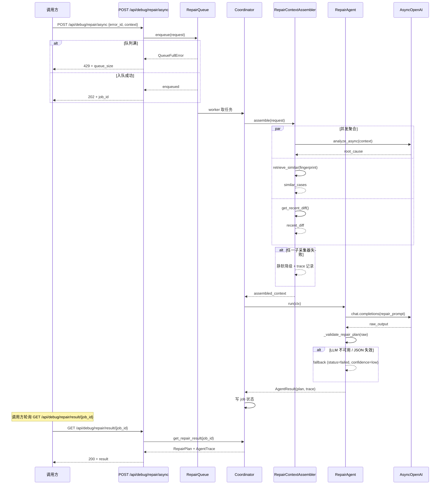

### 17.4 降级矩阵

| 失败点 | 行为 | 调用方可见 |
| --- | --- | --- |
| `agent_enabled=False` | 路由不挂载，零行为变更 | `404 Not Found` |
| `RepairQueue` 满 | 入队抛 `QueueFullError` | `429 Too Many Requests` + `queue_size` |
| `analyze_async` 失败 | `RepairContextAssembler` 静默降级，`root_cause=None` | `RepairPlan` 中 `root_cause=null`，`AgentTrace` 记录降级 |
| `retrieve_similar` 失败 | 静默降级，`similar_cases=[]` | `RepairPlan` 中 `similar_cases=[]`，trace 记录 |
| `get_recent_diff` 失败 | 静默降级，`recent_diff=None` | `RepairPlan` 中 `recent_diff=null`，trace 记录 |
| LLM 调用失败（重试耗尽） | `RepairAgent` 返回 `status=failed` + 原因 | `RepairPlan.status=failed`，`error` 字段含原因 |
| LLM 返回非 JSON / 字段缺失 | `_validate_repair_plan` 容错填充默认值 | `RepairPlan.confidence=low`，`raw_truncated` 字段保留前 500 字符 |
| `RepairQueue.drain` 超时 | 未完成任务在停机时可见 | `get_repair_result` 返回 `status=cancelled` |

### 17.5 配置项（11 个，统一前缀 `agent_`）

| 配置项 | 类型 | 默认值 | 说明 |
| --- | --- | --- | --- |
| `agent_enabled` | bool | False | 是否启用 AI Debug Agent（false=不挂载路由，零行为变更） |
| `agent_queue_maxsize` | int | 50 | 修复队列容量上限（满则 429 背压） |
| `agent_queue_workers` | int | 2 | 常驻消费协程数 K |
| `agent_queue_drain_timeout` | int | 60 | 优雅停机排空超时（秒） |
| `agent_model` | str | "" | 修复 Agent 使用的 LLM 模型（空则继承 `llm_model`） |
| `agent_max_retries` | int | 2 | 修复 Agent LLM 调用重试次数（独立于 `llm_max_retries`） |
| `agent_timeout` | int | 90 | 修复 Agent 单次执行总超时（秒，含 LLM 调用 + 重试） |
| `agent_prior_analysis_enabled` | bool | True | 是否启用上下文装配的 prior_analysis（关闭则仅基于原始 debug_context） |
| `agent_multi_agent_enabled` | bool | False | Phase 2 多 Agent DAG 开关（false=走 Phase 1 单 Agent 串行） |
| `agent_dag_parallel_timeout` | int | 0 | Phase 2 DAG 并行节点总超时（秒，0=继承 `agent_timeout`） |
| `agent_dag_failure_threshold` | int | 2 | 并行节点失败数阈值，触发 `dag_degraded=True`（不阻断聚合） |

### 17.6 测试策略

| 层级 | 测试文件 | 用例数 | 要点 |
| --- | --- | --- | --- |
| 单元测试 | `tests/unit/test_agent_base.py` 等 10 文件 | 116 | `BaseAgent` ABC 状态机、`RepairAgent` 重试/fallback/JSON 容错、`GitAgent` 归因/SKIPPED/降级、`TestAgent` 验证策略生成、`SecurityAgent` 安全审查/10 类风险归一化、`dag.py` 拓扑、`Coordinator` Phase 1 兼容 + Phase 2 DAG 调度 + `dag_degraded` 信号、`RepairContextAssembler` 并发降级、`RepairQueue` 削峰/drain、schemas 校验 |
| 集成测试 | `tests/integration/test_repair_agent_e2e.py` 等 3 文件 | 8 | e2e 端到端（skip-if-no-api-key）、队列满 429、降级矩阵、`agent_enabled=False` 零行为变更 |

测试基线：单元 `636 passed / 6 skipped / 0 failed`（Phase 1 基线 520 → 583 → Phase 2 增至 636，新增 53 项）；ruff 0 违规。

### 17.7 设计权衡

- **为何 Phase 1 只做单 Agent？** 多 Agent DAG（Git/Test/Security）需要先验证 `BaseAgent` ABC + `Coordinator` 编排框架的可扩展性；Phase 1 用 `RepairAgent` 单 Agent 跑通完整链路（上下文装配 → Agent 执行 → trace 收集 → 结果回传），为 Phase 2 多 Agent 并行编排打地基。
- **为何 `RepairAgent` 复用 `analyzer._get_async_client`？** 避免重复造 LLM 客户端管理逻辑（连接池、超时、provider 切换）；`analyzer` 已稳定，复用其客户端获取函数零风险。
- **为何 `RepairQueue` 结构对称 `analysis_queue.py`？** 削峰语义完全一致（有界队列 + Semaphore + K worker + drain），复用同一套模式降低认知负担；未来可抽象为通用 `AgentQueue` 基类。
- **为何 `RepairContextAssembler` 用 `asyncio.gather(return_exceptions=True)` 而非顺序执行？** 三个子采集器（LLM 分析、向量召回、Git diff）无依赖关系，并发执行可将总延迟从 `sum(latency)` 降到 `max(latency)`；`return_exceptions=True` 保证任一失败不阻断其他。
- **为何 `_validate_repair_plan` 与 `analyzer._validate_and_normalize` 风格一致？** LLM 输出不可信是普遍问题，统一的容错模式（缺字段补默认、超长截断、非法枚举归低）降低维护成本；Phase 2 多 Agent 时各 Agent 可复用同一套容错工具。

### 17.8 限制与未来扩展

**当前限制**：
1. `RepairQueue` 是进程内的，多 worker 实例间无共享队列（与 `analysis_queue.py` 同一限制）
2. `RepairContextAssembler` 的三个子采集器是固定组合
3. Phase 2 DAG 拓扑是静态两层（先行 + 并行），暂不支持任意 DAG 依赖图（如条件分支、循环）

**未来扩展**：
- Agent 间通信机制升级（当前通过 `ctx.repair_context` 单向传递 `repair_plan`，未来可引入 `AgentContext.shared_state` 支持更复杂的 DAG 节点间数据传递）
- DAG 拓扑动态化（按错误类型选择不同 Agent 组合，如前端错误跳过 SecurityAgent）
- `RepairQueue` 抽象为通用 `AgentQueue` 基类，与 `analysis_queue.py` 复用

### 17.9 Phase 2 多 Agent DAG 实现（`AGENT-002`，2026-07-30）

> Phase 2 在 Phase 1 的 `BaseAgent` ABC + `Coordinator` 框架上扩展多 Agent DAG，零侵入既有接口。

#### 17.9.1 DAG 拓扑

```
    ┌─────────────┐
    │ RepairAgent │  (Layer 1: 先行，产出 repair_plan)
    └──────┬──────┘
           │  repair_plan 注入 ctx.repair_context
           ├──────────────┬──────────────┐
           ▼              ▼              ▼
     ┌──────────┐  ┌──────────┐  ┌──────────────┐
     │ GitAgent │  │TestAgent │  │SecurityAgent │  (Layer 2: 并行审查)
     └──────────┘  └──────────┘  └──────────────┘
```

- **Layer 1（先行）**：`PHASE2_FIRST_NODES = ["repair"]`，串行执行，产出 `repair_plan`
- **Layer 2（并行）**：`PHASE2_PARALLEL_NODES = ["git", "test", "security"]`，`asyncio.gather(return_exceptions=True)` 并行执行
- **依赖关系**：`TestAgent` / `SecurityAgent` 依赖 `repair_plan`（缺失返回 SKIPPED）；`GitAgent` 不依赖 `repair_plan`（纯 git 归因，Layer 1 失败仍执行）

#### 17.9.2 新增 Agent 职责

| Agent | 职责 | LLM 依赖 | 依赖 repair_plan | 输出 |
| --- | --- | --- | --- | --- |
| `GitAgent` | git blame/diff 归因，判断错误是否由近期改动引入 | 否（纯 git 数据） | 否 | `suspect_commits` / `recent_changes` / `attribution` |
| `TestAgent` | 基于修复方案生成验证策略（受影响测试文件、回归风险点、手动验证步骤） | 是（复用 `_get_async_client`） | 是（缺失返回 SKIPPED） | `test_plan`：`test_files` / `test_cases` / `regression_risks` / `validation_steps` / `coverage_note` |
| `SecurityAgent` | 对修复方案做安全审查（LFI/SSRF/SQLi 等 10 类风险） | 是（复用 `_get_async_client`） | 是（缺失返回 SKIPPED） | `security_review`：`risks[]` / `recommendations` / `overall_severity` / `summary` |

#### 17.9.3 Coordinator DAG 调度

| 模式 | 开关 | 行为 |
| --- | --- | --- |
| Phase 1 兼容 | `agent_multi_agent_enabled=False` | `_run_phase1()`：单 `RepairAgent` 串行，返回 `multi_agent_mode=False` |
| Phase 2 DAG | `agent_multi_agent_enabled=True` | `_run_dag()`：Layer 1 先行 → Layer 2 并行 → 聚合，返回 `multi_agent_mode=True` |

**降级与信号**：
- 并行节点失败数 ≥ `agent_dag_failure_threshold`（默认 2）→ 返回 `dag_degraded=True`（可观测信号，不阻断聚合）
- 任一并行 Agent 抛异常 → `_run_parallel_agents` 防御性兜底转为 FAILED（`return_exceptions=True` 保证不影响其他节点）
- `RepairAgent` 失败 → `repair_plan=None`，下游 `TestAgent` / `SecurityAgent` 返回 SKIPPED，`GitAgent` 仍执行

#### 17.9.4 Phase 2 返回结构

```json
{
  "repair_plan": {...} | null,
  "sources": {"vector_recall": [...], "git_context": [...], "knowledge_base_hit": bool},
  "agent_trace": [
    {"agent_name": "repair", "status": "success", ...},
    {"agent_name": "git", "status": "success", ...},
    {"agent_name": "test", "status": "success", ...},
    {"agent_name": "security", "status": "success", ...}
  ],
  "git_attribution": {...} | null,
  "test_plan": {...} | null,
  "security_review": {...} | null,
  "multi_agent_mode": true,
  "dag_degraded": false
}
```

---

## 18. Dashboard 实时 SSE 推送（DASH-SSE-001，2026-07-30）

> 对应 PRD FR20。在 Web 控制台 Dashboard 现有 10s 轮询基础上叠加 SSE 实时推送通道，使 trace/error 写入后前端无需等待下一轮轮询即可刷新。

### 18.1 设计目标与定位

| 目标 | 设计落点 |
| --- | --- |
| 降低运维观测延迟 | trace/error 写入 → `invalidate_cache` → 广播 → 前端去抖刷新（~500ms），替代最长 10s 轮询等待 |
| 零侵入主写入链路 | 广播钩子挂在 `invalidate_cache` 内，`try/except` 静默降级，广播失败不影响 trace/error 落库 |
| 向后兼容 | `dashboard_sse_enabled=False` 默认关闭，关闭时端点返回 503、广播为 no-op，行为与旧版完全一致 |
| 复用现有鉴权 | EventSource 无法设置自定义 header，复用 `AuthMiddleware` 的 `?api_key=` query 参数降级 |

### 18.2 模块结构

| 文件 | 职责 |
| --- | --- |
| `app/api/dashboard_events.py` | `DashboardEventBus` 进程内广播总线 + `broadcast_dashboard_event` 便捷函数 + 模块级 `dashboard_hub` 单例 |
| `app/api/dashboard.py` | `GET /api/dashboard/stream` SSE 端点 + `invalidate_cache` 内挂广播钩子 |
| `app/web/dashboard.html` | 前端 EventSource 客户端（去抖 refresh + 轮询兜底 + 断线重连） |
| `app/config.py` | `dashboard_sse_enabled: bool = False` feature flag |

### 18.3 DashboardEventBus 广播总线设计

**为何不复用 MCP 的 `SSEHub`（`app/mcp/transports/sse.py`）？**
MCP `SSEHub` 是 session-scoped 的——订阅需绑定 `Mcp-Session-Id`，专为 MCP 协议的 server→client notifications 设计。Dashboard 是公开 Web 控制台，无 MCP 会话概念，强制复用会引入不必要的 session 门槛与耦合。因此新建独立的 `DashboardEventBus`，职责单一：进程内 pub/sub 广播。

**核心机制**：

```python
class DashboardEventBus:
    def __init__(self) -> None:
        self._subs: list[_DashboardSubscription] = []  # (queue, loop) 元组

    def subscribe(self) -> asyncio.Queue:
        loop = asyncio.get_running_loop()           # 捕获订阅方所在事件循环
        q: asyncio.Queue = asyncio.Queue(maxsize=256)
        self._subs.append(_DashboardSubscription(queue=q, loop=loop))
        return q

    def publish(self, event: dict) -> int:
        delivered = 0
        for sub in list(self._subs):               # 快照遍历，允许迭代中修改
            try:
                sub.loop.call_soon_threadsafe(self._put_nowait, sub, event)
                delivered += 1
            except RuntimeError:                    # 订阅方 loop 已关闭
                self._safe_remove(sub)
        return delivered

    @staticmethod
    def _put_nowait(sub, event):
        try:
            sub.queue.put_nowait(event)
        except asyncio.QueueFull:                   # 慢消费者：丢旧保最新
            sub.queue.get_nowait()
            sub.queue.put_nowait(event)
```

**设计要点**：
1. **跨线程投递**：`invalidate_cache` 可能被同步写入路径（非 async 上下文）调用，`publish` 用 `loop.call_soon_threadsafe` 将 `put_nowait` 调度回订阅方的事件循环，避免跨线程直接操作 `asyncio.Queue`。
2. **队列满策略**：丢旧保最新（`get_nowait` + `put_nowait`）。Dashboard 场景下"最新状态"比"不丢事件"更重要——客户端收到任意一个 `dashboard_changed` 都会全量 re-fetch，丢失中间事件无影响。
3. **失效订阅清理**：`call_soon_threadsafe` 抛 `RuntimeError`（loop 已关闭）时 `safe_remove` 清理，避免泄漏。
4. **优雅停机**：`close_all()` 向所有订阅者投递 `{"type":"__close__"}` 终止事件，SSE 端点检测到后 `break` 退出迭代。

### 18.4 SSE 端点设计（`GET /api/dashboard/stream`）

```python
@router.get("/stream", dependencies=[Depends(require_role("admin", "developer", "viewer"))])
async def dashboard_stream(request: Request):
    if not settings.dashboard_sse_enabled:
        return JSONResponse({"detail": "Dashboard SSE 未启用"}, status_code=503)
    q = dashboard_hub.subscribe()

    async def event_stream():
        try:
            yield ": connected\n\n"
            while True:
                try:
                    msg = await asyncio.wait_for(q.get(), timeout=15.0)  # 15s 心跳
                except asyncio.TimeoutError:
                    yield ": ping\n\n"
                    continue
                if dashboard_hub.is_close_event(msg):
                    break
                yield dashboard_hub.format_event(msg)
        finally:
            dashboard_hub.unsubscribe(q)

    resp = StreamingResponse(event_stream(), media_type="text/event-stream")
    resp.headers["Cache-Control"] = "no-cache"
    resp.headers["X-Accel-Buffering"] = "no"   # 禁用 Nginx 代理缓冲
    return resp
```

**设计要点**：
1. **15s 心跳**：`asyncio.wait_for(q.get(), timeout=15.0)` 超时后 yield `: ping\n\n`（SSE 注释行，客户端忽略但保活连接），防止代理/浏览器因空闲超时断连。
2. **`finally` unsubscribe**：无论正常终止、客户端断开还是异常，都从总线注销队列，防泄漏。
3. **响应头**：`Cache-Control: no-cache` + `X-Accel-Buffering: no` 确保 Nginx/浏览器不缓冲 SSE 流。
4. **鉴权**：`require_role("admin","developer","viewer")` 依赖门控 + `?api_key=` query 降级（EventSource 无法设自定义 header）。

### 18.5 invalidate_cache 广播钩子

```python
def invalidate_cache(source: str | None = None) -> None:
    _cache.pop("all_traces", None)
    # ... Redis L2 清除 ...
    try:
        from app.api.dashboard_events import broadcast_dashboard_event
        broadcast_dashboard_event({"type": "dashboard_changed", "source": source, "ts": time.time()})
    except Exception:
        pass   # 静默降级，不阻断主链路
```

**设计意图**：广播钩子与 Redis L2 清除同级——都是缓存失效的副作用，均 `try/except` 静默降级。这保证 SSE 广播故障绝不影响 trace/error 写入主链路。

### 18.6 前端 EventSource 集成

```javascript
let _refreshTimer = null;
function scheduleRefresh() {                    // 去抖：500ms 内多次事件合并为一次 refresh
    if (_refreshTimer) return;
    _refreshTimer = setTimeout(() => { _refreshTimer = null; refresh(); }, 500);
}
function initSSE() {
    try {
        const apiKey = new URLSearchParams(location.search).get('api_key') || '';
        const url = '/api/dashboard/stream' + (apiKey ? ('?api_key=' + encodeURIComponent(apiKey)) : '');
        const es = new EventSource(url);
        es.onmessage = scheduleRefresh;
        es.onerror = () => { try { es.close(); } catch (e) {} setTimeout(initSSE, 5000); };
    } catch (e) { console.error('SSE init failed', e); }
}
refresh(); setInterval(refresh, 10000); initSSE();   // 轮询兜底 + SSE 叠加
```

**设计要点**：
1. **去抖 refresh**：500ms 合并窗口，避免高频写入触发风暴式 re-fetch。
2. **轮询兜底**：`setInterval(refresh, 10000)` 保留，SSE 断线期间轮询仍可获取更新。
3. **断线重连**：`onerror` 关闭连接后 5s 自动 `initSSE()`，应对服务端重启/网络抖动。

### 18.7 降级矩阵

| 场景 | 行为 |
| --- | --- |
| `dashboard_sse_enabled=False` | `/stream` 返回 503；`invalidate_cache` 广播为 no-op；前端 EventSource 失败后回落纯轮询 |
| 广播异常 | `try/except` 静默吞没，不影响主写入链路 |
| 订阅者 loop 已关闭 | `call_soon_threadsafe` 抛 `RuntimeError` → `safe_remove` 清理 |
| 队列满（慢消费者） | 丢旧保最新，避免阻塞广播 |
| 服务端重启 | 前端 `onerror` → 5s 重连 |

### 18.8 测试策略

`tests/unit/test_dashboard_sse.py`（18 用例）覆盖：
- `DashboardEventBus`：subscribe/unsubscribe/publish/close_all、跨线程投递、队列满丢旧保最新、失效订阅清理
- `dashboard_stream` 端点：`enabled=False` 返回 503、`enabled=True` 返回 `text/event-stream` + `: connected`、15s 心跳、close 事件终止、`finally` unsubscribe
- `invalidate_cache` 广播钩子：触发广播、广播失败静默降级
- 确定性测试：直接迭代 `StreamingResponse.body_iterator`，绕过 HTTP 层避免 async 死锁

测试基线：654 passed / 6 skipped / 0 failed（583 → 654，新增 18 项）；ruff 0 违规。

---

## 19. v0.4.0 架构评审决策（2026-08-03 架构委员会）

> 本节记录架构委员会对 v0.4.0 开发路线的最终决策，包括项目状态评估、Quality System 评分模型设计、评分基线建立、M2-M4 改进逻辑与评分推演。
> 配套文档：PRD.md §12.2（v0.4.0 路线图）。

### 19.1 项目当前状态评估

| 维度 | 判定 | 依据 |
| --- | --- | --- |
| 代码完整度 | Beta | 8 个 Phase 全部落地，654 单元测试通过 |
| 价值可证明性 | Demo | Debug Context 质量无法量化，无法回答「用了比不用好多少」 |
| 部署就绪度 | Beta | Docker Compose 一键部署，但大量功能需外部依赖 |
| 综合判定 | **Beta 偏 Demo** | 代码完整度达 Beta 标准，但核心价值停留在 Demo 级别 |

**v0.4.0 的核心任务：把「代码上的 Beta」变成「价值上的 Beta」。**

### 19.2 Quality System 评分模型设计

#### 19.2.1 设计目标

Quality System 的核心问题是：**如何量化 Debug Context 的质量，让「用了比不用好多少」可度量。**

评分模型需要回答两个问题：
1. **上下文完整度（ContextCompleteness）**：采集到的调试上下文各维度是否齐全？→ 衡量「有没有」
2. **分析可信度（AnalysisConfidence）**：已有证据对根因推断的支持强度如何？→ 衡量「靠不靠谱」

综合评分公式：`overall_score = completeness × confidence`（乘法而非平均，隐含「数据再全，证据不相关也白搭」的语义）。

#### 19.2.2 9 维度加权评分

ContextCompleteness 将 Debug Context 拆分为 9 个维度，各维度独立评分（0.0~1.0），加权平均得到整体完整度：

| 维度 | 权重 | 评分逻辑 | 数据来源 |
| --- |:---:| --- | --- |
| Trace（异常堆栈） | 0.20 | ≥5帧=1.0，2-4帧=0.7，1帧=0.4，无=0.0 | `debug_context.exception` |
| CodeSnippet（源码片段） | 0.20 | 全部找到=1.0，部分=0.6，全无=0.0 | `debug_context.code_snippets` |
| Runtime（运行时快照） | 0.10 | 有 pid=1.0，无=0.0 | `debug_context.runtime` |
| GitContext（Git 归因） | 0.10 | blame+diff=1.0，仅一项=0.6，无=0.0 | `debug_context.git_blame + recent_diffs` |
| Network（网络请求） | 0.08 | 有=1.0，无=0.0 | `debug_context.network_trace` |
| UIEvent（前端事件） | 0.05 | 有=1.0，无=0.0 | `debug_context.ui_events` |
| Spec（规范校验） | 0.07 | spec_diffs=1.0，仅related_specs=0.5，无=0.0 | `debug_context.spec_diffs + related_specs` |
| KnowledgeBase（知识库） | 0.10 | 精确命中=1.0，向量召回=0.6，无=0.0 | `repair_context.sources.knowledge_base_hit + vector_recall` |
| LLMAnalysis（LLM 分析） | 0.10 | high=1.0，medium=0.8，low=0.5，无=0.0 | `repair_context.prior_analysis.confidence` |

权重设计原则：Trace + CodeSnippet 各 20%（报错场景核心），Runtime/Git/KB/LLM 各 10%（辅助分析），Network/UI/Spec 各 5-8%（场景相关）。

#### 19.2.3 模块结构

| 文件 | 职责 |
| --- | --- |
| `app/quality/schemas.py` | Pydantic 数据模型：`QualityReport` / `ContextCompleteness` / `AnalysisConfidence` / `EvidenceItem` / `DimensionScore` |
| `app/quality/scorer.py` | 规则引擎：`evaluate()` 纯函数入口 + 9 个 `_score_*()` 维度评分器 + `_extract_evidence()` 证据提取 + `_score_confidence()` 可信度评分 + `_generate_suggestions()` 改进建议 |
| `app/quality/__init__.py` | 包导出 |
| `app/config.py` | `quality_scoring_enabled: bool = True` feature flag |
| `app/agent/context_assembler.py` | `assemble()` 返回新增 `quality_report` 字段 |
| `app/llm/analyzer.py` | SYSTEM_PROMPT 增加 `reasoning_chain` + `evidence_items`；`_validate_and_normalize` 向后兼容 |
| `app/api/dashboard.py` | `get_trace_detail` 注入 `quality_report`；新增 `GET /trace/{tid}/quality` 独立端点 |
| `app/web/dashboard.html` | Quality 卡片渲染：综合评分进度条 + 9 维度网格 + 证据列表 + 改进建议 |

#### 19.2.4 设计约束

1. **纯函数**：`evaluate()` 不依赖 I/O，内部异常 `try/except` 吞掉返回 `null_score()`
2. **静默降级**：feature flag 关闭时返回 `None`，评分失败返回 `null_score()`，不阻断主流程
3. **向后兼容**：旧格式数据（缺字段）不抛异常，各 `_score_*()` 函数做兜底
4. **零侵入**：QualityScorer 在 `context_assembler.assemble()` 末尾调用，不改已有 collector/builder 逻辑

### 19.3 M1 评分基线（5 场景对比）

用 5 个模拟真实场景的 debug_context 跑 QualityScorer，建立 v0.4.0 的量化基线：

| 场景 | 完整度 | 可信度 | 综合 | 证据数 | 场景说明 |
| --- |:---:|:---:|:---:|:---:| --- |
| A-完整上下文 | 0.95 | 0.82 | 0.78 | 13 | 所有采集维度齐备 + LLM 高置信度 + 向量召回 |
| B-典型后端报错 | 0.61 | 0.82 | 0.50 | 5 | 堆栈+源码+git blame，缺少前端/网络/规范/知识库 |
| C-最简报错 | 0.18 | 0.43 | 0.08 | 2 | 仅堆栈（1帧）+运行时，其他 7 个维度全缺 |
| D-静默失败 | 0.38 | 0.80 | 0.30 | 6 | 200 OK 但 spec_diffs 偏离，无异常堆栈，KB 命中 |
| E-知识库命中 | 0.61 | 0.94 | 0.57 | 5 | 知识库精确命中，复用历史修复，跳过 LLM |
| **平均** | **0.55** | **0.76** | **0.45** | **6.2** | — |

**基线分析要点**：
1. 场景 A 完整度 0.95（Spec 仅 0.5 + KB 仅 0.6），上下限拉开说明评分器有区分度
2. 场景 C 综合 0.08，触发「完整度严重不足」警告 + 7 条缺失维度建议，能直接指导排查
3. 场景 D 无异常堆栈但 KB+spec_diffs+LLM 撑起可信度 0.80，评分器对非异常场景有合理评估
4. 场景 E 可信度 0.94 最高——5 条证据 4 条高相关，知识库复用场景确实更可信
5. 乘法公式天然区分「数据全但分析弱」（B: 0.61×0.82）和「数据少但分析强」（D: 0.38×0.80）

### 19.4 M2-M4 改进逻辑与评分推演

#### 19.4.1 M2: Debug Case Schema → KnowledgeBase 维度提升

**改进逻辑**：M2 落地 30 条种子知识覆盖高频异常模式（ValueError/TypeError/KeyError/AttributeError/ConnectionError 等）。当异常指纹精确命中知识库时，KnowledgeBase 维度从 0.0→1.0，同时 LLMAnalysis 置信度因知识库辅助从 medium→high。

**各场景维度变化**：

| 场景 | KnowledgeBase | LLMAnalysis | 完整度变化 | 可信度变化 |
| --- |:---:|:---:|:---:|:---:|
| A | 0.6→1.0（向量召回→精确命中） | 维持 1.0 | +0.04 | +0.02 |
| B | 0.0→1.0（KeyError 种子覆盖） | 0.8→1.0 | +0.10 | +0.04 |
| C | 0.0→1.0（NoneType 种子覆盖） | 0.0→1.0（有堆栈即可调 LLM） | +0.20 | +0.15 |
| D | 维持 1.0 | 0.8→1.0 | +0.02 | +0.03 |
| E | 维持 1.0 | 维持 1.0 | 0 | 0 |

#### 19.4.2 M3: Fault Localization 2.0 → CodeSnippet + GitContext 维度提升

> **实现状态：✅ 已完成（2026-08-04）**。`url_resolver.py` 按 HTTP 方法+路径反查 FastAPI 路由表定位 handler；`static_analyzer.py` 新增 `analyze_handler` 无堆栈入口；`build_debug_context` 在静默失败场景注入 `static_analysis` 字段。

**改进逻辑**：StaticAnalyzer（基于 Python `ast` 标准库，零外部依赖）在 Task 12 已落地，能从堆栈帧自动提取函数签名、参数、类型注解、复杂度、可疑输入。Task 13 将其集成到 `context_assembler`，并在无异常堆栈场景下基于网络请求 URL → handler 函数 → 源码片段的路径自动定位代码。

**各场景维度变化**：

| 场景 | CodeSnippet | GitContext | 完整度变化 |
| --- |:---:|:---:|:---:|
| A | 维持 1.0 | 维持 1.0 | 0 |
| B | 维持 1.0 | 0.6→1.0（自动采集 diff） | +0.04 |
| C | 0.0→1.0（code_locator 自动提取） | 0.0→0.6（自动采集 blame） | +0.26 |
| D | 0.0→1.0（URL→handler→源码定位） | 0.0→0.6（自动采集 blame） | +0.26 |
| E | 维持 1.0 | 0.0→0.6（自动采集 blame） | +0.06 |

#### 19.4.3 M4: Agent Verify Loop → LLMAnalysis 置信度 + 长期 KB 积累

> **实现状态：✅ 已完成（2026-08-04）**。`verify_loop.py` 实现三层开关（agent→multi→verify）+ 四级判定（high_confidence/passed/partial/failed）+ 验证通过后 KB 写回（`record_verification` 递增 `verify_count` / 提升 `case_confidence`）。Coordinator 在 `agent_verify_loop_enabled` 时走迭代闭环。

**改进逻辑**：Agent Verify Loop 形成「修复→验证→记忆」闭环，每次成功修复的案例自动写入 DebugCase。短期效果是 LLMAnalysis 置信度因 VerifyAgent 验证反馈而从 medium→high；长期效果是知识库随系统运行持续积累，KnowledgeBase 精确命中率不断提升。

**短期效果**（首次运行 M4 后）：

| 场景 | LLMAnalysis | 可信度变化 |
| --- |:---:|:---:|
| A | 维持 1.0 | 0 |
| B | 已在 M2 提升 | 0 |
| C | 已在 M2 提升 | 0 |
| D | 已在 M2 提升 | 0 |
| E | 维持 1.0 | 0 |

**长期效果**（系统运行 N 周后，KB 积累 100+ 条）：
- 场景 B/C 的 KnowledgeBase 命中率从 60%→90%+
- 平均可信度从 0.76→0.88+
- M4 的长期价值无法在单次评分推演中体现，需通过 M5 全量回归持续观测

#### 19.4.4 综合评分推演汇总

| 场景 | M1 基线 | M2 后 | M3 后 | M4 后 | 总提升 |
| --- |:---:|:---:|:---:|:---:|:---:|
| A-完整上下文 | 0.78 | 0.82 | 0.82 | 0.90 | +0.12 |
| B-典型后端报错 | 0.50 | 0.60 | 0.65 | 0.65 | +0.15 |
| C-最简报错 | 0.08 | 0.32 | 0.46 | 0.46 | +0.38 |
| D-静默失败 | 0.30 | 0.35 | 0.61 | 0.61 | +0.31 |
| E-知识库命中 | 0.57 | 0.57 | 0.65 | 0.65 | +0.08 |
| **平均** | **0.45** | **0.53** | **0.64** | **0.65** | **+0.20** |

> 注：M4 列的数值含 M2+M3 的累积效果。M4 自身的短期增量约 +0.02，长期增量随 KB 积累持续放大。

### 19.5 架构稳定性约束

以下模块在 v0.4.0 期间禁止大改（只新增不修改）：

| 模块 | 路径 | 禁止原因 |
| --- | --- | --- |
| MCP 协议层 | `app/mcp/protocol/` | 基础协议层，变更影响所有下游 |
| Storage 抽象层 | `app/runtime/core/storage/` | 接口稳定。PG 同步/异步双轨延后至 v0.5.0 |
| Browser SDK 采集链 | `browser-sdk/ai-debug.js` | 2000+ 行原生 JS，V2-V6 迭代积累。任何改动可能引入采集覆盖率退化 |
| Agent 框架 | `app/agent/base.py` | BaseAgent ABC 是多 Agent 契约基础。v0.4.0 只增加新 Agent 实现，不修改契约 |
| 安全中间件 | `app/middleware.py` | 中间件栈顺序错误可能导致安全漏洞 |
| 配置系统 | `app/config.py` | 70+ 配置项。v0.4.0 只新增配置项，不修改已有配置项签名和默认值 |

### 19.6 v0.4.0 明确不做

- ❌ 新增 MCP 工具（17 个已够用，先做深不做广）
- ❌ 合并 PG 同步/异步双轨（风险太高，留给 v0.5.0）
- ❌ 多语言 StaticAnalyzer（先用 Python 验证价值）
- ❌ Dashboard 重写/美化
- ❌ 告警/通知系统
- ❌ SaaS 托管平台
- ❌ 多项目采集隔离（v0.5.0 团队协作的前置条件）
