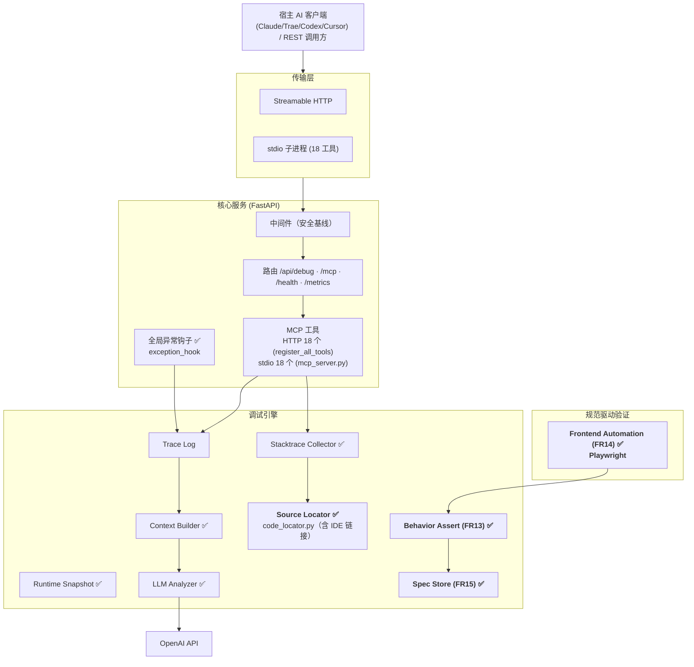
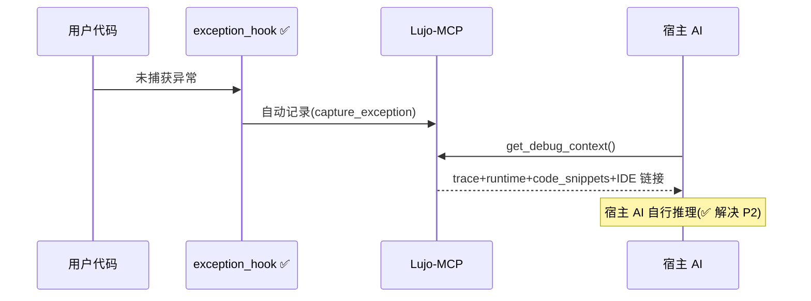
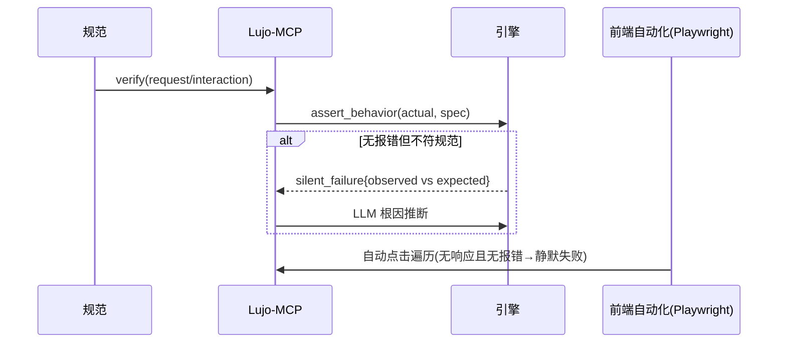

# Lujo-MCP 产品需求文档（PRD）

> 基于 MCP（Model Context Protocol）协议的 AI 智能调试服务
> 核心目标：**把开发者从「查日志 → 翻代码 → 手写规范提示词 → 丢给 AI → 反复排查」的繁琐链路中解放，并解决「无报错但功能不对」的静默失败问题。**

| 项目 | 说明 |
| --- | --- |
| 文档版本 | v6.6（v0.6.9 同步） |
| 产品名称 | Lujo-MCP |
| 当前产品版本 | v0.6.9 |
| 文档状态 | 已交付（Delivered） |
| 创建日期 | 2026-07-07 |
| 最后更新 | 2026-08-27 |
| 负责人 | AI 调试平台团队 |
| 审阅视角 | 高级工程师 / 高级架构师（代码核实） |

---

## 1. 修订记录

| 版本 | 日期 | 修订人 | 修订说明 |
| --- | --- | --- | --- |
| v1.0 | 2026-07-07 | 团队 | 首版 PRD |
| v2.0 | 2026-07-07 | 团队 | 以真实痛点重构，新增 FR11–FR15 |
| v3.0 | 2026-07-07 | 高级架构师 | **代码核实后修正实现状态**：标注自动捕获/宿主AI推理已落地；代码定位标记为"模块已实现但未接线+配置缺失"；静默失败/前端自动化确认为待开发；补充架构师痛点覆盖度矩阵与落地缺口 |
| v4.0 | 2026-07-08 | 高级后端架构师 | **参考项目迁移完成（M1–M8）**：redaction/trace_repo/network/ui_event/git/silent_failure/ingest_error/build_debug_context 全部落地；6 个新工具双传输注册；FR13 采集链就绪（自动检测仍待建）；FR14/FR15 未纳入本次优先级 |
| v4.2 | 2026-07-08 | 高级后端架构师 | **全量交付**：FR13 assert_engine+verify ✅、FR14 Playwright UI 遍历+verify_ui ✅、FR15 spec_store+闭环 ✅、浏览器 SDK TS ✅、多 LLM provider ✅、Web 控制台 Dashboard ✅。全量交付（测试状态以 [README.md](../../README.md) 项目状态表为准）。 |
| v5.0 | 2026-07-24 | 高级架构师 | **Phase 5 数据层长期优化交付**：P3-1 数据分区（traces 表按月 RANGE 分区）、P3-2 归档策略（>N 天自动归档到 traces_archive）、P3-3 批量写入、P3-5 优雅降级、P3-8 熔断器、Phase 7 智能错误分析引擎。单元测试 369 passed / 6 skipped / 0 failed；ruff 0 违规。 |
| v5.1 | 2026-07-25 | 高级架构师 | **增量能力同步**：Browser SDK V3/V6（网络错误自动标记、UI 静默失败自动检测）与指纹知识库基础能力（命中优先 + 自动沉淀）已落地；向量检索版 RAG 与 AI Debug Agent 仍为后续阶段。 |
| v5.2 | 2026-07-25 | 高级架构师 | **三轨并行交付**：P3-6 异步分析队列（有界 `asyncio.Queue` + K 常驻消费协程 + `Semaphore` 对齐 RPM/TPM + lifespan drain）；Phase 7 向量检索 RAG（`VectorStore` ABC + `InProcess`/`Null` 实现 + Qdrant 留空插槽 + 工厂注册表）；AUDIT-2-13/14 RBAC + API Key 轮换（多 key 恒定时间比较 + 角色分级 + `require_role` 依赖门控）。零侵入 `analyzer.py` 与 `AuthMiddleware` 公共签名。 |
| v5.3 | 2026-07-26 | 高级架构师 | **Qdrant 适配器 + L3 缓存预热交付**：Qdrant 向量检索适配器（`QdrantVectorStore`：OpenAI/智谱 Embeddings 语义召回 + `uuid5(fingerprint)` 幂等 upsert + 静默降级）；P3-7 L3 缓存预热（只写 L1 不刷新 L2 TTL）。向量检索 RAG 双后端（in-process + Qdrant）完整落地，AI Debug Agent 前置依赖就绪。单元测试 520 passed / 6 skipped / 0 failed。 |
| v5.4 | 2026-07-26 | 高级架构师 | **AI Debug Agent Phase 1 交付**：新增 `app/agent/` 模块（7 文件）——`BaseAgent` ABC + `AgentContext`/`AgentResult`/`AgentTrace` + `AgentStatus` 枚举、`RepairAgent`（复用 `analyzer._get_async_client`，独立重试/fallback + `_validate_repair_plan` 容错 JSON）、`RepairContextAssembler`（并发聚合 `analyze_async` + `retrieve_similar` + `get_recent_diff`，各失败静默降级）、`RepairQueue` + lifespan helper、`Coordinator` 编排器（装配上下文 → 调度 Agent → 收集 trace）。新增 2 REST 端点（`POST /api/debug/repair/async` + `GET /api/debug/repair/result/{job_id}`）+ 2 MCP 工具（`repair_async` + `repair_result`，工具数 15→17）。新增 9 个 `agent_*` 配置项（`agent_enabled` 默认 False）。Phase 1 定位为单 Agent（`RepairAgent`）+ 多 Agent 协同框架（`BaseAgent` ABC 预留），Phase 2 多 Agent DAG 为后续待办。单元测试 583 passed / 6 skipped / 0 failed；ruff 0 违规。 |
| v5.5 | 2026-07-30 | 高级架构师 | **Dashboard 实时 SSE 推送交付（`DASH-SSE-001`）**：新增 `app/api/dashboard_events.py`——`DashboardEventBus` 广播总线（无 session 门槛，跨线程 `call_soon_threadsafe` 投递，队列满丢旧保最新）；`dashboard.py` 新增 `GET /api/dashboard/stream` SSE 端点（15s 心跳 + close 事件终止）+ `invalidate_cache` 内挂广播钩子（广播失败静默降级，不影响主写入链路）；`dashboard.html` 前端 EventSource 集成（去抖 refresh + 10s 轮询兜底 + 断线 5s 重连）；`dashboard_sse_enabled=False` 默认关闭（向后兼容零开销）；鉴权复用 `?api_key=` query 降级（EventSource 无法设自定义 header）。新增 FR20 + 18 单测（测试基线 583→654 passed / 6 skipped / 0 failed）；ruff 0 违规。 |
| v5.6 | 2026-08-03 | 架构委员会 | **v0.4.0 开发路线制定 + M1 Quality Foundation 交付**：(1) 架构委员会四轮评审（代码审计 / 技术架构 / 产品战略 / 开发路线），判定项目当前为「Beta 偏 Demo」，v0.4.0 唯一核心目标为「让 Debug Context 价值可量化、可证明」；(2) 制定 17 个任务、5 个 Milestone 的执行计划（M1 Quality System → M2 Debug Case Schema → M3 Fault Localization 2.0 → M4 Agent Verify Loop → M5 全量回归）；(3) M1 全部 6 个 Task 落地——`app/quality/` 模块（schemas + scorer 规则引擎，9 维度加权评分 + 证据提取 + 改进建议）、`context_assembler.py` 质量注入、`analyzer.py` LLM 增强（reasoning_chain + evidence_items）、Dashboard 质量报告卡片 + `/api/dashboard/trace/{tid}/quality` 独立端点；M3 Task 12（StaticAnalyzer，基于 `ast` 标准库函数级静态分析）同步落地；(4) 5 场景评分基线建立（平均综合 0.45），M2-M4 评分提升预期推演完成（平均 0.45→0.65）。详见 §12.2、DESIGN.md §19。测试基线 764 passed / 6 skipped / 0 failed。 |
| v5.7 | 2026-08-04 | 架构委员会 | **M2-M4 交付**：(1) M2 Debug Case Schema——`debug_case.py` 标准 Schema + 三级指纹计算、`knowledge_base.py` 三级 fallback 匹配（L1 精确 → L1.5 归一化 → L2 类型级 Jaccard）+ 向量索引双写同步、`seed_data.py` 30 条种子知识；(2) M3 Fault Localization 2.0——`url_resolver.py` 无堆栈按方法+路径反查 handler、`static_analyzer.py` 新增 `analyze_handler` 无堆栈入口、`build_debug_context` 静默失败注入 `static_analysis` 字段；(3) M4 Agent Verify Loop——`verify_loop.py` 三层开关 + 四级判定（high_confidence/passed/partial/failed）+ 验证通过后 KB 写回（`record_verification` 递增 `verify_count` / 提升 `case_confidence`），Coordinator 在 `agent_verify_loop_enabled` 时走迭代闭环。详见 §12.2、DESIGN.md §19.4。测试基线 772 passed / 6 skipped / 0 failed。 |
| v5.8 | 2026-08-04 | 架构委员会 | **M5 全量回归 + 文档同步交付**：(1) 修复合入 main 后两个测试回归——`test_static_analyzer.py` 移除已删除的 `analyze_source_code`/旧版 `analyze_handler(module_path=...)` API（无堆栈入口由 `test_url_resolver.py` 覆盖）、`test_security_agent_severity.py` 修正 `VALID_SEVERITY`（`unknown` 为哨兵值，改为断言无效值映射为 `unknown`）；(2) 全量回归验证——单元 792 passed / 6 skipped / 0 failed（不含依赖真实 LLM 的 `coordinator` 用例）+ e2e 10 passed（需启动 uvicorn 服务器）；LLM 依赖用例（`test_coordinator.py`、`test_agent_repair_e2e.py`）在无有效 API Key 时 skip，属环境依赖非代码回归；(3) CHANGELOG/DESIGN/PRD 版本号与测试基线同步，产品版本 v0.3.0 → v0.4.0。v0.4.0 目标「让 Debug Context 价值可量化、可证明」达成。 |
| v5.9 | 2026-08-08 | 架构委员会 | **CODE_REVIEW_FIX_PROMPT 代码审查修复交付**：按 `CODE_REVIEW_FIX_PROMPT.md` 清单完成 P0×5 + P1-A×6 + P1-B×2 + P1-9×9 + P1-10×3 + P2 全部项——P0：`debug.py` 补 `import time`（session/health 端点 500）、`static_analyzer` LFI 路径白名单（realpath + 允许前缀）、`ui_runner` SSRF 重定向逐跳守卫、`dashboard.html` 存储型 XSS（esc 补引号转义 + 事件委托去内联 onclick）+ `main.py` dashboard 响应加 CSP 头、DDL 双源分叉收敛（`app/runtime/core/storage/ddl.py` 共享常量，pg_store / async_pg_store / migrations 三处一致）；P1：SDK 离线重试数据全丢、beacon 压缩失败、repair/analysis 队列残留与 `_jobs` TTL 清理、`pg_async_enabled` 混合行为 fail-fast、启动鉴权语义统一、redact 递归脱敏全边界、RBAC 默认角色 fail-closed、analyzer 指纹去 request_id、fault_localizer 帧索引错位、scorer runtime 嵌套键、分区表检测、PG 池 `_get_conn` 无限递归 bug 与超时、errors 同指纹节流、verify_loop 超时/语义、dag_degraded 计入 repair 失败、stdio 畸形输入、params 非 dict、SSE 有界队列、metrics 归一化、state.store 限流键驱逐；P2：spec_store 缓存/LIKE/delete/get 回源、ui_runner `browser.close()` finally、assert_engine 值类型归一、死配置收敛（`cb_*`/`qdrant_connect_timeout` 移除）、版本号 `0.4.0-beta` 对齐、Dockerfile 非 root + `requirements-locked.txt`。另修 2 个审查 bug（P1-7 RBAC 语义回归、`test_mcp_verify_ui` `_FakeBrowser` mock 脱节）。新增 `test_state_store`/`test_ddl_consistency`/`test_debug_endpoints` 回归测试。单元测试 891 passed / 6 skipped / 0 failed。产品版本 v0.4.0 → v0.4.0-beta。 |
| v5.10 | 2026-08-11 | 架构委员会 | **stacktrace 工具 + 存储工厂测试补齐与文档同步交付**：新增 `tests/unit/test_stacktrace_api.py`（9 用例——`stacktrace` MCP 工具 `handler()` 各分支：无异常无 request_id / request_id 无错误 / request_id 有错误 / 当前异常 / 缺参不抛 KeyError / `invoke` 包装 + `get_stacktrace()`：无记录无异常 / 按 error_id 取 / 取最新 fallback）+ `tests/unit/test_factory.py`（8 用例——存储工厂后端校验 fail-fast（非法拼写 raise）、memory 后端分发、error/spec no-op、async 混合 fail-fast、PG 初始化失败 fallback→no-op 与 fail-fast 双路径）。测试基线 891 → 908 passed / 6 skipped / 0 failed。同步更新 RESUME / INTERVIEW / handoff / README / PROJECT_SUMMARY / CHANGELOG / RELEASE_NOTES 测试基线。 |
| v6.0 | 2026-08-16 | 架构委员会 | **v0.5.0/v0.5.1/v0.5.2 发布 + 第 3 轮代码审查修复交付**：(1) v0.5.0 工程质量加固（DebugContext 7→20 字段、MCP Tool Category Metadata、Prompt Injection Guard、API Schema Validation、Session 加固）已发布；v0.5.1 Source Map 解析（`resolve_stack` 工具 18/18）+ deepseek/LLM e2e/git 编码修复已发布；v0.5.2 品牌统一（ai-debug-mcp → lujo-mcp）已发布；(2) 第 3 轮代码审查 P1/P2/P3 共 17 项修复收口（KB 索引泄漏、非 ASCII 鉴权头 500、JSON-RPC 非 dict 500、指标 path 失效、symlink 白名单绕过、LLM 复合键脱敏、data_table NameError、限流误伤轮询、beacon 前缀边界、会话驱逐 DoS、清理任务静默死亡、stdio 挂死、errors bucket 无界、默认暴露告警、beacon 令牌堆积、会话固定、SSE 竞争、batch 上限）。测试基线 1087 → 1105 passed / 6 skipped / 0 failed。产品版本 v0.4.0-beta → v0.5.2。 |
| v6.1 | 2026-08-18 | 架构委员会 | **v0.5.3 发布 + KB 持久化与 P3-9 收口交付**：(1) RAG 知识库 PostgreSQL 持久化——新增 `kb_entries` 表（fingerprint 主键 + analysis JSONB + 三级指纹索引 + verify_count/case_confidence）、`KnowledgeBaseStorage` ABC 与 `PGKnowledgeBaseStore`/`NoOpKnowledgeBaseStore` 双实现、upsert/record_verification/clear/LRU 驱逐同步写穿落库、启动 `load_from_persistent()` 回灌，learned 知识跨重启保留；(2) 数据库改名 ai_debug_mcp → lujo_mcp；(3) 第 3 轮审查 P3 最后一环 pg_store 重连缺陷（P3-9）修复——`_query_with_retry` 返回 `(rows, conn)`，7 处调用方归还最新连接，消除连接泄漏与重复归还。测试基线 1105 → 1134 passed / 6 skipped / 0 failed。产品版本 v0.5.2 → v0.5.3。 |
| v6.2 | 2026-08-18 | 架构委员会 | **v0.5.4 发布 + 工程收口与文档补全交付**：(1) TST-3 测试资产收口——`tests/unit/test_distribution_smoke.py`（9 项分发链 smoke：PyInstaller spec / npm 元包与三平台包一致性 / bin 脚本）+ `browser-sdk/test/sdk-core.test.js`（7 项 SDK JS 契约单测）+ CI 新增 `sdk-js-smoke` job（防 SDK 演进失联）；(2) DOC-1/DOC-3 文档补全——新增 `docs/public/API_REFERENCE.md`（REST 5 组端点 + 18 个 MCP 工具 + RBAC + 字段速查）与 `docs/public/SDK_GUIDE.md`（接入 / 26 项配置 / 采集 / 脱敏 / V5 传输），README 文档导航挂入；(3) SEC-1 CSP 头统一移入 `SecurityHeadersMiddleware` 覆盖所有响应；(4) QC-1 修正 SDK 注释过时工具名。无新功能、无 Breaking Change，测试基线保持 1134 passed / 6 skipped / 0 failed。产品版本 v0.5.3 → v0.5.4。 |
| v6.3 | 2026-08-19 | 架构委员会 | **v0.5.5 发布 + FR12 调试提示词端点交付**：(1) FR12 可选增强落地——新增 `GET /api/debug/prompt?request_id={id}`（viewer 可读）：基于完整调试上下文（异常帧/源码片段/运行时/git 归因/网络链等）脱敏 + 截断后套用提示词模板，返回可一键复制的纯文本提示词，补齐非 MCP 场景使用闭环；新增 `PROMPT_TEMPLATE_PATH` 配置（自定义模板，占位符 `$context` / `$request_id`，缺失回退内置，`safe_substitute` 容错）；(2) 单测存储后端隔离修复——`tests/unit/conftest.py` 强制 memory 后端（改写 `settings.storage_backend` + 重置 storage factory 缓存），修复 3 项本机预存失败（固定 request_id 在 PG 跨运行累积 / `_add_log` 注入 traces 表 vs PG 恢复走 specs 表），单测与 CI 一致；(3) 新增 `tests/unit/test_prompt_builder.py` 10 项。测试基线 1134 → 1153 passed / 6 skipped / 0 failed。产品版本 v0.5.4 → v0.5.5。 |
| v6.5 | 2026-08-25 | 架构委员会 | **v0.6.3 ~ v0.6.7 发布 + 全量代码审查三档 Major 清零交付**：(1) v0.6.3 稳定性维护补丁（2 Critical + 10 Major）；(2) v0.6.4 安全补丁（embedding 未脱敏外发、verify_loop 安全门失效、限流键绕过）；(3) v0.6.6 可用性补丁（stdio 坏输入、槽位竞态、事件循环阻塞、async 双池绕过）；(4) v0.6.7 正确性补丁（SDK 传输三件套、LLM 缓存指纹碰撞、流式绕熔断、smoke_test 死锁、sourcemap 版本键）。测试基线 1198 → 1231 passed / 6 skipped / 0 failed。产品版本 v0.6.2 → v0.6.7。 |

---

## 2. 问题陈述与用户痛点（核心）

> 本章是文档灵魂，所有需求均围绕解决以下真实开发场景。后期开发以本章为验收出发点。

### 2.1 场景一：报错后的「找文件 + 写规范」时间黑洞

**用户原话**：写代码报错，查日志再丢给 AI，时间在找代码文件、以及书写规范的提示词里。

| 子痛点 | 表现 | 传统损耗 |
| --- | --- | --- |
| P1 找代码文件 | 堆栈只有相对路径+行号，需自行翻找 | 每次 5–15 分钟 |
| P2 手写规范提示词 | 日志原始噪声大，需手动整理成角色+上下文+期望格式 | 重复劳动、格式不统一 |
| P3 上下文割裂 | 日志/代码/运行时分散，手动对齐 | AI 分析质量不稳 |

### 2.2 场景二：规范驱动开发中「无报错但功能不对」的静默失败

**用户原话**：不能一个个点前端 UI；有些点了没反应、又没代码错误；AI 说语法没问题、API 无报错，但实际上存在问题。

| 子痛点 | 表现 | 为何现有工具查不出 |
| --- | --- | --- |
| P4 前端交互手工遍历繁琐 | 需人工逐个点击验证 | 调试工具只覆盖后端，不覆盖前端交互 |
| P5 点击无反应（静默失败） | 按钮无反应，控制台/后端均无报错 | 无异常抛出 = 堆栈捕获失效 |
| P6 「AI 说没问题但实则有问题」 | 语法对、接口 200，但行为不符规范 | 缺"期望规范"基准，AI 只能判"有无错误" |

**本质**：当前排障范式是"有异常才调试"，而真实问题大量是"无异常但行为偏离规范"。需把**规范（Spec）作为一等公民**。

---

## 3. 架构师核实：当前实现已覆盖 / 未覆盖的能力

> 本节直接回答「读 PRD 能否解决痛点」。结论：**已实现约 60%**，其余为真实待开发项。

### 3.1 全部已落地（代码核实 ✅，v0.3.0 + Phase 5 + v0.5.3 增量）

| 能力 | 代码证据 | 对应痛点 |
| --- | --- | --- |
| **全局异常自动捕获** | `app/runtime/hooks/exception_hook.py` | P3 ✅ |
| **代码定位 + 源码片段 + IDE 链接** | `code_locator.py` → `stone_finish_api` / `context_api` → `get_debug_context` 含 `code_snippets` + `vscode://` 链接 | P1 ✅ |
| **宿主 AI 推理模式** | 服务只交付结构化原始数据，宿主 AI 自行推理 | P2 ✅ |
| **LLM 分析 + 多 provider** | `analyzer.py`（openai/zhipu/deepseek/custom）| 辅助 P2 ✅ |
| **静默失败检测** | `assert_engine.py` + `verify` MCP 工具 + `/api/debug/verify` | P5/P6 ✅ |
| **规范存储** | `spec_store.py`（dict+Lock + add_log 持久化，预留 PG 工厂模式待迁移）+ `/api/spec` CRUD | FR15 ✅ |
| **前端自动化验证** | `ui_runner.py`（Playwright）+ `verify_ui` MCP 工具 + `/api/debug/verify/ui` | P4 ✅ |
| **浏览器 SDK** | `browser-sdk/ai-debug.js`（UMD/CJS/ESM） | P4/P5 ✅ |
| **Browser SDK V3/V6 增强** | `browser-sdk/ai-debug.js` + demo 页面 | P4/P5/P6 ✅ |
| **Web 控制台** | `dashboard.html` + `/api/dashboard/*` | 运维 ✅ |
| **安全中间件 / 可观测性 / 双传输 / 配置** | 见 v1.0 | 基础设施 ✅ |
| **数据层长期优化（Phase 5）** | P3-1 按月 RANGE 分区 + P3-2 自动归档 + P3-3 批量写入 + P3-5 优雅降级 + P3-8 熔断器 | 企业级性能 ✅ |
| **智能错误分析引擎（Phase 7）** | `errors.py` 指纹聚合 + 根因排序 + dashboard API | 运维效率 ✅ |
| **指纹知识库基础能力** | `knowledge_base.py` + `analyzer.py` | 历史结论复用 ✅ |
| **异步分析队列（P3-6）** | `app/llm/analysis_queue.py` + `app/main.py` lifespan 钩子 | 限流削峰 ✅ |
| **向量检索 RAG（Phase 7 增量）** | `app/rag/vector_store.py`（`VectorStore` ABC + `InProcess`/`Null`）+ `app/rag/qdrant_vector_store.py`（`QdrantVectorStore` OpenAI/智谱 Embeddings 语义召回） | 召回增强 ✅ |
| **RBAC + API Key 轮换（AUDIT-2-13/14）** | `app/auth/key_rotation.py` + `app/auth/rbac.py` | 鉴权增强 ✅ |
| **AI Debug Agent（Phase 1）** | `app/agent/`（`BaseAgent` ABC + `RepairAgent` + `Coordinator` + `RepairQueue` + `RepairContextAssembler` + `schemas`）+ 2 REST 端点 + 2 MCP 工具 | 自动修复 ✅ |
| **Dashboard 实时 SSE 推送** | `app/api/dashboard_events.py`（`DashboardEventBus` 广播总线）+ `GET /api/dashboard/stream` SSE 端点 + `invalidate_cache` 广播钩子 + 前端 EventSource | 实时运维 ✅ |
| **RAG 知识库 PostgreSQL 持久化（v0.5.3）** | `knowledge_base.py` 写穿（kb_entries 表 + `load_from_persistent()` 启动回灌）+ `factory.get_knowledge_store()` 分发（PG/NoOp 降级） | 历史结论跨重启复用 ✅ |

> **架构师结论（更新 v5.5）**：P1–P6 全部痛点已可交付解决。产品全面覆盖：
> - 报错场景：自动捕获 → 源码定位 → IDE 跳转（P1/P2/P3）
> - 静默场景：规范断言 → verify → spec_diffs 诊断（P5/P6）
> - 前端场景：SDK 上报 + Playwright 自动遍历（P4）
> - 前端增量场景：网络错误自动标记 + UI 静默失败自动检测（Browser SDK V3/V6）
> - 运维场景：Web 控制台 Dashboard 可视化
> - 企业级场景：数据分区 + 归档 + 批量写入 + 优雅降级 + 熔断器（Phase 5）
> - 智能化场景：错误指纹聚合 + 根因排序 + 智能分析引擎（Phase 7）+ 指纹知识库基础能力
> - 限流场景：异步分析队列削峰 + 优雅停机 drain（P3-6，v5.2）
> - 召回增强场景：向量检索 RAG fallback（Phase 7 增量，v5.2）+ Qdrant 语义召回（v5.3，OpenAI/智谱 Embeddings + uuid5 幂等 upsert + 静默降级）
> - 鉴权场景：多 API Key 轮换 + RBAC 角色分级（AUDIT-2-13/14，v5.2）
> - 缓存预热场景：L3 缓存预热（只写 L1 不刷新 L2 TTL，P3-7，v5.3）
> - 自动修复场景：AI Debug Agent Phase 1 单 Agent `RepairAgent` + Phase 2 多 Agent DAG（`GitAgent`/`TestAgent`/`SecurityAgent` 并行审查，`AGENT-002`，2026-07-30）+ `BaseAgent` ABC 协同框架 + `Coordinator` 编排 + `RepairQueue` 削峰（v5.4/v5.5）
> - 实时运维场景：Dashboard SSE 实时推送（`DashboardEventBus` 广播总线 + `GET /api/dashboard/stream` + 前端 EventSource 去抖刷新 + 轮询兜底，`DASH-SSE-001`，v5.5）
> - 持久化场景：RAG 知识库 PostgreSQL 写穿 + 启动回灌（kb_entries 表，learned 经验跨重启保留，v0.5.3）

---

## 4. 产品定位与目标

### 4.1 定位

面向「规范驱动开发」的 AI 调试上下文中枢：采集运行时追踪/异常/代码位置/快照 → 结构化交付宿主 AI → 以规范为基准识别静默失败 → 自动装配提示词。

### 4.2 设计原则

1. **零手工整理**：任何"复制-粘贴-改格式"动作都应自动化。
2. **规范优先（Spec-First）**：能干"行为对不对"就别只做"有没有报错"。
3. **可定位、可跳转**：报错必须附带可直接打开的代码位置。
4. **宿主 AI 推理优先**：服务交付干净数据，推理交给宿主 AI（已落地，保留）。
5. **安全可部署**：沿用安全基线。

### 4.3 价值对比

| 维度 | 传统 | Lujo-MCP（v0.5.3） |
| --- | --- | --- |
| 查日志 | 手动翻 | ✅ 自动捕获 |
| 找代码 | 手动翻 | ✅ 内联源码片段+IDE 可跳转链接 |
| 写提示词 | 手写 | ✅ 宿主 AI 直接推理 |
| 查"无报错的问题" | 无解 | ✅ 规范断言比对 + 静默失败检测 |
| 测前端 | 人工点 | ✅ Playwright 自动遍历 + 浏览器 SDK 上报 |

---

## 5. 目标用户与角色

| 角色 | 诉求（真实场景） |
| --- | --- |
| 开发者（你） | 不翻文件、不写提示词，直接拿"代码位置+根因" |
| AI 编码助手（宿主 AI） | 拿结构化上下文自行推理（已支持） |
| 前端开发者 | 不逐个点 UI，自动遍历并报告静默问题（✅ 已交付：browser-sdk + Playwright）|
| SRE / 运维 / 平台管理员 | 监控、部署、配置 |

---

## 6. 术语表

| 术语 | 解释 |
| --- | --- |
| 静默失败（Silent Failure） | 无异常、无 API 报错，但行为不符预期 |
| 规范驱动开发（SDD） | 以"期望规范"为基准自动校验实现是否偏离 |
| 宿主 AI 推理模式 | 服务只交付结构化原始数据，由 Claude/Trae/Codex/Cursor 等宿主模型自行推理（本产品核心设计） |
| 代码定位 / Source Locator | 由堆栈帧解析文件+行号+源码片段（本产品 `code_locator.py`） |
| 全局异常钩子 | `exception_hook` 自动捕获未处理异常 |
| Trace / Context / Request ID / Mcp-Session-Id | 见 v1.0 |

---

## 7. 功能需求（含真实实现状态）

> 说明：本节描述产品需求与阶段性实现状态；若与仓库中其他文档冲突，功能完成度以内部文档的代码实情判定为准。

> 状态：✅ 已实现 / ⚠️ 已实现模块但未接线或配置缺失 / 🔲 待开发。优先级 P0/P1/P2。

### 7.1 基础能力

| 编号 | 名称 | 优先级 | 状态 | 说明 |
| --- | --- | --- | --- | --- |
| FR0 | 全局异常自动捕获 | P0 | ✅ | `exception_hook` 覆盖 sync+asyncio 未捕获异常，自动记录（消解"手动查日志"） |
| FR1 | 请求追踪 | P0 | ✅ | `request_id` + 时序日志 + TTL |
| FR2 | 调试上下文构建 | P0 | ✅ | `build_context()` → `{flow,input,output,errors}` |
| FR3 | 异常堆栈捕获 | P0 | ✅ | `capture_exception` 含帧/局部变量 |
| FR4 | 运行时快照 | P0 | ✅ | `psutil` 采集，降级 |
| FR5 | LLM 智能分析 | P0 | ✅ | 重试/超时/fallback/截断/流式 |
| FR6 | MCP 工具集（HTTP/REST 侧） | P0 | ✅ | `debug`/`context`/`trace`/`stacktrace` |
| FR6b | MCP 工具集（stdio 侧） | P0 | ✅ | `mcp_server.py` 暴露 17 工具，完整清单见 §10.2 |
| FR7 | 双传输 | P0 | ✅ | Streamable HTTP + stdio |
| FR8 | REST 调试 API | P1 | ✅ | `/api/debug/run` `/analyze` `/analyze/stream` `/runtime` `/session` |
| FR9 | 可观测性 | P1 | ✅ | `/metrics` `/health` |
| FR10 | 配置管理 | P1 | ✅ | `.env` 集中管理 |

### 7.2 痛点驱动能力（重点）

#### FR11 代码位置自动关联（P0）✅ 已实现（v0.2.1 补完接线与配置）

- **目标**：报错即给出可点击/可读的源码位置，开发者零翻找。
- **实现要点**：
  1. `config.py` 增加 `code_context_lines`（默认 5）、`source_path_map`、`ide_scheme`、`whitelist_path_prefix`。
  2. `code_locator.py` 生成 `vscode://file/<abs>:<lineno>` 可点击链接，支持路径映射与白名单防穿越。
  3. `stacktrace` / `context` 工具及 `/api/debug/run` 在异常含帧时自动附加 `code_snippets`。
  4. 新建 `app/runtime/core/errors.py` 近期异常存储；`exception_hook` 真正持久化捕获的异常，供 `get_debug_context`/`list_recent_traces`/`search_logs` 检索。
  5. 修复 `mcp_server.py` 的 `tool_*` 导入 bug，当时的 6 个 stdio 工具全部可用（现已扩至 18 个，见 §10.2）。
- **验收**：`get_debug_context` / `stacktrace` 返回每帧源码片段与 IDE 链接；点击可在 IDE 打开到对应行。

#### FR12 调试提示词（规范）自动生成（P0）✅ 设计已解决（宿主 AI 推理模式）+ 可选增强已实现

- **说明**：本产品**不**生成"给人类复制的提示词文本"，而是把清洗好的结构化上下文直接交给宿主 AI 推理（见 `mcp_server.py` 设计原则与 `analyze_with_llm` 可选工具）。这从架构上消解了 P2「手写规范提示词」——开发者无需整理格式。
- **可选增强（✅ 已实现，v0.5.5）**：新增 `GET /api/debug/prompt?request_id={id}` 返回纯文本提示词，便于非 MCP 场景一键复制。基于该 request_id 已采集的完整调试上下文（异常帧/源码片段/运行时/git 归因等），脱敏 + 截断后套用提示词模板；模板默认内置，可用 `PROMPT_TEMPLATE_PATH` 自定义（占位符 `$context` / `$request_id`）。实现：`app/llm/prompt_builder.py` + `app/api/debug.py`。验收：给定已运行的 request_id → 返回含完整上下文的纯文本提示词 ✅。

#### FR13 静默失败检测（Silent Failure Detection）（P0）✅ 已实现 —— `app/runtime/verifier/assert_engine.py` + `verify` 工具

- **目标**：无异常、API 200 时，依规范识别"行为不符预期"。
- **已落地**：`ingest_silent_failure` + `assert_engine` + `verify` 工具 + `/api/debug/verify` 全部就绪。
- **验收**：给定"200 但字段缺失"请求 → `verify` 自动判 `silent_failure=true` ✅。

#### FR14 规范驱动前端自动化验证（P1）✅ 已实现 —— `app/runtime/verifier/ui_runner.py` + `verify_ui` 工具

- **目标**：不用人工点 UI，按规范自动遍历交互并断言。
- **功能点**：规范入口（元素/动作/期望状态）；对接 Playwright 自动点击/输入；`无响应且无报错` → 静默失败；输出 `{page,interactions[]}`。
- **验收**：含"按钮无反应"的规范，自动遍历并报告为 `silent_failure`。

#### FR15 规范驱动开发闭环（SDD 主线）（P0）✅ 已实现 —— `app/runtime/verifier/spec_store.py` + verify 闭环 + spec_diffs 注入

- **目标**：规范作为一等公民，从"等报错"升级为"持续比对规范校验"。
- **已落地**：`collectors/spec.py` 扫描 + `spec_store.py` CRUD + `/api/spec` REST 端点 + `verify` 工具 + `spec_diffs` 注入 `build_debug_context`。
- **验收**：定义规范 → verify 自动校验 → 偏离即告警 ✅。

### 7.3 迁移增量（参考项目迁移，M1–M10 已完成）✅

| 能力 | 模块 | 状态 |
| --- | --- | --- |
| 敏感信息脱敏 | `core/redaction.py`（存储边界统一脱敏） | ✅ |
| 统一 trace 存取 | `core/trace_repo.py`（复用 TraceStorage，零存储改动） | ✅ |
| 网络请求采集 | `collectors/network.py` + `ingest_network`/`get_network_trace` | ✅ |
| UI 事件采集 | `collectors/ui_event.py` | ✅ |
| Git 归因 | `core/git.py` + `get_blame_for_frame`/`get_recent_diff`（白名单+超时） | ✅ |
| 静默失败采集 | `tools/silent_failure_api.py` + `/ingest/silent-failure` | ✅ |
| 跨语言错误上报 | `tools/ingest_api.py` + `/ingest/error` | ✅ |
| inbound 请求采集 | `middleware_network.py`（默认关闭，安全栈内层） | ✅ |
| 完整调试上下文 | `builders/context.build_debug_context`（注入 code/git/network/ui/runtime） | ✅ |
| 规范驱动采集 | `collectors/spec.py` + `tools/spec_api.py`（扫描/标签匹配/缓存/脱敏） | ✅ |
| 规范注入上下文 | `build_debug_context` 注入 `related_specs`（前3帧去重限长） | ✅ |
| 指纹去重聚合 | `core/errors.py` compute_fingerprint + occurrence_count（避免重复刷屏） | ✅ |
| 双传输工具注册 | HTTP 18 工具 + stdio 18 工具 | ✅ |

> **已补齐**：Playwright 自动遍历（FR14，`ui_runner.py` + `verify_ui`）；浏览器 SDK TS（`browser-sdk/ai-debug.js`）；FR15 verify 自动断言+spec 存储（`assert_engine` + `spec_store` + `verify` 工具）。proj2 的 tenacity 评估为不适用，未迁移。

### 7.4 企业级增量能力（v5.2 三轨并行交付 + v5.4 AI Debug Agent）✅

| 编号 | 名称 | 优先级 | 状态 | 说明 |
| --- | --- | --- | --- | --- |
| FR16 | 异步分析队列（P3-6 消息队列削峰） | P1 | ✅ | `analysis_queue.py` + lifespan 钩子；零侵入 `analyzer.py` |
| FR17 | 向量检索 RAG（Phase 7 增量） | P1 | ✅ | `vector_store.py` ABC + 工厂 + 注册表；Qdrant 后端已实现（`QdrantVectorStore`：OpenAI/智谱 Embeddings 语义召回 + uuid5 幂等 upsert + 静默降级） |
| FR18 | RBAC + API Key 轮换（AUDIT-2-13/14） | P0 | ✅ | `key_rotation.py` + `rbac.py`；`AuthMiddleware` 公共签名零变更 |
| FR19 | AI Debug Agent（Phase 1 自动修复） | P1 | ✅ | `app/agent/` 模块（`BaseAgent` ABC + `RepairAgent` + `Coordinator` + `RepairQueue` + `RepairContextAssembler` + `schemas`）；2 REST 端点 + 2 MCP 工具；`agent_enabled` 默认 False |
| FR20 | Dashboard 实时 SSE 推送（DASH-SSE-001） | P2 | ✅ | `app/api/dashboard_events.py`（`DashboardEventBus` 广播总线）+ `GET /api/dashboard/stream` SSE 端点 + `invalidate_cache` 广播钩子 + 前端 EventSource；`dashboard_sse_enabled` 默认 False |

#### FR16 异步分析队列（消息队列削峰）（P1）✅ 已实现 —— `app/llm/analysis_queue.py`

- **目标**：在 LLM RPM/TPM 限流场景下，对突发分析请求削峰填谷，避免雪崩与 429 上抛。
- **实现要点**：
  1. 有界 `asyncio.Queue(maxsize=N)` 作为内存消息队列；满载时新请求直接 429（快速失败）。
  2. K 个常驻消费协程 + `asyncio.Semaphore(K)` 对齐 LLM provider RPM/TPM 上限。
  3. 零侵入 `analyzer.py`：消费协程内延迟导入 `analyze_async`，原同步路径不受影响。
  4. lifespan 钩子：`app/main.py` 启动期 `start_analysis_queue()`，停机期 `drain_analysis_queue(timeout)` 优雅 drain。
  5. 配置项：`llm_async_analysis_enabled` / `llm_queue_maxsize=100` / `llm_queue_workers=4` / `llm_queue_drain_timeout=30`。
- **新端点**：
  - `POST /api/debug/analyze/async`：入队返回 `job_id`，队列满返回 429。
  - `GET /api/debug/analyze/result/{job_id}`：轮询查询结果。
- **验收**：并发 N>K 请求时仅 K 个并行执行，其余排队不丢失；停机信号触发后 `drain_timeout` 内未完成任务优雅终止。

#### FR17 向量检索 RAG（Phase 7 增量）（P1）✅ 已实现 —— `app/rag/vector_store.py`

- **目标**：在指纹精确命中失效时，通过向量召回补充相似历史结论，提升根因命中率。
- **抽象层**：`VectorStore` ABC 定义纯检索语义 `add(docs)` / `search(query, top_k) -> [(doc, score)]`，禁止 Qdrant collection/point 概念 leak 到上层。
- **实现**：
  1. `InProcessVectorStore`：Jaccard 相似度，零依赖，默认后端。
  2. `NullVectorStore`：`vector_store_enabled=False` 时 no-op，保证 feature flag 关闭零行为变更。
  3. 工厂 + 注册表：`get_vector_store()` 单例 + `register_vector_backend(name, cls)` 插槽。
  4. Qdrant 后端已实现（`QdrantVectorStore`）：OpenAI/智谱 Embeddings 语义召回 + uuid5 幂等 upsert + 静默降级；配置 `backend=qdrant` 时实例化，依赖未装或连接失败时降级为 add=no-op / search=空。
- **集成位置**：`app/llm/analyzer.py` KB hook 区，精确指纹 miss 后做向量召回 fallback；返回结果新增 `knowledge_base_hit` / `analysis_source` 字段。
- **配置项**：`vector_store_enabled=False` / `vector_store_backend="in_process"` / `vector_store_top_k=3` / `vector_store_min_score=0.3` / `qdrant_url` / `qdrant_collection` / `qdrant_api_key`。
- **验收**：指纹未命中但知识库存在相似文档时，`analysis_source=vector_recall` 且相似度 ≥ `min_score` 才返回；`vector_store_enabled=False` 时行为与旧版完全一致。

#### FR18 RBAC + API Key 轮换（AUDIT-2-13/14）（P0）✅ 已实现 —— `app/auth/key_rotation.py` + `app/auth/rbac.py` + `app/api/debug.py` + `app/api/mcp_routes.py`

- **目标**：支持多 API Key 平滑轮换，并基于 Key 绑定角色实现最小权限；消除单 Key 泄漏与权限越权风险。
- **实现要点**：
  1. 多 Key 恒定时间比较：`verify_api_key` 遍历所有 key **不短路**，统一用 `hmac.compare_digest` 防时序侧信道。
  2. 角色分级：`admin > developer > viewer`；`rbac_enabled=False` 时全 admin（向后兼容）；未命中映射默认 viewer（fail-closed）。
  3. 零签名变更：`AuthMiddleware` 公共签名未变（仅 `__init__` / `dispatch` 体内调 key_rotation / rbac），`setup_middleware(app)` 签名未变，`ingest.py` 完全无鉴权改动。
  4. FastAPI 依赖：`require_role(*allowed_roles)` 工厂，挂载**全部 33 条 REST 路由**（`debug.py` 14 + `ingest.py` 7 + `dashboard.py` 7 + `spec.py` 5）通过 `dependencies=[Depends(require_role(...))]` 加角色门控；MCP HTTP 传输层在 `tools/call` 分发前通过 `TOOL_ROLE_REQUIREMENTS` 字典做工具级角色门控。
- **配置项**：`api_keys`（逗号分隔多 key）/ `api_key_rotation_enabled` / `rbac_enabled` / `rbac_role_mapping`（如 `key1:admin,key2:viewer`）。
- **验收**：旧单 key 配置无需改动即可工作（向后兼容）；多 key 中任一失效 key 仍被恒定时间比较；未授权角色访问受限路由返回 403。

#### FR19 AI Debug Agent Phase 1（自动修复）+ Phase 2（多 Agent DAG）（P1）✅ 已实现 —— `app/agent/`

- **目标**：在错误已捕获并完成根因分析后，自动产出可执行的修复计划（RepairPlan），把"分析 → 修复"链路从纯人工升级为 Agent 辅助；Phase 2 在此基础上引入多 Agent DAG（Git Agent + Test Agent + Security Agent）并行审查，提升修复方案的可信度与安全性。
- **Phase 1 定位**：单 Agent（`RepairAgent`）+ 多 Agent 协同框架（`BaseAgent` ABC 预留）。
- **Phase 2 定位**（`AGENT-002`，2026-07-30 落地）：多 Agent DAG 编排 —— `RepairAgent`（先行，产出 `repair_plan`）→ `GitAgent` / `TestAgent` / `SecurityAgent`（并行审查，依赖 `repair_plan`）。
- **模块结构**（`app/agent/`，11 文件）：
  1. `base.py`：`BaseAgent` ABC + `AgentContext` / `AgentResult` / `AgentTrace` + `AgentStatus` 枚举。ABC 定义 `run(ctx) -> AgentResult` 抽象方法，子类只需实现业务逻辑，trace 收集、状态机、错误兜底由基类统一承担。
  2. `schemas.py`：Pydantic 模型 `RepairRequest` / `RepairPlan` / `RepairJob` / `Sources`，约束 Agent I/O 契约。
  3. `context_assembler.py`：`RepairContextAssembler` 并发聚合 `analyze_async`（LLM 根因分析）+ `retrieve_similar`（向量召回）+ `get_recent_diff`（Git diff）；各子采集器独立 `try/except`，任一失败静默降级，不阻断主链路。
  4. `repair_agent.py`：`RepairAgent` 复用 `analyzer._get_async_client` 取 LLM 客户端；独立重试/fallback（与 analyzer.py 同构但解耦）；`_validate_repair_plan` 容错 JSON 解析（缺字段补默认、超长截断、非法 confidence 归 "low"），与 `analyzer._validate_and_normalize` 风格一致。
  5. `git_agent.py`（Phase 2）：`GitAgent` 纯 git 归因（复用 `get_recent_diff` + 优先复用 `repair_context.git_context`，不调 LLM）；输出 `suspect_commits` / `recent_changes` / `attribution`；无堆栈帧返回 SKIPPED。
  6. `test_agent.py`（Phase 2）：`TestAgent` 基于修复方案生成验证策略（`test_files` / `test_cases` / `regression_risks` / `validation_steps` / `coverage_note`）；复用 `analyzer._get_async_client`，独立重试/fallback；`repair_plan` 缺失返回 SKIPPED。
  7. `security_agent.py`（Phase 2）：`SecurityAgent` 对修复方案做安全审查（`risks` 数组 + `recommendations` + `overall_severity` + `summary`）；覆盖 LFI/SSRF/SQLi/CmdInjection/PathTraversal/AuthBypass/InfoLeak/Deserialization/HardcodedSecret/Other 10 类风险；`repair_plan` 缺失返回 SKIPPED。
  8. `dag.py`（Phase 2）：多 Agent DAG 拓扑定义 —— `PHASE2_FIRST_NODES=["repair"]`（先行）+ `PHASE2_PARALLEL_NODES=["git","test","security"]`（并行）；`build_phase2_agents()` 构造节点注册表。
  9. `repair_queue.py`：`RepairQueue` + lifespan helper，结构对称 `analysis_queue.py`（有界 `asyncio.Queue` + `Semaphore(K)` + K 常驻消费协程 + `drain(timeout)`）。
  10. `coordinator.py`：`Coordinator` 编排器，`agent_multi_agent_enabled=False` 走 Phase 1 单 Agent 串行；`True` 走 Phase 2 DAG（`_run_dag` + `_run_parallel_agents`）；并行节点失败静默降级 + `dag_degraded` 信号（失败数 ≥ `agent_dag_failure_threshold`）。
  11. `__init__.py`：模块导出。
- **新端点**：
  - `POST /api/debug/repair/async`：入队修复请求，返回 `job_id`；队列满返回 429。
  - `GET /api/debug/repair/result/{job_id}`：轮询修复结果（含 `RepairPlan` 与 `AgentTrace`；Phase 2 额外返回 `git_attribution` / `test_plan` / `security_review` / `multi_agent_mode` / `dag_degraded`）。
- **新 MCP 工具**（HTTP / stdio 共用注册表，工具数 15→17）：
  - `repair_async`：MCP 侧入队修复请求。
  - `repair_result`：MCP 侧查询修复结果。
- **配置项**（11 个，统一前缀 `agent_`）：`agent_enabled=False`（默认关闭，路由仍挂载但返回 501）/ `agent_queue_maxsize=50` / `agent_queue_workers=2` / `agent_queue_drain_timeout=60`（实际默认值）/ `agent_model`（空则继承 `llm_model`）/ `agent_max_retries=2` / `agent_timeout=90` / `agent_prior_analysis_enabled=True` / `agent_multi_agent_enabled=False`（Phase 2 DAG 开关）/ `agent_dag_parallel_timeout=0`（0=继承 `agent_timeout`）/ `agent_dag_failure_threshold=2`（并行节点失败数阈值，触发 `dag_degraded`）。
- **降级矩阵**：
  - `agent_enabled=False`：路由仍挂载但调用返回 501 `agent disabled`；MCP 工具仍可 list，调用返回 `{"error":"agent disabled"}`。
  - `agent_multi_agent_enabled=False`：走 Phase 1 单 Agent 串行（向后兼容，返回 `multi_agent_mode=False`）。
  - LLM 不可用：`RepairAgent` / `TestAgent` / `SecurityAgent` 返回结构化 fallback（`status=failed` + 原因），不抛异常穿透。
  - `RepairAgent` 失败：`repair_plan=None`，下游 `TestAgent` / `SecurityAgent` 返回 SKIPPED（依赖 `repair_plan`）；`GitAgent` 仍执行（不依赖 `repair_plan`）。
  - 上下文子采集器失败：`RepairContextAssembler` 静默降级，缺失字段以 `None` / 空集合占位，trace 记录降级原因。
  - 并行节点失败数 ≥ `agent_dag_failure_threshold`：返回 `dag_degraded=True`（可观测信号，不阻断聚合）。
  - LLM 返回非 JSON / 字段缺失：`_validate_repair_plan` / `_validate_test_plan` / `_validate_security_review` 容错填充默认值并标记低置信度/`raw_truncated`。
- **验收**：`agent_enabled=False` 时行为与旧版完全一致；`agent_multi_agent_enabled=False` 时走 Phase 1 单 Agent 串行；启用 Phase 2 后 `repair_result` 返回 4 个 Agent 的 `agent_trace` + `git_attribution` / `test_plan` / `security_review`；任一 Agent 失败不阻断其他 Agent 与最终聚合；测试基线 636 passed / 6 skipped / 0 failed。

#### FR20 Dashboard 实时 SSE 推送（DASH-SSE-001）（P2）✅ 已实现 —— `app/api/dashboard_events.py` + `app/api/dashboard.py` + `app/web/dashboard.html`

- **目标**：在 Web 控制台 Dashboard 现有 10s 轮询基础上，叠加 SSE 实时推送通道，使 trace/error 写入后前端无需等待下一轮轮询即可刷新，降低运维观测延迟。
- **实现要点**：
  1. `DashboardEventBus`（`app/api/dashboard_events.py`）：无 session 门槛的进程内广播总线，`subscribe()` 返回 `asyncio.Queue(maxsize=256)`；`publish()` 用 `loop.call_soon_threadsafe` 跨线程投递（兼容同步写入路径调用）；队列满时丢旧保最新（`get_nowait` + `put_nowait`）；`close_all()` 广播终止事件实现优雅停机。
  2. `GET /api/dashboard/stream` SSE 端点（`dashboard.py`）：订阅总线 → `StreamingResponse(media_type="text/event-stream")`；15s 心跳（`: ping\n\n`）保活代理连接；收到 close 事件终止迭代；`finally` 块 `unsubscribe` 防泄漏；`Cache-Control: no-cache` + `X-Accel-Buffering: no` 禁用缓冲。
  3. `invalidate_cache` 钩子（`dashboard.py`）：缓存失效时调用 `broadcast_dashboard_event({"type":"dashboard_changed","source":...,"ts":...})`；广播失败 `try/except` 静默降级（不阻断主写入链路，与 Redis L2 清除失败降级行为一致）。
  4. 前端 EventSource（`dashboard.html`）：`new EventSource('/api/dashboard/stream?api_key=...')`；`onmessage` 触发去抖 refresh（500ms 合并多次事件）；`onerror` 关闭后 5s 自动重连；与现有 10s `setInterval(refresh, 10000)` 并存，轮询作兜底。
  5. 鉴权：复用 `AuthMiddleware` 的 `?api_key=` query 参数降级（EventSource 无法设置自定义 header）；`require_role("admin","developer","viewer")` 依赖门控。
- **配置项**：`dashboard_sse_enabled: bool = False`（默认关闭，关闭时 `dashboard_stream` 返回 503、`broadcast_dashboard_event` 为 no-op，零开销向后兼容）。
- **降级矩阵**：
  - `dashboard_sse_enabled=False`：`/stream` 返回 503；`invalidate_cache` 广播钩子为 no-op；前端 EventSource 连接失败后回落到纯轮询。
  - 广播异常：`try/except` 静默吞没，不影响 trace/error 写入与缓存失效主链路。
  - 订阅者离线：`call_soon_threadsafe` 抛 `RuntimeError` 时 `safe_remove` 清理失效订阅。
  - 队列满：丢旧事件保最新，避免慢消费者阻塞广播。
- **验收**：`dashboard_sse_enabled=False` 时行为与旧版完全一致（纯轮询）；启用后 `invalidate_cache` 触发时订阅客户端收到 `dashboard_changed` 事件并去抖刷新；15s 无事件收到心跳保活；`close_all` 后客户端正常终止；测试基线 654 passed / 6 skipped / 0 failed（新增 18 单测）。

---

## 8. 非功能需求

### 8.1 安全（NFR-SEC）

| 项 | 要求 | 状态 |
| --- | --- | --- |
| 鉴权 / 限流 / 请求体限制 / CORS / 安全头 / 脱敏 | 同 v1.0 | ✅ |
| 规范存储鉴权 | `specs` 读写受 API Key 保护 | ✅ |
| 路径安全 | `vscode://`/`file://` 仅限白名单前缀，防路径穿越 | ✅ **已修复（2026-07-22，SEC-01）**：原默认空=放行任意路径（LFI）；现 `code_locator`/`git` 白名单为空时**默认收敛到进程 CWD**，默认拒绝目录外路径。读 CWD 外源码需配 `WHITELIST_PATH_PREFIX` |
| API Key 轮换（AUDIT-2-13） | 多 key 恒定时间比较，防时序侧信道 | ✅ **已落地（2026-07-25，FR18）**：`verify_api_key` 遍历所有 key **不短路**，统一 `hmac.compare_digest`；`api_keys` 逗号分隔多 key；旧单 key 配置无需改动 |
| RBAC 角色分级（AUDIT-2-14） | admin > developer > viewer；未命中映射默认 viewer | ✅ **已落地（2026-07-25，FR18）**：`rbac_enabled=False` 时全 admin（向后兼容）；`require_role(*roles)` FastAPI 依赖门控；`AuthMiddleware` 公共签名零变更 |

### 8.2 性能 / 可靠性 / 兼容性

- 性能：沿用 v1.0；前端自动化（FR14）单页 P95 < 30s；断言引擎单请求 < 20ms。
- 可靠性：降级沿用 v1.0；FR14 元素未发现不阻断主流程。
- 兼容性：Python 3.10+；前端自动化支持 Chromium（Playwright）；规范支持 JSON/YAML/自然语言。
- 限流削峰（FR16）：异步分析队列默认 `maxsize=100` + `workers=4`；满载返回 429 快速失败；停机 `drain_timeout=30s` 优雅终止；`llm_async_analysis_enabled=False` 时无行为变更。
- 召回增强（FR17）：向量检索 RAG 默认关闭（`vector_store_enabled=False`），开启后 `top_k=3` + `min_score=0.3` 阈值过滤；`NullVectorStore` 保证零行为变更；Qdrant 后端已实现，不可用时静默降级为 no-op。

---

## 9. 系统架构

### 9.1 组件架构图（v3.0，标注真实状态）



### 9.2 痛点场景数据流（现状 vs 目标）

#### 场景一（P1/P2）现状已跑通的部分



#### 场景二（P4/P5/P6）已落地



---

## 10. 接口规格

### 10.1 REST API（当前）

| 方法 | 路径 | 说明 | 状态 | 最低权限要求 |
| --- | --- | --- | --- | --- |
| POST | `/api/debug/run` | 调试流程 | ✅ | admin / developer |
| POST | `/api/debug/analyze` | LLM 分析（非流式） | ✅ | admin / developer |
| POST | `/api/debug/analyze/stream` | 流式 | ✅ | admin / developer |
| POST | `/api/debug/analyze/async` | 异步分析入队（返回 job_id，满返 429） | ✅ FR16 | admin / developer |
| GET | `/api/debug/analyze/result/{job_id}` | 异步分析结果轮询 | ✅ FR16 | admin / developer / viewer |
| POST | `/api/debug/repair/async` | AI Debug Agent 修复入队（返回 job_id，满返 429） | ✅ FR19 | admin / developer |
| GET | `/api/debug/repair/result/{job_id}` | AI Debug Agent 修复结果轮询（含 RepairPlan + AgentTrace） | ✅ FR19 | admin / developer / viewer |
| GET | `/api/debug/runtime` | 运行时快照 | ✅ | admin / developer / viewer |
| GET | `/api/debug/session` | 活跃会话 | ✅ | admin / developer / viewer |
| POST | `/api/debug/verify` | 按规范校验（静默失败检测） | ✅ | admin / developer |
| POST | `/api/debug/verify/ui` | 前端自动化验证 | ✅ | admin / developer |
| GET | `/api/debug/health` | debug 路由组健康检查 | ✅ | admin / developer / viewer |
| GET/POST/PATCH/DELETE | `/api/spec` + `/api/spec/{id}` | 规范 CRUD | ✅ | 写：admin/developer；读：admin/developer/viewer |
| GET | `/api/debug/prompt?request_id={id}` | 生成纯文本调试提示词（FR12 增强，非 MCP 场景一键复制） | ✅ | admin / developer / viewer |
| POST | `/api/debug/echo` | 回显请求体（诊断端点，默认关闭） | ⚠️ 诊断 | admin |
| GET | `/api/debug/token` | 返回含 token 的诊断响应（默认关闭） | ⚠️ 诊断 | admin |
| POST | `/ingest/*`（6 条写） | 错误/网络/控制台/UI 写入 | ✅ | admin / developer |
| GET | `/ingest/network/{trace_id}` | 网络记录查询 | ✅ | admin / developer / viewer |
| GET | `/api/dashboard/*`（7 条） | Trace/Spec/Error 只读查询 | ✅ | admin / developer / viewer |

### 10.2 stdio MCP 工具（**18 个**，已注册）✅

HTTP 传输侧（`register_all_tools()` 注册表）与 stdio 传输共用同一注册表，实际各 **18 个工具**，均为短名：

`debug, context, trace, stacktrace, ingest_network, get_network_trace, get_blame_for_frame, get_recent_diff, ingest_silent_failure, ingest_error, ingest_console, get_related_specs, verify, verify_ui, auto_test, repair_async, repair_result, resolve_stack`

> 说明：此前文档中列出的 `get_debug_context / list_recent_traces / search_logs / get_runtime_snapshot / analyze_with_llm` 为**内部 Python 函数名**，非对外 MCP 工具名；`get_runtime_snapshot`、`analyze_with_llm` 未作为独立 MCP 工具注册。新增的 `repair_async` / `repair_result` 由 FR19（v5.4）引入，`agent_enabled=False` 时仍注册但调用返回 501。

### 10.3 已实现接口（FR13/FR14/FR15）✅

| 方法 | 路径 | 说明 |
| --- | --- | --- |
| GET/POST | `/api/spec` | 规范 CRUD |
| POST | `/api/debug/verify` | 按规范校验（静默失败检测） |
| POST | `/api/debug/verify/ui` | 前端自动化验证 |

### 10.4 统一诊断输出结构（FR15 目标）

```json
{
  "request_id": "req-xxxx",
  "errors": [],
  "silent_failures": [{ "type": "ui_no_response", "element": "#submit",
    "expected": "提交并跳转", "observed": "无反应", "likely_cause": "点击事件未绑定" }],
  "code_locations": [{ "file": "app/api/x.py", "lineno": 42,
    "link": "vscode://file//abs/app/api/x.py:42", "snippet": "..." }],
  "spec_diffs": [{ "field": "data.status", "expected": "ok", "actual": "null" }],
  "analysis": { "root_cause": "...", "impact": "...", "fix": "...", "confidence": "high" }
}
```

---

## 11. 数据模型与配置

### 11.1 现有结构

- `TraceStep`（步骤）/ `TraceEntry`（完整链路）/ `DebugContext{trace,runtime,code_snippets[],note}` / `CodeSnippet{file,error_line,snippet,found}` / `RuntimeSnapshot` / `Session`。

### 11.2 已实现结构

- `Spec{kind:api|ui|rule, target, expect}`、`VerifyResult{matched, diffs, silent_failure}` → `app/schemas/__init__.py`。

### 11.3 配置项（修正）

| 类别 | 键 | 默认 | 状态 |
| --- | --- | --- | --- |
| 代码定位 | `code_context_lines` | 5 | ✅ 已补全（FR11） |
| | `SOURCE_PATH_MAP` | 空 | ✅ 已支持（路径映射） |
| | `IDE_SCHEME` | vscode | ✅ 已支持（可点击链接） |
| | `WHITELIST_PATH_PREFIX` | 空（=收敛到 CWD） | ✅ 已修复（SEC-01）；空值时默认收敛到进程 CWD 防目录穿越 |
| 提示词 | `PROMPT_TEMPLATE_PATH` | 内置 | ✅ FR12（自定义模板文件路径，支持 `$context` / `$request_id` 占位符；为空或缺失回退内置） |
| 规范 | `SPEC_BACKEND` | memory | ✅ FR15 spec_store |
| 前端验证 | `PLAYWRIGHT_ENABLED` | false | ✅ FR14 ui_runner（可选依赖） |
| 安全 | `WHITELIST_PATH_PREFIX` | 空 | ✅ FR11 增强 |
| 异步分析队列 | `LLM_ASYNC_ANALYSIS_ENABLED` | false | ✅ FR16 |
| | `LLM_QUEUE_MAXSIZE` | 100 | ✅ FR16 |
| | `LLM_QUEUE_WORKERS` | 4 | ✅ FR16 |
| | `LLM_QUEUE_DRAIN_TIMEOUT` | 30 | ✅ FR16 |
| 向量检索 RAG | `VECTOR_STORE_ENABLED` | false | ✅ FR17 |
| | `VECTOR_STORE_BACKEND` | in_process | ✅ FR17（支持 `in_process` / `qdrant` 双后端） |
| | `VECTOR_STORE_TOP_K` | 3 | ✅ FR17 |
| | `VECTOR_STORE_MIN_SCORE` | 0.3 | ✅ FR17 |
| | `QDRANT_URL` / `QDRANT_COLLECTION` / `QDRANT_API_KEY` | 空 / `ai-debug-kb` / 空 | ✅ FR17 Qdrant 后端已实现（`qdrant_url` 为空时降级为 in_process；配置后启用语义召回） |
| | `QDRANT_EMBEDDING_MODEL` | text-embedding-3-small | ✅ FR17（OpenAI 用 `text-embedding-3-small` 1536 维；智谱用 `embedding-3` 1024 维） |
| | `QDRANT_EMBEDDING_DIM` | 1536 | ✅ FR17（必须与已建 collection 维度一致） |
| | `QDRANT_REQUEST_TIMEOUT` | 10 | ✅ FR17（upsert/query 单次超时；注：`QDRANT_CONNECT_TIMEOUT` 已随 v0.5.0 死配置收敛移除） |
| API Key 轮换 | `API_KEYS` | 空（沿用 `API_KEY`） | ✅ FR18 |
| | `API_KEY_ROTATION_ENABLED` | false | ✅ FR18 |
| RBAC | `RBAC_ENABLED` | false | ✅ FR18（false=全 admin 向后兼容） |
| | `RBAC_ROLE_MAPPING` | 空 | ✅ FR18（如 `key1:admin,key2:viewer`） |
| AI Debug Agent | `AGENT_MODE` | off | ✅ FR19（有效值：off / single / dag / verify_loop；显式设置后优先于旧布尔开关，显式 off 保持关闭） |
| | `AGENT_ENABLED` | false | ✅ FR19（仅在未显式设置 `AGENT_MODE` 时作为兼容回退；false=路由仍挂载但调用返回 501） |
| | `AGENT_QUEUE_MAXSIZE` | 50 | ✅ FR19 |
| | `AGENT_QUEUE_WORKERS` | 2 | ✅ FR19 |
| | `AGENT_QUEUE_DRAIN_TIMEOUT` | **60** | ✅ FR19（实际默认 60s，非 30s） |
| | `AGENT_PRIOR_ANALYSIS_ENABLED` | true | ✅ FR19（控制 RepairContextAssembler 是否调用 analyze_async） |
| | `AGENT_MULTI_AGENT_ENABLED` | false | ✅ FR19（仅在未显式设置 `AGENT_MODE` 时作为 DAG 兼容回退；false 时走 Phase 1 单 Agent 串行） |
| | `AGENT_MAX_RETRIES` | 2 | ✅ FR19 |
| | `AGENT_TIMEOUT` | 90 | ✅ FR19 |
| | `AGENT_VERIFY_LOOP_ENABLED` | false | ✅ FR19（仅在未显式设置 `AGENT_MODE` 时参与兼容派生） |
| L3 缓存预热（P3-7） | `LLM_CACHE_PREWARM_ENABLED` | false | ✅ Phase 7 |
| | `LLM_CACHE_PREWARM_TOP_N` | 20 | ✅ Phase 7 |
| | `LLM_CACHE_PREWARM_INTERVAL_SECONDS` | 3600 | ✅ Phase 7 |
| 诊断端点 | `DEBUG_ENDPOINTS_ENABLED` | false | ✅ 诊断 `echo/token` 端点开关（默认关闭，生产必须保持 false） |
| （沿用 v1.0） | LLM/存储/TTL/安全/日志/服务 | 见 v1.0 | ✅ |

---

## 12. 未来路线图（按痛点优先级重排）

| 优先级 | 阶段 | 方向 | 解决痛点 |
| --- | --- | --- | --- |
| ~~P0 立即~~ ✅ | ~~补完 FR11~~ | ~~接线 `code_snippets` + 加 `code_context_lines` 配置~~ | P1 |
| ~~P0~~ ✅ | ~~FR13 静默失败检测~~ | ~~assert_engine + verify 工具~~ | P5/P6 |
| ~~P0~~ ✅ | ~~FR15 规范驱动闭环~~ | ~~spec_store + verify 闭环 + spec_diffs~~ | P4/P5/P6 |
| ~~P1~~ ✅ | ~~FR14 前端自动化~~ | ~~Playwright ui_runner + verify_ui~~ | P4 |
| ~~P1~~ ✅ | ~~FR16 异步分析队列（P3-6）~~ | ~~analysis_queue.py + lifespan drain~~ | 限流削峰 |
| ~~P1~~ ✅ | ~~FR17 向量检索 RAG（Phase 7 增量）~~ | ~~vector_store.py ABC + InProcess/Null + Qdrant 插槽~~ | 召回增强 |
| ~~P0~~ ✅ | ~~FR18 RBAC + API Key 轮换（AUDIT-2-13/14）~~ | ~~key_rotation.py + rbac.py + require_role~~ | 鉴权安全 |
| ~~P1~~ ✅ | ~~FR19 AI Debug Agent Phase 1（自动修复）~~ | ~~app/agent/ 模块（BaseAgent ABC + RepairAgent + Coordinator + RepairQueue）+ 2 端点 + 2 MCP 工具~~ | 自动修复 |
| P1 | FR12 增强 | `/api/debug/prompt` 文本端点 | P2（非 MCP 场景） |
| ~~P2~~ ✅ | ~~AI Debug Agent Phase 2（多 Agent DAG）~~ | ~~GitAgent / TestAgent / SecurityAgent 并行编排（`AGENT-002`，2026-07-30）~~ | 自动修复增强 |
| P2 | 多 LLM 厂商 / OpenTelemetry / Web 控制台 / 多租户 | 见 v1.0 | — |

### 12.2 v0.4.0 路线图：让 Debug Context 价值可量化、可证明

> 2026-08-03 架构委员会批准。完整架构决策见 DESIGN.md §19。

**核心目标**：不做新功能堆砌，不重构已有模块。通过 Quality System 量化 Debug Context 的完整度和可信度，通过 Debug Case Schema 沉淀调试知识，通过 Fault Localization 2.0 提升定位精度，通过 Agent Verify Loop 形成「修复→验证→记忆」闭环，最终让项目从「代码上的 Beta」变成「价值上的 Beta」。

#### Milestone 概览

| Milestone | 核心任务 | 预计工期 | 状态 |
| --- | --- | --- | --- |
| M1-quality-foundation | Quality System 核心框架 + LLM 分析增强 + Dashboard 质量报告 | 4-6 周 | ✅ 已完成（2026-08-03） |
| M2-debug-case-schema | Debug Case 标准 Schema + 30 条种子知识 + 知识库三级 fallback | 3-4 周 | ✅ 已完成（2026-08-04） |
| M3-fault-localization | URL Resolver 无堆栈定位 + StaticAnalyzer 函数级静态分析 | 3-4 周 | ✅ 已完成（2026-08-04） |
| M4-agent-verify-loop | Agent Verify Loop（三层开关 + 四级判定 + KB 写回） | 3-4 周 | ✅ 已完成（2026-08-04） |
| M5-full-regression | 全量回归测试 + 文档更新 | 2 周 | ✅ 已完成（2026-08-04） |

#### M1 评分基线（5 场景对比）

QualityScorer 对 5 个模拟场景的评分结果，作为 v0.4.0 的量化基线：

| 场景 | 完整度 | 可信度 | 综合 | 证据数 | 场景说明 |
| --- |:---:|:---:|:---:|:---:| --- |
| A-完整上下文 | 0.95 | 0.82 | 0.78 | 13 | 所有采集维度齐备 + LLM 高置信度 |
| B-典型后端报错 | 0.61 | 0.82 | 0.50 | 5 | 堆栈+源码+git，缺少前端/网络/规范 |
| C-最简报错 | 0.18 | 0.43 | 0.08 | 2 | 仅堆栈+运行时，其他全缺 |
| D-静默失败 | 0.38 | 0.80 | 0.30 | 6 | 200 OK 但 spec_diffs 偏离，无异常 |
| E-知识库命中 | 0.61 | 0.94 | 0.57 | 5 | 知识库精确命中，复用历史修复 |
| **平均** | **0.55** | **0.76** | **0.45** | **6.2** | — |

#### M2-M4 评分提升预期

基于 9 维度权重精确推演，各 Milestone 落地后的评分提升预期：

| 场景 | M1 基线 | M2-M4后预期 | 提升 | 主要贡献维度 |
| --- |:---:|:---:|:---:| --- |
| A-完整上下文 | 0.78 | **0.90** | +0.12 | Spec 0.5→1.0 + KnowledgeBase 0.6→1.0 |
| B-典型后端报错 | 0.50 | **0.65** | +0.15 | KnowledgeBase 0→1.0 + GitContext 0.6→1.0 |
| C-最简报错 | 0.08 | **0.46** | +0.38 | CodeSnippet 0→1.0 + KnowledgeBase 0→1.0 + LLMAnalysis 0→1.0 |
| D-静默失败 | 0.30 | **0.61** | +0.31 | CodeSnippet 0→1.0（M3 StaticAnalyzer 基于 URL 反查 handler） |
| E-知识库命中 | 0.57 | **0.65** | +0.08 | GitContext 0→0.6 |
| **平均** | **0.45** | **0.65** | **+0.20** | — |

#### 各 Milestone 贡献分解

| Milestone | 贡献维度 | 受益场景 | 平均综合提升 |
| --- | --- | --- |:---:|
| M2 Debug Case Schema | KnowledgeBase 维度 0→1.0 | A/B/C/D/E | **+0.10** |
| M3 Fault Localization 2.0 | CodeSnippet + GitContext 维度补全 | B/C/D/E | **+0.08** |
| M4 Agent Verify Loop | LLMAnalysis 置信度提升 + 长期 KB 积累 | A/B/C/D | **+0.02** |

M2 贡献最大（+0.10），因为知识库命中同时提升完整度和可信度；M3 次之（+0.08），主要补源码和 git 维度；M4 短期效果最小（+0.02），但长期效果随知识库积累持续放大。

---

## 13. 验收标准

### 13.1 已落地（可直接验证）

| 编号 | 验收项 |
| --- | --- |
| AC1 | 18 个 stdio MCP 工具可 `list_tools` 并 `call_tool` |
| AC2 | `exception_hook` 安装后，未捕获异常自动进入 trace，`list_recent_traces` 可见 |
| AC3 | LLM 分析返回 `root_cause/impact/fix/confidence` |
| AC4 | 上下文超长被截断且不报错 |
| AC5 | 启用 `API_KEY` 后无凭证返回 401 |
| AC6 | 超 `MAX_BODY_SIZE` 返回 413 |
| AC7 | 限流生效 |
| AC8 | `/health` PG 断开不泄露内部错误 |
| AC15 | `POST /api/debug/analyze/async` 返回 `job_id`；并发 N>K 时仅 K 个并行执行，其余排队不丢失 |
| AC16 | 队列满载时 `POST /api/debug/analyze/async` 返回 429；停机信号触发 `drain_timeout` 内未完成任务优雅终止 |
| AC17 | 指纹未命中但向量库存在相似文档时，`analysis_source=vector_recall` 且相似度 ≥ `min_score`；`vector_store_enabled=False` 时行为与旧版完全一致 |
| AC18 | 多 key 中任一 key 失效仍被恒定时间比较（无时序侧信道）；未授权角色访问受限路由返回 403 |
| AC19 | `rbac_enabled=False` 时所有请求获得 admin 角色（向后兼容）；`api_key_rotation_enabled=False` 时单 key 配置无需改动 |
| AC20 | `agent_enabled=False` 时 `/api/debug/repair/*` 路由仍挂载，但调用返回 HTTP 501 (agent disabled)；MCP 侧 `repair_async` / `repair_result` 工具仍可 list，但调用返回 `{"error":"agent disabled"}` |
| AC21 | `agent_enabled=True` 时 `POST /api/debug/repair/async` 返回 `job_id`；并发 N>K 时仅 K 个并行执行，其余排队不丢失；队列满返回 429 |
| AC22 | `GET /api/debug/repair/result/{job_id}` 返回 `RepairPlan` + `AgentTrace`；任一上下文子采集器（analyze/retrieve_similar/get_recent_diff）失败不阻断主链路，trace 记录降级原因 |
| AC23 | LLM 返回非 JSON 或字段缺失时，`_validate_repair_plan` 容错填充默认值并标记 `confidence=low`，不抛异常 |

### 13.2 痛点驱动（修正后）

| 编号 | 验收项 | 对应痛点 | 当前状态 |
| --- | --- | --- | --- |
| **AC9** | `get_debug_context` 返回**每帧源码片段**（含 IDE 链接） | P1 | ✅ |
| **AC10** | 不配置 `code_context_lines` 时 `code_locator` 不抛 `AttributeError` | P1 | ✅ |
| **AC11** | 给定"200 但字段缺失"请求，`verify` 输出 `silent_failure` 而非误判成功 | P5/P6 | ✅ |
| **AC12** | 含"按钮无反应"规范，FR14 自动遍历并报告 `silent_failure` | P4 | ✅ |
| **AC13** | 定义规范后 `verify` 对后续同类请求自动校验，偏离即告警 | P4/P5/P6 | ✅ |
| **AC14** | `file://`/`vscode://` 链接仅限白名单前缀 | 安全 | ✅ **已修复（2026-07-22）**：白名单为空时默认收敛到进程 CWD，默认拒绝目录外路径（SEC-01） |

---

## 14. 风险与开放问题

| 类型 | 描述 | 缓解 / 待确认 |
| --- | --- | --- |
| ~~一致性缺陷~~ | ~~`get_debug_context` 缺源码片段~~ | ✅ 已修复 |
| 规范质量 | 静默失败强依赖规范准确性 | 提供模板；支持 OpenAPI 自动生成规范草稿 |
| 前端自动化 | Playwright 对 Canvas/SPA 兼容有限 | 先覆盖标准 DOM；支持外部 E2E 结果导入 |
| 厂商锁定 | ~~仅 OpenAI~~ | 多 LLM provider 已支持（openai/zhipu/deepseek/custom）|
| ~~待确认~~ | ~~是否默认开启前端自动化~~ | `PLAYWRIGHT_ENABLED` 可选依赖，未安装不影响 |

---

## 附录 A：痛点 → 实现状态 → 验收 速览

| 用户场景 | 痛点 | 当前实现状态 | 验收 |
| --- | --- | --- | --- |
| 报错查日志丢给 AI，时间在找代码文件 | P1 | ✅ 已落地（代码定位+源码片段+IDE 链接） | AC9/AC10 |
| 时间在书写规范（提示词） | P2 | ✅ 宿主 AI 推理模式已解决 | AC1/AC2 |
| 不能一个个点前端 UI，繁琐 | P4 | ✅ FR14 Playwright ui_runner + verify_ui | AC12 |
| 点了没反应、无代码错误 | P5 | ✅ FR13 assert_engine + verify 闭环 | AC11 |
| AI 说语法/接口没问题但实则有问题 | P6 | ✅ FR15 spec_store + verify + spec_diffs 注入 | AC11/AC13 |
| 手动查日志繁琐 | P3 | ✅ 全局异常钩子自动捕获 | AC2 |
